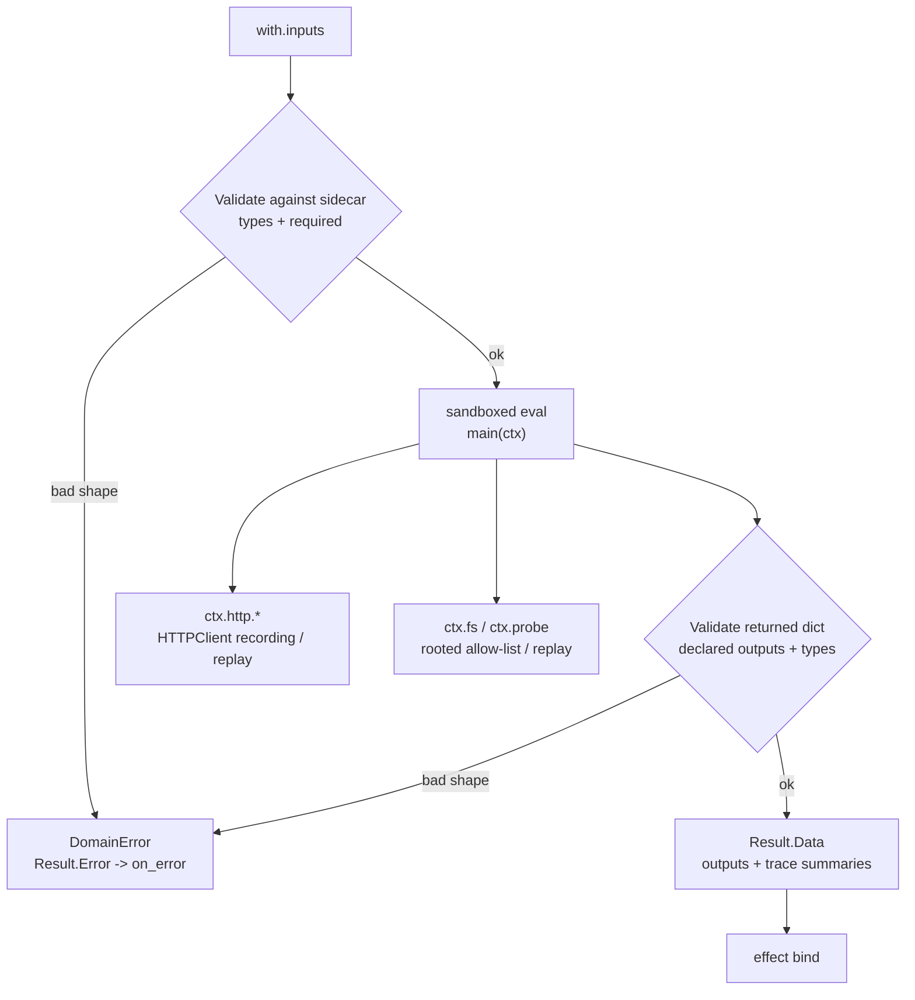
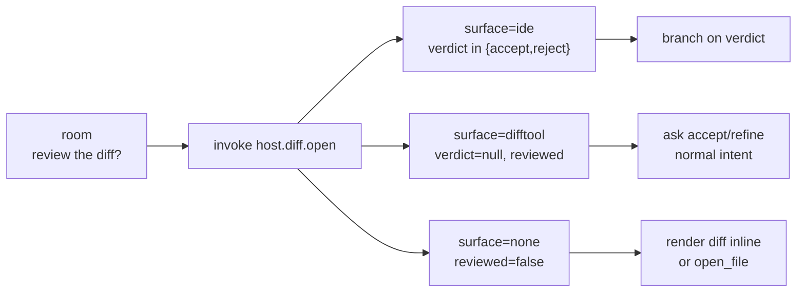

# Built-in Host Handlers

Hosts are the only escape hatch from the pure machine. Apps invoke them
through effects; the orchestrator dispatches to the registry; the
handler returns a `Result` that may carry `Data` (a typed map) and/or
an `Error` envelope.

This document is the user-facing reference for every built-in. The
authoritative source is `internal/host/`. To extend the registry with
your own handler, see
[`developer-guide.md` §5.2](../guide/development/developer-guide.md#52-adding-a-new-built-in-host-handler).
For a shorter family index, see [`hosts/`](hosts/README.md).

For the effect-level shape (`invoke:`, `with:`, `bind:`, `on_error:`,
`background:`, `on_complete:`) see `kitsoki docs app-schema`.

For named-capability composition (`host_interfaces:` declared on a
sub-story, rebound by importers) see [`imports.md`](../stories/imports.md) §11.

For the Starlark-specific authoring experience shared by
`host.starlark.run` and `host.agent.codeact` — stdlib, `ctx` capability
grants, sandboxing, validation, cassettes, and promotion — see
[`starlark.md`](starlark.md).

For invoking agent handlers directly from scripts, CI jobs, or
validator subprocesses — without a running state machine — see
[`docs/guide/agents/cli.md`](../guide/agents/cli.md). That document covers
`kitsoki agent <verb>`, `kitsoki agent-serve` (unix-socket daemon),
the JSON-RPC method shapes, and `KITSOKI_SESSION_ID` trace continuity.

## Registry dispatch and prefix-fallback

The host registry resolves handler names via exact match first, then
falls back to the longest registered prefix split on `.`. So
`Get("host.diary.announce")` returns:

1. The handler registered exactly at `host.diary.announce` if any.
2. Otherwise the handler registered at `host.diary` if any.
3. Otherwise not found.

This makes multi-op `host_interface` dispatch work without forcing
authors to register every `<binding>.<op>` combination. Register one
handler per op when each op has a different surface; register a single
carrier handler when the op name is dispatched from `with:` args.

---

## Cheat sheet

| Handler | Purpose |
|---|---|
| [`host.run`](#hostrun) | Execute a shell command in a working directory. |
| [`host.starlark.run`](#hoststarlarkrun) | Run a sandboxed, deterministic Starlark glue script (`main(ctx) -> dict`) with typed inputs/outputs and replayable HTTP. |
| [`host.agent.extract`](#hostagentextract) | Tiered resolver: synonyms → slot_template → llm. Returns typed JSON + `resolved_by`. |
| [`host.agent.ask`](#hostagentask) | Read-only inspection call: read tools + Bash under a profile; no mutation. Returns prose + optional typed JSON. |
| [`host.agent.decide`](#hostagentdecide) | Typed LLM verdict (schema required; submit auto-attached; read-only tools optional). |
| [`host.agent.codeact`](#hostagentcodeact) | Bounded agent loop that emits capability-scoped Starlark snippets, then `done(payload)`. |
| [`host.agent.task`](#hostagenttask) | Agentic verb with full tool surface, acceptance loop, and replay artifacts (Mode A/B/C). |
| [`host.agent.converse`](#hostagentconverse) | Free-form conversational Claude session with permission_mode control. |
| [`host.transport.post`](#hosttransportpost) | Post a message to a registered transport (TUI / Jira / Bitbucket). |
| [`host.workspace_manager.get`](#hostworkspace_managerget) | Load a structured workspace context (repos, issue, PRs). |
| [`host.capsule_workspace`](#hostcapsule_workspace-workspace-interface) | `workspace` provider: checked-in Capsule definitions create/get/status/sync/commit/close under `.capsules/workspaces/<id>`. |
| [`host.git_worktree`](#hostgit_worktree-compatibility-workspace-interface) | Compatibility `workspace` provider: legacy `name/base/sync` contract backed by the development Capsule provider plus linked-worktree cleanup. |
| [`host.jobs.answer_clarification`](#hostjobsanswer_clarification) | Resume a paused background job with the user's answer. |
| [`host.chat.resolve`](#hostchatresolve) | Get-or-create a persistent chat thread for a `(app, room, scope_key)`. |
| [`host.chat.list`](#hostchatlist) | List chat threads matching `(app, room, scope_key)`. |
| [`host.chat.transcript`](#hostchattranscript) | Fetch a chat's transcript. |
| [`host.chat.create`](#hostchatcreate) | Explicitly create a new chat thread. |
| [`host.chat.fork`](#hostchatfork) | Fork a chat — copy messages, fresh Claude session. |
| [`host.chat.archive`](#hostchatarchive) | Soft-delete a chat. |
| [`host.chat.rename`](#hostchatrename) | Update a chat's title. |
| [`host.chat.suggest_title`](#hostchatsuggest_title) | Ask Claude to propose a title from the transcript. |
| [`host.chat.resolve_ref`](#hostchatresolve_ref) | Resolve a chat reference (id, alias, or "current") to a chat row. |
| [`host.chat.drive`](#hostchatdrive) | Enqueue a turn against a chat; optionally `await` completion. |
| [`host.ide.*`](#hostide--editor-awareness) | Editor awareness over the live IDE link: diagnostics, selection, open editors, open file/diff. |
| [`host.diff.open`](#hostdiffopen--review-a-change-in-the-best-surface) | Open a change for review in the best available diff surface — connected IDE (with a captured accept/reject verdict) or a view-only system difftool — and report what the operator decided. |
| [`host.slidey.render`](#hostslideyrender) | Validate + render a JSON scene spec to MP4, PDF, or interactive HTML via the slidey pipeline. |
| [`host.contact_sheet`](#hostcontact_sheet) | Assemble a PNG contact-sheet montage from a directory of PNG frames via ffmpeg. |
| [`host.video.frame`](#hostvideoframe) | Grab a single still PNG from a video at a timestamp via ffmpeg; deterministic, no LLM. |

Every handler must be present in the app's top-level `hosts:`
allow-list to be invokable.

---

## host.run

Execute a shell command or, in argv mode, a program with explicit
arguments. The default `host` for "shell out and capture stdout".

| Field | Type | Required | Notes |
|---|---|---|---|
| `cmd` | string | yes | The program (argv-mode) or shell command (bash-mode). |
| `script` | string | no | App-relative script path inserted before `args`. This always selects argv-mode. Imported-story paths are rebased to the defining child story, avoiding parent/global `KITSOKI_APP_DIR` ambiguity. |
| `args` | list | no | Present → argv-mode: `cmd` is exec'd directly with these positional args, no shell. Use this whenever an argument is templated from world or slot data. |
| `cwd` | string | no | Working directory. |
| `fail_on_error` | bool | no | Default `false`. When `true`, a non-zero exit populates `Result.Error` so `on_error:` fires instead of returning success-with-data. |

Returns:

| Field | Type | Notes |
|---|---|---|
| `stdout` | string | Combined stdout/stderr. |
| `exit_code` | int | |
| `ok` | bool | True iff `exit_code == 0`. |
| `stdout_json` | any | Set when stdout's last non-empty line parses as a single JSON document. Lets CLIs that emit a structured envelope be bound directly via `bind: foo: stdout_json`. |
| `stdout_json_parse_error` | string | Set (and `stdout_json` absent) when the last line looked like JSON but failed to parse. |

### Background usage

`host.run` is the canonical example for `background: true`. The
`stdout` / `exit_code` / `stdout_json` fields end up in
`world.last_job_result` when the job terminates.

---

## host.starlark.run

Run a small, author-supplied [Starlark](https://github.com/google/starlark-go)
script in a tightly restricted, **deterministic** interpreter and bind its
named outputs into world. This is the escape hatch for glue that is too fiddly
for the expr-lang `with:`/guard vocabulary (shaping a payload, deriving several
fields, writing a small artifact, calling a plain HTTP API) but too small to justify a bespoke Go
handler. Unlike `host.run` it is sandboxed, introspectable, and replayable: no
environment, no clock, no randomness — and only a narrow filesystem +
allow-listed-probe surface (`ctx.fs` / `ctx.probe`, below), never a shell — so a
recorded run replays byte-for-byte.

The authoritative source is `internal/host/starlark/` (the sandbox) and
`internal/host/starlark_run.go` (the `host.Handler` adapter); see
`internal/host/starlark/doc.go` for the design rationale. For a narrative
authoring guide that also covers CodeAct and sandbox layering, see
[`starlark.md`](starlark.md).

| Field | Type | Required | Notes |
|---|---|---|---|
| `script` | string | yes | Path to the `.star` file, relative to the app root. The loader resolves it against the manifest dir, rejects `../` escapes, and requires both the `.star` and its `.star.yaml` sidecar to exist at load time. By dispatch the path is absolute. Templated (`{{…}}`) paths skip the load-time check and are validated at runtime. |
| `inputs` | object | no | The named inputs exposed to the script as `ctx.inputs["name"]`. Type-validated against the sidecar's `inputs:` block before evaluation. Values are templated like any other `with:` arg — **wrap every value in `{{ }}`** (a *sole* `{{ expr }}` preserves the typed value, so a declared `int` stays an `int`). A **bare** `world.foo` is NOT evaluated — it reaches the script as the literal string `"world.foo"`, silently breaking resolution (the general rule: [state-machine.md §7.1](../stories/state-machine.md#71-expressions-vs-templates--which-syntax-goes-where)). The loader rejects bare-expression inputs at load (see below). |
| `capabilities` | object | no | The capability grants for this run. Defaults expose only pure helpers plus `ctx.inputs` and read-only `ctx.world`; `ctx.http`, `ctx.fs`, `ctx.probe`, and `ctx.host` are absent unless granted here. The loader rejects unknown capability keys and obvious static script/grant mismatches. |

Returns: the script's `main(ctx)` **must return a dict**; each key/value becomes
a named output. The output dict is validated against the sidecar's `outputs:`
block (see below), then handed to the effect's `bind:` exactly like any other
handler's `Result.Data`. Bind only the keys you name — nothing reaches world
unasked-for. Two reserved trace-summary keys are added automatically when the
script uses those capabilities: `__http_exchanges`, a body-free list of
`{method, url, status}` for HTTP calls, and `__inspections`, a body-free list of
`{op, target, status}` for `ctx.fs` / `ctx.probe` calls. Authors **must not**
declare outputs with those names.

Number conversion back to Go: an integer becomes `int64` (or `float64` when out
of `int64` range); a float becomes `float64`. The sidecar's `int` and `number`
types both accept either.

### The sidecar contract

Every script has a sidecar named `<script>.star.yaml` sitting beside it. The
sidecar — not the script — is the **authoritative** declaration of the script's
interface; the engine validates against it and ignores any in-script
`INPUTS`/`OUTPUTS` convention dicts.

```yaml
inputs:
  <name>: { type: <T>, required: <bool> }   # required defaults to false
outputs:
  <name>: { type: <T> }                     # every declared output is mandatory
```

`<T>` is one of `string | int | number | bool | object | list | any` (an empty
type means `any`; an unknown type fails the app load). Validation semantics:

- **Inputs** — a missing `required: true` input, or a type mismatch, is an
  error. Inputs *not* declared in the sidecar pass through untouched (the script
  may still read them via `ctx.inputs`). `validateStarlarkEffects` additionally
  rejects two wiring mistakes **at load** (run `kitsoki validate <app.yaml>` to
  surface them without a session): an `inputs:` value that is a **bare
  expression** (`world.x` / uses `??` / `?.` with no `{{ }}`) — it would reach the
  script as that literal string — and a **non-template literal** wired to an input
  whose declared type it can never satisfy (e.g. a string to a declared `int`,
  which has no coercion). Both are the silent "the script saw a literal, not the
  value" footgun; template the value (`"{{ world.x }}"`) to fix it.
- **Outputs** — when `outputs:` is non-empty, **every declared output must be
  returned** (a forgotten one is an error) and **every returned key must be
  declared** (an undeclared return is rejected), each value type-checked. This
  keeps the world-binding surface exactly what the sidecar promises.

A malformed sidecar fails the app at **load time** (`validateStarlarkEffects` in
`internal/app/loader.go`); a type/shape mismatch at **run time** is an expected
domain error (see below).

### The `ctx` surface (deliberately narrow)

`main` takes one argument, `ctx`, a struct with `inputs`, read-only `world` by
default, and only the external attributes granted by `with.capabilities`. The
narrowness *is* the sandbox: an ungranted attribute (for example `ctx.http`
without an `http` grant, or `ctx.env` always) fails at eval with a clear
Starlark "has no `.X` field" traceback, surfaced as a domain error.

```
ctx.inputs["name"]                          # dict of the resolved, type-checked inputs
ctx.world.get("key")                        # read-only world snapshot; None when absent
ctx.http.get(url, headers={}, auth=None)    # -> response (only with http grant)
ctx.http.post(url, body=..., headers={}, auth=None) # -> response (only with http grant)
ctx.fs.read(path)                           # -> string (only with fs.read grant)
ctx.fs.exists(path)                         # -> bool (only with fs.read grant)
ctx.fs.glob(pattern)                        # -> [path] (only with fs.read grant)
ctx.fs.write(path, content)                 # -> path (only with fs.write grant)
ctx.probe(name, args=[])                    # -> {exit: int, out: string} (only with probe/vcs/github grant)
ctx.host.call(name, args={})                # -> dict (only with exact host.verbs grant)
```

- `ctx.inputs` is a **dict**, accessed by key (not attribute).
- `ctx.world.get(key)` returns the value or `None`. The orchestrator threads a
  **read-only snapshot of the live world** (as it stands after earlier `on_enter`
  binds) into every call, so `ctx.world` reflects current state with no author
  plumbing. There is no `set` — outputs flow **only** through `main`'s return
  dict, so a script can never mutate world out-of-band.
- `ctx.http.post` `body` may be a Starlark dict (JSON-encoded, `Content-Type`
  defaulted to `application/json`) or a string (sent verbatim). `headers` is a
  dict of string→string.
- `ctx.http.get/post` `auth` may be a string or list of strings when the
  injected HTTP client supports auth policy, such as `ticket_provider/v1`
  runners. It is symbolic: the script names host-side auth policies, and the
  transport resolves env/secrets and applies request headers after Starlark
  constructs the request. Secret values are never exposed as Starlark values.
- The **response** object exposes `.status` (int), `.headers` (dict), `.text()`
  (string method) and `.json()` (parses the body to a Starlark value; a parse
  error is a Starlark error). A response is truthy iff its status is in
  `200..299`. A non-2xx status is **not** an error — branch on it in-script.

Example grants:

```yaml
capabilities:
  stdlib: [json, math, yaml]       # default; can be narrowed
  world: read                      # default; use none/false to hide ctx.world
  http:
    methods: [GET]
    hosts: ["api.github.com"]      # optional; omitted means any host
    cassette_required: true        # require an injected HTTP cassette/replay client
  fs:
    read: ["docs/**", ".artifacts/**"]
    write: [".artifacts/reports/**"]
    max_bytes: 1048576
  vcs: read                        # grants git.status and git.ls_files probes
  github:
    issues: read                   # grants gh.issue.list
  host:
    verbs: ["host.graph.load"]
```

The host vocabulary also includes the agent ladder (`host.agent.ask`,
`decide`, `task`, `extract`, and `converse`) for project-supplied orchestration
scripts. These are never implicit: the effect must grant each exact verb, and
the call still passes through that verb's normal tool, provider, sandbox, and
trace policy. Automated flows must replace agent calls with host-handler
stubs/cassettes; granting an agent verb does not make a test live-spend safe.

`http`, `fs`, `probe`, `github`, and `host` are opt-in: the matching `ctx`
attribute is absent unless the effect grants it. The production adapter only
installs the live HTTP client when `http` is granted and
`http.cassette_required` is not set, and only installs the working-dir-rooted
inspector when `fs`/`probe`/`github` capabilities are granted. If
`http.cassette_required: true`, a flow/test/runtime must already have injected a
Starlark HTTP client, normally through `starlark_http_cassette:`. The runtime
then enforces HTTP methods/hosts, fs read/write path patterns, probe names, and
host verbs.

#### Filesystem/probe boundary: `ctx.fs` and `ctx.probe`

`ctx.fs` and `ctx.probe` are the **filesystem + allow-listed-process boundary**
— the sibling of `ctx.http` for the working tree and a few curated probes. They
exist so a glue script can assert against reality ("does this file exist", "does
GitHub list ≥ N issues") and write small deterministic artifacts while
keeping the record/replay contract intact. `ctx.env` is still absent — there is
deliberately no environment surface.

- `ctx.fs.read/exists/glob/write` are **repo-scoped** by default: every relative
  path is resolved against the run's working directory, cleaned, and rejected if
  it escapes via `..`. Absolute paths are rejected except for paths under `/tmp`
  or the platform temp dir, used by flow fixtures for disposable outputs that
  should stay out of the checkout. Reads and writes are each capped at 1 MiB.
  `write` replaces exactly one file, creating parent directories as needed, and
  returns the normalized path. There is no delete, chmod, rename, shell,
  environment, or clock surface.
- `ctx.probe(name, args=[])` is an **allow-list, not a shell.** `name` must be on
  a fixed global vocabulary of read-only probes. GitHub probes such as
  `gh.issue.list` use native GitHub API calls; local VCS probes such as
  `git.status` and `git.ls_files` map to static argv templates exec'd directly
  (no shell, no word-splitting), with `args` substituted positionally (see
  `internal/host/starlark/inspect.go`). A non-zero exit is **not** an error — it
  is returned in the result's `exit` so a script can branch on a clean failure,
  exactly like a non-2xx HTTP status; an unknown name is an error.

All filesystem/probe calls funnel through one `Inspector` interface (`internal/host/starlark/inspect.go`)
— the inspection-side analogue of `HTTPClient`. It is injected via
`WithInspector`/`InspectorFromContext` (mirroring `WithHTTP`); the default is a
**deny-all** inspector so a script that touches the disk without an injected
inspector fails loud. In production the adapter installs a working-dir-rooted
inspector only when `capabilities` grants `fs`, `vcs`, or `github`; a flow
fixture injects a **`ReplayInspector`** backed by an inspect cassette, so the
*real* script runs with its fs/probe served from disk — no real process, fully
deterministic, no LLM and no cost. Each call records a body-free `{op, target,
status}` summary for the trace (full payloads stay in cassettes), exactly as
HTTP exchanges do.

The worked example is the dev-story ad-hoc plan's verify gate
([`stories/dev-story/verify/issues_migrated.star`](../../stories/dev-story/verify/issues_migrated.star));
see [docs/stories/ad-hoc-plan.md](../stories/ad-hoc-plan.md) for the full
propose → accept → apply → verify story it sits behind.

Predeclared stdlib: `json`, `math`, and decode-only `yaml` **only** (no
`time`, no `random`).
`FileOptions` are strict defaults (no `set` builtin, no global reassignment, no
recursion); execution is capped at 10,000,000 steps to turn an accidental hot
loop into a clean error.

### Error mapping

A `*DomainError` — bad input/output shape, a malformed or failing script, a
missing `main`, an HTTP-replay miss propagated through the script — becomes
`Result.Error`, which fires the effect's `on_error:` arc and sets
`world.last_error`. Only a true infrastructure failure (e.g. the script file
vanished after load) is a Go error.

### Flow of one call



### Record / replay (HTTP cassettes)

All network access funnels through one `HTTPClient` interface — the sandbox's
only I/O boundary. In production the adapter injects a recording client only
when `capabilities.http` is granted (real `net/http`, 30s timeout) and policy
checks methods/hosts before dispatch. In a flow fixture the testrunner injects a **replay client**
backed by an HTTP cassette, so the *real* script runs with its network served
from disk — no socket, fully deterministic, no LLM and no cost.

This `http_cassette` is intentionally a **different** kind from the agent
`host_cassette`: a `host_cassette` episode replaces a whole handler with a
canned `Result`, whereas this one lets the real handler run and only replays its
HTTP. The model is deliberately close to Python's [VCR.py](https://vcrpy.readthedocs.io/)
— record modes, configurable request matchers, secret redaction, and per-
interaction request/response capture — so the workflow is familiar.

```yaml
kind: http_cassette
record_mode: none                  # none | once | new_episodes | all (default none)
match_on: [method, url]            # any of: method, url/uri, scheme, host, port, path, query, body, headers
ignore_hosts: ["metrics.internal"] # optional: pass straight through, never record/replay
ignore_localhost: false
filter_headers: ["X-Api-Key"]              # redacted to REDACTED on write …
filter_query_parameters: ["token"]         # … (Authorization/Cookie/Set-Cookie always are)
filter_post_data_parameters: ["password"]
allow_playback_repeats: false      # global form of per-episode `replay: any`
exchanges:
  - request:                       # the recorded (VCR-style) form
      method: GET
      url: "https://api.example.com/v1/widgets/42"
      headers: { Accept: application/json }
      body: ""
    response:
      status: 200
      headers: { Content-Type: application/json }
      body: '{"id":42,"name":"sprocket"}'
    replay: any                    # optional; default consumes after one match
```

**Record modes** (mirroring VCR.py), set via the cassette's `record_mode:` or
the `KITSOKI_HTTP_CASSETTE_RECORD` env var (env wins):

| Mode | Behaviour |
|---|---|
| `none` (default) | Replay only; a request that misses the cassette is a loud error. |
| `once` | Record when the cassette starts empty, otherwise replay-only. |
| `new_episodes` | Replay matches; record (append) anything that misses. |
| `all` | Never replay; re-record every request, discarding prior recordings. |

A recording run hits the real API, captures request+response, and on completion
writes the cassette back to disk (YAML, or JSON via the serializer). Secrets are
**redacted on write** — `Authorization`, `Cookie`, `Set-Cookie`,
`Proxy-Authorization` always, plus anything in `filter_headers` /
`filter_query_parameters` / `filter_post_data_parameters` — so a first-run
recording is safe to commit. `KITSOKI_CASSETTE_STRICT=1` forbids recording (a CI
guard). The redaction applies only to the written file; the live run still serves
real values to the script.

**Matching.** A recorded (`request:`) episode matches when every field named in
`match_on` matches (`query` is compared order-insensitively; `headers` is a
subset check; default `[method, url]`). A legacy hand-authored episode uses a
`match:` selector instead — `method` (case-insensitive), `url` (exact), or
`url_pattern` (a Go regexp) — and is matched on that selector regardless of
`match_on`, so existing cassettes keep working. The first not-yet-consumed match
wins (consumed once unless `replay: any` or `allow_playback_repeats`). A miss is
a loud error listing the available selectors. A fixture that wants the script to
run with **no** HTTP simply omits the cassette — any `ctx.http` call then fails
with the deny-all client.

A runnable end-to-end example (record-once cassette, happy + 404 error paths)
lives in [`stories/starlark-enrich/`](../../stories/starlark-enrich/); its
cassettes under `cassettes/` were recorded against a live API and trimmed.
[`stories/weather-report/`](../../stories/weather-report/) is a larger sibling:
free-text input, two chained HTTP calls, a branch on operator-chosen mode, and
structured (object + list) outputs rendered as markdown tables.

See the [state-machine](../stories/state-machine.md#5-effects) §Effects note for
where this sits in the effect vocabulary.

### Worked example

Effect (in a room's `on_enter` or a transition's `effects:`):

```yaml
hosts: [host.starlark.run]   # must be in the app-level allow-list

# …
effects:
  - invoke: host.starlark.run
    with:
      script: scripts/widget_name.star
      inputs:
        widget_id: "{{ world.selected_widget }}"
    bind:
      widget_name: name      # copy the script's `name` output into world.widget_name
    on_error: lookup_failed
```

`scripts/widget_name.star`:

```python
def main(ctx):
    wid = ctx.inputs["widget_id"]
    resp = ctx.http.get("https://api.example.com/v1/widgets/" + wid)
    if not resp:                      # truthy iff 2xx
        fail("widget lookup failed: " + str(resp.status))
    body = resp.json()
    return {"name": body["name"]}
```

`scripts/widget_name.star.yaml`:

```yaml
inputs:
  widget_id: { type: string, required: true }
outputs:
  name: { type: string }
```

A flow fixture exercises this against the **real** handler by adding a
`starlark_http_cassette:` field (resolved relative to the fixture) whose
`http_cassette` serves the `GET …/widgets/<id>` call; the testrunner injects the
replay client, the script runs for real, and the `__http_exchanges` summary
lands in the `harness.returned` event for `expect_events`. (The polished example
app and its fixture live under `testdata/apps/` / `stories/`; reference whichever
is present in the tree.)

---

## Agent verb summary

Six verbs ordered by blast radius. Pick the narrowest one that fits.

| Verb | Blast radius | Schema required | Mutation | Transcript |
|---|---|---|---|---|
| `host.agent.extract` | Deterministic-first | yes | no | no |
| `host.agent.decide` | LLM-only verdict | yes | no | no |
| `host.agent.ask` | LLM inspection | optional | no | no |
| `host.agent.codeact` | Bounded Starlark loop | optional | only granted `ctx` surfaces | step journal |
| `host.agent.task` | Agentic write | yes (acceptance) | yes | journal |
| `host.agent.converse` | Open conversation | no | optional | ChatStore |

**Choosing a verb:**

1. Can a synonym list or slot template answer the input? → `extract`.
2. Does the call require a typed structured verdict with no file mutations? → `decide`.
3. Do you just need prose or an optional typed annotation from a read-only agent? → `ask`.
4. Should an agent explore, but only by emitting scoped Starlark snippets over
   declared capabilities? → `codeact`.
5. Does the agent need to edit files, run commands, or loop until a `submit()` is accepted? → `task`.
6. Is this a multi-turn conversation the user drives? → `converse`.

The agent verbs share named-agent lookup and `KITSOKI_SESSION_ID` propagation;
the CLI-backed paths run through `AgentStreamer.Run` while plugin/direct-API
paths preserve the same handler result contracts. The
persona table pattern — one named agent per role, declared in `agents:` — is
documented with worked examples in `stories/bugfix/AGENT-BRIEF.md` and
`stories/bugfix/README.md`.

## host.agent.codeact

Bounded "code-act" agent loop. Instead of giving the model an open Claude Code
toolbox, Kitsoki asks the named agent for one Starlark snippet per step, runs
that snippet through the same capability-scoped evaluator as
`host.starlark.run`, and feeds either the returned dict or a structured error
back to the next step. The loop ends when the agent emits `done(payload)` that
passes `schema:` validation, or when the step budget is exhausted.

Use CodeAct when a task is still exploratory but the available actions should be
strictly `ctx.world`, `ctx.http`, `ctx.fs`, `ctx.probe`, or `ctx.host.call`
surfaces you explicitly grant. Promote stable CodeAct trajectories to
`host.starlark.run` once the transform is known.

### Arguments

| Field | Type | Required | Notes |
|---|---|---|---|
| `agent` | string | yes | Named agent from the top-level `agents:` block. Supplies system prompt, provider/model, and launch policy context. |
| `goal` | string | yes | Natural-language objective for the loop. This is the stable instruction every step sees with the remaining budget and prior observation/error. |
| `capabilities` | object | no | Shared Starlark capability authority for every emitted snippet. Same schema as `host.starlark.run`. Absent means pure stdlib plus read-only `ctx.world`; external surfaces are absent. Unknown keys fail app load. |
| `budget` | int | no | Maximum snippet/done attempts. Default: `5` when absent or non-positive. |
| `schema` | string | no | JSON Schema path for the final `done(payload)`. Invalid payloads are rejected and fed back as the next step's error instead of terminating. |
| `working_dir` | string | no | Working directory for the agent subprocess and the production inspector root fallback. Agent `DefaultCwd` is used when omitted. |

`sandbox:` is deliberately invalid on CodeAct. `sandbox:` is the external-agent
runtime policy for `task`/write-capable `converse`; CodeAct's boundary is the
Starlark capability sandbox described here and in [`starlark.md`](starlark.md).
The loader rejects a `sandbox:` block on `host.agent.codeact` so a copied
task-shaped effect cannot silently run under the wrong assumptions.

### Return values

| Field | Type | Notes |
|---|---|---|
| `terminated` | string | `"done"` or `"budget_exhausted"`. |
| `payload` | object | The schema-valid final payload when `terminated == "done"`; empty on budget exhaustion. |
| `steps` | list | Per-step journal entries containing the emitted snippet, observation, and optional error message. |

### Capability enforcement

CodeAct snippets run as anonymous Starlark files named `<codeact-snippet>`.
They use the same `def main(ctx): ...` entry point as `host.starlark.run`, but
there is no sidecar because the snippet is generated per step. Snippets should
read session state through `ctx.world.get(key)` and whatever external `ctx`
surfaces the effect grants; the final `done(payload)` schema is the typed output
contract for the whole loop.

Capability enforcement is not prompt-only:

- `ctx.http`, `ctx.fs`, `ctx.probe`, and `ctx.host` are not present unless
  `with.capabilities` grants them.
- HTTP methods/hosts, fs read/write patterns, probe names, and host verbs are
  checked by runtime policy wrappers before the production adapter is called.
- `http.cassette_required: true` requires an injected Starlark HTTP client; a
  live production recording client is not installed behind the author's back.
- A snippet failure becomes a structured CodeAct error envelope and the next
  agent step receives it for self-correction.

### Example

```yaml
hosts:
  - host.agent.codeact

agents:
  triager:
    system_prompt: "Use scoped Starlark snippets to inspect and submit a verdict."

states:
  triaging:
    on_enter:
      - invoke: host.agent.codeact
        once: true
        with:
          agent: triager
          budget: 6
          capabilities:
            world: read
            vcs: read
          schema: schemas/triage_verdict.json
          goal: >-
            Triage {{ world.ticket_id }} against the current tree. Do not fix
            anything. Return whether the bug is still live with code evidence.
        bind:
          triage: payload
          codeact_steps: steps
        on_error: triage_failed
```

Flow fixtures can stub or replay the whole `host.agent.codeact` result through
`host_cassette` for zero-LLM coverage. If the loop produces a deterministic
transform that should become part of the story, promote it to a checked-in
`scripts/*.star` + sidecar and replace the effect with `host.starlark.run`; the
promoted flow should no longer dispatch `host.agent.codeact`.

### Cache-usage visibility and the pre-dispatch budget gate

Every `host.agent.*` call already gets a byte-stable, cache-eligible system
prompt for free (see [system-prompt.md](system-prompt.md)'s layering order).
Two more things ride on top of that: **what caching actually bought** (visible
after the call) and **whether an oversized call should even be sent**
(decided before it).

**Cache-usage visibility.** The claude CLI's `stream-json` terminal `result`
event already reports `cache_read_input_tokens` / `cache_creation_input_tokens`
alongside `input_tokens` / `output_tokens` — kitsoki parses the whole usage
object onto `agent.call.complete`'s `Meta.usage` map unchanged, and additionally
derives a small typed view, `Meta.cache` (`host.CacheUsage{ReadTokens,
CreationTokens, Hit}`, `internal/host/agent_event_sink.go`), mirroring the
`UsageInfo` shape `LiveHarness` already reports for routing calls
(`internal/harness/live.go`). `Hit` is true only when `ReadTokens > 0` — a
call that merely writes a new cache-eligible prefix (first call after a
prompt-shape change) is a miss, not a hit. `Meta.cache` is omitted entirely
(not a false all-zero struct) for a transport that reports no cache
accounting at all (e.g. `copilot`). No new event kind — this is an additive
field on the event every dispatch already emits.

**Pre-dispatch budget gate.** `host.agent.decide` and `host.agent.task` route
through a shared wrap point, `runAgentVerbWithLadder` (`internal/host/ladder.go`),
before any rung is dispatched. That wrap now runs a deterministic, LLM-free
size check (`internal/host/budget_gate.go`): marshal the call's args + the
resolved agent's system-prompt body, divide by a fixed chars-per-token ratio,
and compare against a `BudgetThresholds{WarnTokens, RefuseTokens}` pair
resolved per-agent (`agents: <name>: token_budget: {warn_tokens,
refuse_tokens}`, `internal/app/types.go`'s `TokenBudgetDecl`) → else a
per-verb default → else a generic fallback. Three outcomes:

| Estimate vs. thresholds | Outcome | Effect |
|---|---|---|
| ≤ WarnTokens | `proceed` | dispatch unchanged |
| > WarnTokens, ≤ RefuseTokens | `escalate` | ladder's walk starts one rung up (skips the cheapest tier) |
| > RefuseTokens, or an invalid agent-declared override | `refuse` | terminal `FailureFatal` **before any `claude` subprocess is spawned** — never metered |

Every decision — proceed, escalate, or refuse — is recorded as a new trace
event, `agent.dispatch.budget_checked` (`internal/store/event.go`), carrying
`{verb, estimated_tokens, budget_warn_tokens, budget_refuse_tokens, decision,
reason, rung}`, so a reviewer can reconstruct why a call was allowed,
escalated, or refused without re-running it. Shipped per-verb defaults are
generous (300k warn / 1M refuse — well above the largest single call observed
in the token-bloat finding) so the gate is present and recording from day one
without any existing story refusing or escalating calls on rollout; an author
tightens it deliberately via the per-agent `token_budget:` override, validated
both at story-load time (`internal/app/loader.go`) and again at runtime
(fail-closed if invalid either way). `host.agent.ask`/`.converse` don't route
through `runAgentVerbWithLadder` today and so aren't covered by the gate yet —
extending it there means extending the ladder wrap to those verbs first.

### Ambient context — editor and screen

The operator-facing read-only verbs (`ask`, `ask_with_mcp`, `converse`) receive
two kinds of ambient context the operator surface attaches at turn-submit, each
exposed both as an opt-in `args.*` template key and as an auto-appended prompt
preamble:

- **Editor** — `IDEAmbient` (`{file, selection, range}`), see
  [`docs/tui/README.md`](../tui/README.md#ambient-editor-context).
- **Screen** — `VisualAmbient` (`{frame, point, element}`): a captured frame,
  a click point, and the DOM element under it, so the oracle can answer about
  *what the operator pointed at*. See
  [`docs/architecture/visual-ambient.md`](visual-ambient.md).

### Hermetic isolation from the operator's Claude Code config

The agent execs the local `claude` CLI, so a story's agents would otherwise
inherit whatever the operator has installed under `~/.claude` — including
**enabled plugins** (and their skills and named agents). Any globally-enabled
plugin can then hijack a story's agent: the model, handed a task that resembles
the plugin's domain, adopts the plugin's persona and workflow instead of the
story's composed system prompt. (Observed: with BMAD-METHOD enabled, the `prd`
story's `interviewer` role-played BMAD's "John" PM agent — deprecation notice,
self-chosen output path, its own pick-one menu — none of which the story asked
for.)

To prevent this, every agent CLI invocation pins
`--setting-sources project,local`, which **omits the `user` source** where
`enabledPlugins` lives. A story's agents are therefore defined only by their own
composed system prompt (the layered kitsoki → project → persona prompt passed
via `--system-prompt`; see [system-prompt.md](system-prompt.md)) / `--model` /
`--allowedTools` flags plus the `project`/`local` config of the `working_dir`.
This isolation is orthogonal to layering — Layer 1 is engine text, not operator
config. Auth is unaffected
(OAuth/credentials are read from the keychain, not from a setting source). The
flag is applied at every construction site via `appendSettingSourcesFlag`
(`internal/host/agents.go`) and locked by `agent_setting_sources_test.go`.

A second isolation concern is the **IDE**. The same inherited environment means
that when kitsoki runs inside a VS Code integrated terminal, the inner `claude`
sees `CLAUDE_CODE_SSE_PORT` and would silently connect to the editor's MCP
server — pulling the operator's selection and opening diffs that the
orchestration layer never sees, routes, or records. So when kitsoki itself holds
an IDE link (see [`host.ide.*`](#hostide--editor-awareness) and
[`transports.md`](transports.md#7-the-ide-link)), a shared env helper
(`envScrubIDE`) is applied at **every** agent exec site — `runClaudeOneShotReal`
and `runClaudeStreamJSON` in `agent_runner.go`, and the Bash MCP exec — unsetting
`CLAUDE_CODE_SSE_PORT` and setting `CLAUDE_CODE_AUTO_CONNECT_IDE=false` (the inner
`claude` also rediscovers a link by scanning `~/.claude/ide/*.lock`, so unsetting
the port alone is not enough). When no link is held the helper is a byte-identical
no-op. kitsoki owns the one IDE link; the agent subprocess receives editor
context as prompt context, not via a second socket.

---

## host.agent.ask

Read-only inspection verb (agent-split Phase 3). The LLM gets read
tools — Read, Grep, Glob, WebFetch, WebSearch, Bash under a profile,
read-only MCP servers — but cannot mutate anything. One-shot; no
transcript persistence. Returns prose; returns typed JSON too when
`schema:` is set.

| Field | Type | Required | Notes |
|---|---|---|---|
| `prompt_path` (or `prompt`) | string | yes | Path to a prompt template file. Relative paths resolve against `KITSOKI_APP_DIR`; absolute paths are used as-is. |
| `agent` | string | no | Name of an entry in `agents:`. Supplies `SystemPrompt`, `Model`, `Effort`, `Tools`, `BashProfile`, `DefaultCwd`. |
| `effort` | string | no | Per-call `claude --effort` level (`low\|medium\|high\|xhigh\|max`). Wins over `agent.effort` / provider default; omit to leave the CLI default. |
| `system_prompt` | string | no | Inline persona; wins over `agent.SystemPrompt` when both are set. |
| `working_dir` | string | no | CWD for the spawned `claude`. Precedence: per-call > `agent.DefaultCwd` > prompt file directory. |
| `args` | map | no | Explicit prompt-template variables. Surfaced as `{{ args.X }}` inside the prompt. Falls back to the full call-args map for legacy compatibility. |
| `schema` | string | no | Path to a JSON schema. When set, kitsoki attaches a `submit` MCP tool and returns `submitted` alongside `stdout`. |
| `tools` | list of string | no | Per-call tool override. Wins over `agent.Tools` (D5). Must still be a subset of the read-only allowlist; `Edit` and `Write` are always rejected. |

Returns:

| Field | Type | Notes |
|---|---|---|
| `stdout` | string | Claude's text reply (source-color wrapped). |
| `exit_code` | int | Claude's exit code. |
| `ok` | bool | True iff `exit_code == 0`. |
| `submitted` | any | Parsed JSON payload. Present only when `schema:` is set and the LLM called `submit()`. |

### Tool surface

The handler enforces the read-only contract at two levels:

1. **Loader** — rejects `Edit` and `Write` in any agent's `Tools` that
   is referenced by an `ask` call.
2. **Handler safety net** — rejects mutation tools at call time
   regardless of how the call was assembled (CLI, test, direct Go call).

Allowed tools: `Read`, `Grep`, `Glob`, `WebFetch`, `WebSearch`, `Bash`
(under a profile), and any MCP server whose declaration carries
`read_only: true`.

### Bash profiles

When `Bash` is in the effective tool list the agent **must** declare a
`bash_profile:`. Three profiles are supported:

| Profile | YAML shape | What it allows |
|---|---|---|
| `read-only` | `bash_profile: read-only` | Built-in allowlist: `grep`, `find`, `cat`, `head`, `tail`, `ls`, `git`, `jq`, `rg`, `wc`, `stat`, `awk`, `sed`, `sort`, `uniq`, `cut`, `tr`, `echo`, `printf`, `env`, `which`, `type`, `python3`. Shell metacharacters (`;`, `\|`, `&`, backticks, `$()`) are always rejected. |
| `commands` | `bash_profile: { commands: [git, jq] }` | Explicit argv0 allowlist. Shell metacharacters rejected. |
| `sandboxed-write` | `bash_profile: { sandboxed-write: /tmp }` | Any command; writes confined to a per-call scratch directory; network denied via `HTTP_PROXY`. |

```yaml
agents:
  failure-explainer:
    system_prompt_path: prompts/explain.md
    model: claude-sonnet-4-6
    effort: high            # forwarded to `claude --effort` for every call
    tools: [Read, Grep, Bash]
    bash_profile:
      commands: [git, jq, grep]
```

### Read-tool snapshot cap (D9)

Every read-tool call's output is captured in the journal so the LLM
span is replayable from recording. Outputs over **256 KiB** are stored
as a `sha256` hash plus the first 4 KiB; replay detects "divergent
input" by comparing the hash, but cannot reconstruct the full bytes
from the journal alone. The cap is configurable per app (default
`ReadSnapshotCap = 256 KiB` in `internal/host/read_snapshot.go`) but
not per call. See also: `CaptureReadSnapshot`, `DigestMatches` in
`internal/host/read_snapshot.go` — these helpers are shared by
`decide` and `extract` (Phases 2 and 5).

### Examples

```yaml
invoke: host.agent.ask
with:
  prompt_path: prompts/explain_failure.md
  working_dir: "{{ world.repo_root }}"
  args:
    failing_test: "{{ world.failure_id }}"
  agent: failure-explainer
bind:
  explanation: stdout
on_error: room_ask_failed
```

With schema (typed JSON alongside prose):

```yaml
invoke: host.agent.ask
with:
  prompt_path: prompts/explain_failure.md
  agent: failure-explainer
  schema: schemas/explanation.json
bind:
  explanation: stdout
  classification: submitted
on_error: room_ask_failed
```

---

## host.agent.converse

Free-form open-ended conversation with persistent transcript (agent-split
Phase 7).

`converse` is distinct from `host.agent.task` in that there is no
`acceptance` loop and no synthetic "done" signal — the user or the
surrounding state machine decides when the conversation ends. The
agent may have full mutation tools; what gates mutation is Claude
Code's own permission system, selected by `permission_mode:`.

| Field | Type | Required | Notes |
|---|---|---|---|
| `question` | string | yes | The user's prompt for this turn. |
| `chat_id` | string | recommended | When set AND a ChatStore is in context, enables **chat-aware mode**: appends messages to the persistent transcript, reuses the chat row's `claude_session_id` across turns, and acquires the per-chat singleton lock. |
| `agent` | string | no | Named agent from `agents:` block. Supplies `SystemPrompt`, `Model`, `Tools`, and `DefaultCwd`. Per-call `system_prompt:` wins over `agent.SystemPrompt` (D5 precedence rule). |
| `permission_mode` | string | no | `ask` / `bypassPermissions` / `denyAll`. Default: `bypassPermissions` (matches legacy `talk` behaviour). |
| `working_dir` | string | no | CWD for the spawned `claude`. `agent.DefaultCwd` is used when this is absent. |
| `session_id` | string | no | Non-chat path only — round-tripped so the caller can persist it. |
| `system_prompt` | string | no | Per-call system prompt override; wins over `agent.SystemPrompt`. |
| `tools` | list | no | Per-call tool allowlist; wins over `agent.Tools` (D5). |

### permission_mode values

| Value | Behaviour |
|---|---|
| `ask` | Operator confirms each mutation through the TUI before the agent proceeds. |
| `bypassPermissions` | No confirmation prompts; mutations run without asking. Matches the old `talk` default. |
| `denyAll` | Mutation tools are rejected; useful for sandboxed off-path explorations. |

### background mode (D15)

`converse` preserves `background: true` (used by `dev-story`'s
`agent_active` room for fire-and-poll submission). When `background: true`
is set on the effect, the orchestrator dispatches the handler as a
background job and binds the job ID into world. The handler itself runs
normally; `background:` is a dispatch-time flag, not a handler-level flag.

### Returns

| Field | Type | Notes |
|---|---|---|
| `answer` | string | Claude's reply text. |
| `session_id` | string | The Claude session ID (new or echoed). |
| `chat_id` | string | Echoes the input (chat-aware path only). |
| `claude_session_id` | string | Same as `session_id` (chat-aware path only). |
| `transcript_seq` | int | Seq of the assistant message row (chat-aware path only). |

### Replay semantics (D10)

`converse` spans are recorded as transcript in ChatStore, not in the
journal. Replay tooling renders them as an opaque block rather than
re-running the conversation — conversations are the artifact and do not
replay deterministically:

```
converse(chat=abc, seq=[12..18]) — 6 turns, see ChatStore
```

### Example

```yaml
invoke: host.agent.converse
with:
  chat_id: "{{ world.chat_id }}"
  question: "{{ in.text }}"
  agent: dev-story-pair
  permission_mode: ask
bind:
  answer: answer
  transcript_seq: transcript_seq
on_error: room_converse_failed
```

---

## host.agent.task

The agentic call. The LLM may Edit, Write, and Bash freely inside the declared
working directory. Every tool call produces a `task.tool` journal event. The
handler drives an acceptance loop until the LLM's `submit()` call passes schema
validation (plus an optional `post_cmd` verifier) or the retry budget is
exhausted.

**`agent:` is mandatory.** A task call without a named agent has no documented
tool allowlist or working directory; the loader rejects it at app-load time.

### Arguments

| Field | Type | Required | Notes |
|---|---|---|---|
| `agent` | string | yes | Named agent from the top-level `agents:` block. The agent declares tools, model, cwd, and `external_side_effect`. |
| `working_dir` | string | no | CWD for the agent subprocess; wins over `agent.DefaultCwd`. |
| `acceptance.schema` | string | yes | Path to a JSON Schema file. The LLM must call `submit()` with a payload that validates against this schema. |
| `acceptance.post_cmd` | string | no | Verifier command run after schema validation passes. Exit code 0 = accepted; non-zero = rejected (LLM gets the stdout as rejection reason). |
| `acceptance.post_cmd_args` | map | no | `{ key: value }` forwarded as `--key value` to the post_cmd subprocess. |
| `acceptance.max_retries` | int | no | Retry budget for the acceptance loop (default: 5). |
| `acceptance.min_information_ratio` | number | no | Minimum information score relative to the richest submission attempt (default: 0.5; `0` disables). |
| `acceptance.min_information_bits` | number | no | Richest-attempt floor before the relative gate activates (default: 256 Shannon bits). |
| `context.prompt` | string | no | Prompt text or path injected into the agent's first turn as stdin. |
| `context.args` | map | no | Template variables for `context.prompt`. |
| `sandbox` | map | no | Runtime policy for the agent subprocess. See [`sandbox:` runtime policy](#sandbox-runtime-policy). |

### Return values

Bound via the effect's `bind:` block:

| Key | Type | Notes |
|---|---|---|
| `submitted` | any | The JSON payload the LLM passed to `submit()`. |
| `task_trace_id` | string | Child span ID pointing at the nested task trace. |
| `files_changed` | []string | Sorted list of mutated paths (git-relative when working_dir is a git tree). |
| `final_diff` | string | Unified diff of all changes (also written to the journal under `task.end`). |
| `replay_mode` | string | One of `file_diff`, `sandboxed_write`, or `external_side_effect`. See Mode A/B/C below. |

### Replay modes (Mode A/B/C)

The `replay_mode` field on the `task.end` journal event classifies the task for
replay tooling:

**Mode A — `file_diff`**  
Agent tools are limited to `Read`, `Edit`, `Write`, and `Bash` with no
`WebFetch`/`WebSearch`/non-`read_only` MCP. The task mutates only the working
directory. Replay is deterministic from `(initial_state_hash, final_diff)`:

```
git checkout <initial_state_hash> && git apply <final_diff>
```

The loader infers Mode A when the agent's tool surface contains no external
tools. The author confirms with `external_side_effect: false` on the agent
declaration.

**Mode B — `sandboxed_write`**  
Agent uses a `sandboxed-write` Bash profile (per-call scratch dir, network
denied). The trace captures both the working-tree diff and the scratch-dir
contents as a tarball appended to the journal. Replay requires the diff plus
the scratch tarball.

**Mode C — `external_side_effect`**  
Agent has unrestricted `Bash`, `WebFetch`/`WebSearch`, or write-capable MCP.
Recorded only; not replayable. The `kitsoki replay --mode file_diff` command
skips Mode C spans and prints a summary:
`"skipped N external-side-effect spans."` Authors must declare
`external_side_effect: true` on the agent; the loader infers it from the tool
surface and warns when declaration and inference disagree.

### Write-mode gate

By default a task agent runs under `--permission-mode bypassPermissions` and may
mutate the working tree from turn one. A dispatching **room** can instead opt the
agent into a read-only-by-default posture with `write_mode: read_only` on the
room state (see [state-machine.md](../stories/state-machine.md#write_mode)). The
agent then boots read-only — exactly as a `bash_profile: read-only` /
`external_side_effect: false` agent does — and every **mutating** tool call is
gated:

- the read-only floor is enforced at dispatch: `bypassPermissions` is downgraded
  to `--permission-mode default` so the `--allowedTools` allowlist binds, and
  `readOnlyDeniedTools` (`Write`, `Edit`, `MultiEdit`, `NotebookEdit`, `Bash`)
  ride `--disallowedTools` as the hard backstop. `Bash` is routed through the
  `kitsoki-bash` MCP wrapper under the read-only profile (the same wrapper
  `host.agent.ask`/`decide` use);
- a Bash command the read-only profile *rejects* is no longer a flat deny — it
  routes through the **write-mode gate** (`internal/host/write_mode_gate.go`),
  which classifies the call (`effect ≥ write`), short-circuits an active
  turn/session grant, else forwards an **action proposal** to the operator via
  the [operator-ask bridge](operator-ask.md#other-consumer-the-write-mode-gates-action-proposals).
  With no operator attached the gate **denies** (headless) and the agent stays
  read-only;
- the operator's opt-in (or denial) is recorded as a `machine.write_mode_granted`
  trace event `{state, action, effect, scope, by, granted}` — the agent's
  side-effect audit trail. Replay treats it as a no-op for world/state (the gated
  call's own effects are authoritative).

The decision boundary is sharp: classifying *which* step needs a grant is
**deterministic** (a class check over the tool call); the operator's *grant* is
the **recorded interpretive decision**; the agent's read-only exploration in
between adds no decision point. There is **no LLM in this gate** — write mode is
granted by a human or, headless, denied, never by a model.

`write_mode:` is additive and default-off: a room that omits it dispatches its
agent with today's exact posture (byte-for-byte), and no existing story or
cassette is affected. The classification today keys on the
`readOnlyDeniedTools` set and the read-only `bash_profile` verdict (the static
signals that exist) and upgrades to the full `pure | read | write | external`
effect class when the effect-taxonomy slice lands.

### `sandbox:` Runtime Policy

Before any external coding-agent launch, an optional global
[`agent_launch_policy:`](../guide/agents/launch-policy.md) preflight may reject the
resolved `working_dir` when it is in a protected checkout/branch or outside an
opened capsule. That guard answers "may this agent start here?" and applies even
when a call does not declare `sandbox:`.

`host.agent.task` and write-capable `host.agent.converse` can opt into the agent
runtime layer with `with.sandbox`. The current OSS backend is `supervised`: it
does process-group launch/kill, timeout/cancel cleanup, a temporary HOME/XDG
environment, provider/Kitsoki env allowlisting, and final diff capture. It is
not filesystem confinement; repo/rw/hidden/network policy is recorded as
degraded when the selected backend cannot enforce it.

```yaml
invoke: host.agent.task
with:
  agent: implementer
  working_dir: "{{ world.worktree }}"
  sandbox:
    min_strength: supervised
    repo: read_only
    rw: ["{{ world.work_dir }}", ".worktrees"]
    hidden: [".env", ".git/config"]
    network: inherit
    degrade: warn
    resources:
      timeout: 8m
  acceptance:
    schema: schemas/result.json
```

Trace events make the boundary auditable:

- `agent.runtime.start` records backend, strength, requested minimum strength,
  repo/rw/hidden/network policy, and `degraded[]`.
- `agent.runtime.end` records exit code, whether Kitsoki killed the process
  tree, duration, and final diff byte count.

CLI-backed launches also emit `agent.process` diagnostics in the trace stream:
`start`, `no_output`, and `finish`. The `start` row records redacted argv,
working directory, pid, uid/root/sandbox posture, provider env key names, and
common env-key presence; `finish` records duration, exit/infra summary, and raw
stream-event count. For direct non-sandboxed launches, set
`KITSOKI_AGENT_ACTIVITY_TIMEOUT=90s` (or another duration) to cancel prolonged
stdout inactivity and force a terminal `agent.call.error` instead of leaving an
in-flight `agent.call.start`. Sandboxed launches should prefer
`sandbox.resources.activity_timeout`.

`degrade: fail` aborts before launch when no backend satisfies
`min_strength`. `degrade: warn` may run the strongest available backend, but the
trace must show the degradation; a degraded start must not look like a confined
run. Plugin-dispatched `host.agent.task` calls currently fail closed when
`sandbox:` is present because the process boundary is outside the local runtime.

### Built-in sub-agent MCP tools

Task agents automatically receive three built-in MCP tools scoped to the
parent session:

- `kitsoki.agent.extract` — invoke `host.agent.extract` as a child span
- `kitsoki.agent.decide` — invoke `host.agent.decide` as a child span
- `kitsoki.agent.ask` — invoke `host.agent.ask` as a child span

These tools ensure that sub-LLM calls by the agent join the parent trace
rather than escaping it. Their invocations appear as child spans under
the parent `task.tool` entry in the trace tree.

### KITSOKI_SESSION_ID propagation

Every subprocess spawned by the agent (the `Bash` tool, the `post_cmd`
acceptance subprocess) inherits the `KITSOKI_SESSION_ID` environment variable
from the parent. Any `kitsoki agent <verb>` call made from within those
subprocesses attaches to the parent trace automatically.

### Journal event kinds

| Kind | When emitted |
|---|---|
| `task.tool` | Once per tool call (rolled-up; stream emits `task.tool.start` + `task.tool.end`). |
| `task.acceptance.attempt` | Once per acceptance loop iteration. |
| `task.end` | Terminal event; carries `files_changed`, `final_diff`, `replay_mode`, `initial_state_hash`. |

### Example

```yaml
invoke: host.agent.task
with:
  agent: bug-fix-implementer
  working_dir: ".bug-fix/{{ world.ticket }}/worktree"
  acceptance:
    schema: schemas/fix_proposal.json
    post_cmd: python3 -m bugfix verify-impl
    post_cmd_args:
      ticket: "{{ world.ticket }}"
    max_retries: 5
  context:
    prompt: prompts/implement.md
    args:
      ticket: "{{ world.ticket }}"
      reproduction: "{{ world.reproduction_artifact }}"
bind:
  proposal: submitted
  task_trace_id: trace_id
  files_changed: files_changed
on_error: room_implementing_failed
```

---

## host.agent.extract

Tiered deterministic-first resolver: maps a free-text input to a typed
JSON payload using up to three resolver tiers tried in declaration order.
First match wins.

**Tiers:**

1. `synonyms` — author-curated phrase → payload (YAML file). Case-insensitive.
   Comma-separated keys match multiple phrases to the same payload.
2. `slot_template` — slot-grammar YAML (same syntax, captures `{slot}` patterns).
3. `llm` — LLM fallback; same read-only tool surface as `host.agent.ask`.

An optional `validator:` block runs after any tier match (read-only sandbox).
Rejection falls through to the next tier for deterministic results; for LLM it
counts as a no-match for that call.

| Field | Type | Required | Notes |
|---|---|---|---|
| `input` | string | yes | Free-text to resolve. |
| `schema` | string | yes | Path to a JSON Schema file. Applied to every tier's output. |
| `resolvers` | list | no | Ordered resolver list (see below). |
| `validator` | map | no | `{ post_cmd, post_cmd_args }` — runs in a read-only sandbox. |
| `working_dir` | string | no | cwd for the LLM tier. |
| `agent` | string | no | Fallback agent name (used when `resolvers[].llm.agent` is absent). |
| `prompt` | string | no | Fallback prompt path (used when no `resolvers: []` list and no per-resolver `llm.prompt`). |

**Resolver list format:**

```yaml
resolvers:
  - synonyms: ./synonyms.yaml
  - slot_template: ./templates.yaml
  - llm:
      prompt: ./extract.md
      agent: extractor
```

**Returns:**

| Field | Type | Notes |
|---|---|---|
| `submitted` | any | The resolved payload (nil when `resolved_by: no_match`). |
| `resolved_by` | string | `synonyms` \| `slot_template` \| `llm` \| `no_match` |
| `claude_session_id` | string | Populated when the LLM tier matched; empty otherwise. |

On `no_match`, `Result.Error` is set so `on_error:` can fire a fallback.

**Synonym file format (`synonyms.yaml`):**

```yaml
"go north,head north,north": { direction: "north" }
wade: { action: "wade" }
```

Keys are comma-separated phrases (case-insensitive). Values are the typed payload.

**Progressive determinism (`kitsoki extract suggest-synonym`):**

After an LLM-tier resolution, run:

```
kitsoki extract suggest-synonym --db <db> <session-id> <call-id>
```

where `<call-id>` is `turn:seq`, a plain turn number (when only one extract
call on that turn), or a 1-based index. The command prints a YAML snippet ready
to paste into the synonyms file, moving the next identical input to the
deterministic tier.

---

## host.transport.post

Post a message to a registered transport.

| Field | Type | Required | Notes |
|---|---|---|---|
| `transport` | string | yes | Transport ID — `"tui"`, `"jira"`. |
| `thread` | string | yes | The external thread (`"PLTFRM-12345"`, `<session-uuid>`). |
| `body` | string | yes | Markdown by convention; the transport converts to its native markup. Maps and slices are pretty-printed as JSON. |
| `phase_id` | string | no | Identifies the originating phase; transports use it for de-dup. |
| `title` | string | no | Used as a section header where the transport supports it. |
| `bot_marker` | string | no | Prepended to the body so polling drivers can filter their own output (default `"[kitsoki]"`). |

Returns: `{ message_id }` — opaque, transport-specific.

See [`transports.md`](transports.md) for the implementations.

---

## host.artifacts_dir

Local-file transport: writes one file per `thread:` under an artifacts
root, complementing `host.append_to_file` (which concatenates all
artifacts into a single bug file). Demo and first-party stories rebind
the transport interface to this handler via `host_bindings` so each
phase artifact lands in its own file under `.artifacts/`, ready for
`expect_files:` regex asserts in flow tests.

| Field | Type | Required | Notes |
|---|---|---|---|
| `thread` | string | yes | Path-safe filename under the artifacts root. A bare name with no extension and no path separator gets `.md` appended; a name that already has an extension (e.g. `.json`) is left alone, and a name with a path separator is honoured as-is. |
| `body` | string | yes | Message body. Maps and slices are pretty-printed as JSON (same coercion as `host.transport.post`). |
| `artifacts_root` | string | no | Override the root. Falls back to `$KITSOKI_ARTIFACTS_ROOT`, then `cwd + "/.artifacts"`. |
| `title` | string | no | Rendered as a `### <title>` header at the top of the chunk. |
| `phase_id` | string | no | Inlined at the foot as `_phase: <id>_`. |
| `author` | string | no | Currently informational. |
| `mode` | string | no | `append` (default) — separator + new chunk appended to an existing file. `replace` — overwrites. |

Returns: `{ ok, path, message_id }`. `path` is the absolute file path
written; `message_id` is `<basename-without-ext>#<append-counter>` for
parity with `host.append_to_file`.

### Media-emit extension

When `src_path` is supplied (non-empty), the handler switches to the **media-emit
path** instead of the markdown-body path. It copies the source file into the
artifacts root, emits an `artifact.emitted` journal event, and returns a stable
handle that a `media` view element can reference.

Additional args (media-emit path — activated when `src_path` is non-empty):

| Field | Type | Required | Notes |
|---|---|---|---|
| `src_path` | string | yes | Absolute path of an existing regular file to copy under the artifacts root. |
| `kind` | string | yes | Media kind: `video`, `image`, `pdf`, `html`, or `slideshow`. |
| `mime` | string | no | MIME type override (e.g. `video/mp4`). Auto-detected from the file extension when absent. |
| `label` | string | no | Human-readable display name recorded in the journal event and returned in the handle. |

Returns (media-emit path): `{ ok, handle, path, mime, kind }`. `handle` is the
`id` field of the recorded `artifact.emitted` event (`<basename>#<counter>`) and
is the stable key used by `GET /artifact/{id}` and by `media` view elements.

The existing markdown-body path is unchanged: pass `body` (no `src_path`) and the
handler behaves exactly as before. The `thread:` arg names the destination file in
both paths.

Path-escape guard: the resolved destination must remain under the artifacts root;
`..` components in `thread` or `src_path` are rejected.

**Companion sidecars.** A media-emit co-locates any sibling companions of the
source beside the copied artifact so they keep resolving against the *resolved*
path: `<stem>.chapters.json` (the [chapter sidecar](#the-chapter-sidecar)),
`<stem>.semantic.json` (the producer's clickable-element map) and
`<stem>.poster.png` (the annotator backdrop). The latter two back the unified
annotation surface — see [artifact-annotation](artifact-annotation.md) for the
`runstatus.artifact.semantic` RPC and `/artifact/<id>/poster` route that read them.

For the recorded `artifact.emitted` event shape see
[`docs/tracing/trace-format.md` §Artifact event kind](../tracing/trace-format.md).

Implementation: [`internal/host/artifacts_dir_transport.go`](../../internal/host/artifacts_dir_transport.go).

---

## host.fs.writable_dir

Resolves a configured "durable path" world var to itself when it accepts
writes, or to a caller-supplied fallback directory otherwise. Exists because
several story-level durable-path defaults (e.g. dev-story's
`design_durable_path`, default `docs/proposals`) are appropriate for that
story's own dogfood checkout but are NOT writable in every context the story
can run in — most notably Kitsoki's own primary checkout, which is
intentionally read-only (see the repo's `AGENTS.md`). Without this check, a
room that mints a workspace folder or writes an artifact under the configured
path hard-fails with a raw `mkdir ...: permission denied` the first time it
runs somewhere read-only, instead of degrading to a location that is always
writable.

The intended usage is a ONE-TIME room-level resolve, early, that rebinds the
story's own "durable path" world var to whatever this returns — so every
downstream step (workspace minting, artifact writes, publish) sees a writable
root without each re-deriving it. See `stories/dev-story/rooms/design_search.yaml`'s
`resolve_durable_path` step for the reference usage.

| Field | Type | Required | Notes |
|---|---|---|---|
| `path` | string | yes | The configured directory to check. It need not exist yet — writability is probed against the nearest existing ancestor, since that is what actually governs whether a later `mkdir -p` under it would succeed. |
| `fallback` | string | yes | The directory to use instead when `path` is not writable. Not itself re-validated — pick one you already know is safe (e.g. `.context/designs`, the repo's conventional local-runtime scratch dir). |

Returns: `{ path, used_fallback }`. `path` is either the input `path`
(writable) or `fallback` (not); `used_fallback` is `true` when the fallback was
returned.

Writability is probed with a real create-then-remove of a hidden marker file
(not a permission-bit inspection), so the answer holds under uid/gid
mismatches, ACLs, and a read-only bind mount alike.

Implementation: [`internal/host/fs_writable_dir.go`](../../internal/host/fs_writable_dir.go).

---

## host.workspace_manager.get

Shells out to a `workspace-manager` CLI and parses the JSON output
into a typed `Workspace` (id, root path, repos, issue, PRs). Fields
are validated by the provisional
[`internal/workspace.Workspace`](../../internal/workspace/workspace.go) type.

| Field | Type | Required | Notes |
|---|---|---|---|
| `workspace_id` | string | yes | Identifier the external CLI understands. |

Returns the parsed object as `Result.Data`. Bind individual fields
(`bind: { workspace_root: root_path, … }`) or copy the whole map
(`bind: { workspace: "" }` on an `any`-typed world key).

---

## host.capsule_workspace (`workspace` interface)

Capsule-backed `workspace` provider
([`internal/host/capsule_workspace.go`](../../internal/host/capsule_workspace.go)).
This is the forward story-facing interface for stories that can express their
workspace policy as a checked-in `.kitsoki/capsules/<definition>.yaml`
definition. It opens the project Capsule manager with repository-local
definitions and materializes the workspace under the project-managed
`.capsules/workspaces` root; branch, source, bootstrap, and scope policy come
from the definition rather than from ad hoc story arguments.

The handler dispatches `list` / `create` / `get` / `status` / `sync` /
`commit` / `close` / `cleanup_scan` / `cleanup_apply` via the `op` arg. It
should be granted to agents when the desired
authority is "manage Capsule workspaces in this project" rather than "run
general git plumbing". A scoped MCP agent can receive only the Capsule MCP
server; an in-story agent can receive this host binding for the same
least-authority lifecycle.

Every return, including domain errors, carries `diagnostics` in `Result.Data`.
The orchestrator records that map in `harness.returned` and mirrors it in
`host_error.data` on failures, so a trace shows the handler, op, repo,
definition, workspace id, generation, path, provider, state, branch/head,
dirty flag, low-level VCS status error when present, and a remediation hint.

`list` args:

| Field | Type | Required | Notes |
|---|---|---|---|
| `repo` | string | no | Project root. |

`list` returns stable, id-sorted workspace records with id, generation,
definition, provider, state, owner, path when resolvable, branch/head, source
ref, dirty flag, and any VCS status error.

`create` args:

| Field | Type | Required | Notes |
|---|---|---|---|
| `id` | string | yes | Workspace identity and instance key. |
| `definition` | string | no | Checked-in Capsule definition id, for example `development`, `staging`, or a story-specific fixture. Empty defaults to `development` during the story-contract migration. |
| `repo` | string | no | Project root. Empty means resolve the current git top-level. |
| `owner` | string | no | Logical owner for close/lease semantics. Defaults to `host`. |

`get` args:

| Field | Type | Required | Notes |
|---|---|---|---|
| `id` | string | yes | Workspace identity. |
| `repo` | string | no | Project root. |

`status` args:

| Field | Type | Required | Notes |
|---|---|---|---|
| `id` | string | yes | Workspace identity. |
| `repo` | string | no | Project root. |

`sync` args:

| Field | Type | Required | Notes |
|---|---|---|---|
| `id` | string | yes | Workspace identity. |
| `repo` | string | no | Project root. |

`sync` is a transitional compatibility barrier for imported stories that still
call `workspace.sync`. It verifies and reports the Capsule workspace status; it
does not perform git remote synchronization.

`commit` args:

| Field | Type | Required | Notes |
|---|---|---|---|
| `id` | string | yes | Existing workspace identity. |
| `message` | string | yes | Commit message passed to the Capsule VCS operation. |
| `repo` | string | no | Project root. |

`close` args:

| Field | Type | Required | Notes |
|---|---|---|---|
| `id` | string | yes | Existing workspace identity. |
| `owner` | string | no | Must match the logical owner when the provider enforces ownership. |
| `repo` | string | no | Project root. |

Returns `ok`, `id`, `generation`, `path`, `branch`, `state`, `head`, `dirty`,
and `diagnostics` for create/get/status/sync/commit operations where those
fields are available. `close` returns `ok`, `id`, `closed`, and `diagnostics`.

`cleanup_scan` args:

| Field | Type | Required | Notes |
|---|---|---|---|
| `repo` | string | no | Project root. |
| `exclude` | string | no | Case-insensitive substring filter against id/path/branch/state. |
| `protected` | string | no | Comma-separated branch names that must not be recommended. |

`cleanup_scan` returns reviewable Capsule candidates and a `recommended_count`.
It recommends only integrated or failed workspaces that are not dirty and do not
use a protected branch. Active, dirty, protected, and already-closed workspaces
are still visible with a reason, so disk-pressure troubleshooting can separate
"safe to close" from "needs operator review".

`cleanup_apply` args:

| Field | Type | Required | Notes |
|---|---|---|---|
| `candidates` | list | yes | The candidate list returned by `cleanup_scan`. |
| `owner` | string | no | Fallback owner when a candidate lacks owner metadata. |
| `repo` | string | no | Project root. |

`cleanup_apply` closes only candidates marked `recommended: true` and rechecks
that the live Capsule state is still `integrated` or `failed`. It returns
`deleted`, `skipped`, and `errors`, all mirrored into diagnostics for postmortem
traces.

Stories that still need dynamic `name` / `base` arguments can remain on
`host.git_worktree` until their `host_interfaces` contract is migrated to
checked-in definitions. New generated project instances bind `workspace` to
`host.capsule_workspace` and emit `.kitsoki/capsules/development.yaml`.

## host.git_worktree (compatibility `workspace` interface)

Compatibility `workspace` provider
([`internal/host/git_worktree.go`](../../internal/host/git_worktree.go)). A
single prefix-fallback handler dispatches `list` / `get` / `create` / `sync` /
`cleanup_scan` / `cleanup_apply` / `clone_create` /
`clone_cleanup_scan` / `clone_cleanup_apply` via the `op` arg. The default
`create` path delegates to
[`scripts/dev-workspace.sh`](../../scripts/dev-workspace.sh), which materializes
clone-backed capsule workspaces under `<repo>/.capsules/workspaces/<id>`, writes
the capsule/clone sentinels, and keeps git plumbing out of agents. Legacy linked
worktree list/cleanup remains for old local checkouts. The operator-facing
lifecycle runbook is [`../dev-workspaces.md`](../dev-workspaces.md).

New stories should prefer `host.capsule_workspace` when they can choose a
checked-in Capsule definition. Keep this provider for old story contracts that
still speak in `name`, `base`, and `sync`, or for cleanup of legacy linked
worktrees.

`create` args:

| Field | Type | Required | Notes |
|---|---|---|---|
| `name` | string | yes | The new feature branch. |
| `id` | string | no | Workspace id / on-disk clone dir basename. Defaults to the slashes-flattened `name` (`fix/foo` -> `fix-foo`). Authors that bind `workspace_id` from world state pass it here so `sync` (which keys on the id) finds the workspace. |
| `base` | string | no | Branch or commit the workspace is rooted at. |
| `session_id` | string | no | Owning kitsoki session. Recorded in `.kitsoki-clone`, `capsule-manifest.json`, and the compatibility `.kitsoki-owner` marker. |

### Per-session isolation (no shared checkouts)

Two concurrent sessions on the same ticket must never share one on-disk
workspace: a routine checkout/revert in one session silently and unrecoverably
reverts the other's uncommitted WIP. The script-owned workspace metadata
prevents it:

- The orchestrator projects its per-session SessionID into the story world as
  `world.session_id` (an ephemeral, replay-safe seed recomputed each
  `loadJourney`, alongside `world.ide.connected`).
  [`stories/bugfix`](../../stories/bugfix/rooms/idle.yaml) threads it into
  `workspace.create`; the story also includes the session id in the workspace id
  so same-ticket sessions get distinct paths.
- `create` consults the script-written session metadata before its idempotency
  short-circuit returns an existing tree. A matching or absent session still
  short-circuits to `{ok:true}` (so legitimate same-session re-entry after a
  restart works); metadata naming a *different* session fails loudly:
  `workspace.create: <id> is already checked out by session <owner>; refusing
  to share …`. So a second session racing the same ticket is refused rather
  than handed the first's live tree — even if a caller forgets the session
  dimension in the id.

Regression: [`concurrent_checkout_repro_test.go`](../../internal/host/concurrent_checkout_repro_test.go).

### Legacy worktree cleanup

`cleanup_scan` returns reviewable candidates for two independent cleanup
classes:

- Whole linked worktrees and branch-only leftovers. These are recommended only
  when the branch is merged into `base` (default `main`), not protected, not
  dirty, and not excluded by the `exclude` refinement string.
- Generated cache directories inside linked worktrees. These use `kind:
  "cache"`, `actions: ["cache_remove"]`, and `preserves_branch: true`; they are
  recommended even when the containing worktree is dirty or unmerged because
  compiler/module caches do not carry branch state. The recognized generated
  directory basenames are `.cache`, `go-cache`, `go-build-cache`,
  `go-mod-cache`, `bf-73-go-build`, and `paired-task-work`.

`cleanup_apply` still deletes only candidates whose `recommended` field is
`true`. For `kind: "cache"` candidates it validates that the path is under
`<repo>/.worktrees` and has a recognized generated-cache basename, makes the
tree owner-writable, and removes only that cache directory; it does not delete
the branch or containing worktree.

### Managed clone capsules

Linked worktrees isolate files and indexes, but they still share refs, stash,
reflogs, hooks/config, the worktree registry, and Git lock files. The default
workspace path now uses managed clone capsules for both human-supervised and
autonomous runs. `create` and `clone_create` both delegate to
`scripts/dev-workspace.sh create`; `clone_create` remains as an explicit op name
for callers that already use it.

`clone_create` args:

| Field | Type | Required | Notes |
|---|---|---|---|
| `id` | string | yes | On-disk clone dir basename under the clone root. Must be a single path segment. |
| `name` | string | no | Local branch to create in the clone. |
| `base` | string | no | Branch or commit to check out, or the start point for `name`. |
| `root` | string | no | Clone root. Defaults to `<repo>/.capsules/workspaces`. Relative paths are resolved under `repo`. |
| `session_id` | string | no | Recorded in the clone sentinel for operator forensics. |

Each managed clone gets a `.kitsoki-clone` sentinel plus a capsule-compatible
`.kitsoki-capsule` / `capsule-manifest.json`, with its id, source repo,
branch/base, session id, and creation time. Cleanup only considers directories
with the clone sentinel.

`clone_cleanup_scan` returns candidates from the clone root. A clone is
recommended only when it is Kitsoki-owned, clean (`git status --porcelain` is
empty), and older than `min_age_hours` (default: `24`). `exclude` suppresses
matching ids, paths, or branches for review refinement.

`clone_cleanup_apply` deletes only candidates whose `recommended` field is
`true`, whose path is still under the clone root, and whose `.kitsoki-clone`
sentinel is still present. It does not delete branches in the source repo
because clone refs are intentionally isolated.

---

## host.jobs.answer_clarification

Resume a background job that called `host.RequestClarification`.

| Field | Type | Required | Notes |
|---|---|---|---|
| `job_id` | string | yes | The job ID from the inbox notification. |
| `answer` | any | yes | Whatever the clarification schema requested. |

The orchestrator persists the answer and the handler's poll loop
returns it as raw JSON. Full round-trip in
[`background-jobs/authoring.md`](../stories/background-jobs/authoring.md).

---

## host.chat.* — persistent chat threads

Chats are persistent multi-turn conversations scoped by
`(app_id, room, scope_key)`. They have their own per-chat singleton
lock so the TUI and an external driver can both interact with the
same session without racing on a chat. Backed by `internal/chats/`.

The full CLI surface is `kitsoki chat new|list|show|continue|fork|archive|unlock`.

### Session scoping (an invariant)

A chat **never persists beyond the session that created it.** `resolve` /
`create` / `list` / `resolve_ref` fold the current kitsoki session id into the
chat identity (`chatScopeKey` in `internal/host/chat_handlers.go`). This is an
engine invariant, not a tunable — there is no cross-session opt-out.

- A brand-new `kitsoki run` starts a **fresh** chat — it never adopts a prior
  session's conversation. (This closes a real bug: the prd discovery chat was
  keyed only by `workdir`, so every run resumed the same thread and replayed a
  persona that had leaked into the transcript once.)
- A `/reload` (on_enter re-fires) or a **resume of the same session** keeps the
  id, so the in-session thread is reused — `resolve` is idempotent in-session.
- `scope_key` is only an additional discriminator **within** a session.
- With no session in context (stateless `kitsoki turn`, tests, and the
  metamode / off-path paths that call the store directly) there is no session
  to scope to, so resolution keys on the bare `scope_key`.

To deliberately reopen a specific past conversation, name it by id —
`kitsoki chat continue <id>` / `host.chat.get` resolve by chat id and bypass
scope resolution entirely. That is an explicit operator act, not scope-based
get-or-create silently inheriting a previous session.

### host.chat.resolve

Get-or-create a chat. Idempotent — cheap to call from `on_enter:` so a
room always knows its chat.

| Field | Type | Required | Notes |
|---|---|---|---|
| `app` | string | yes | App ID. |
| `room` | string | yes | Logical room name. |
| `scope_key` | string | no | Sub-scope inside the room (e.g. a workspace ID); discriminates within a session — see "Session scoping" above. |
| `title` | string | no | Title to use if a new chat is created. |

Returns: `{ chat_id, title, status, is_new }`.

### host.chat.list

| Field | Type | Required | Notes |
|---|---|---|---|
| `app` | string | yes | Filter by app. |
| `room` | string | yes | Filter by room. |
| `scope_key` | string | no | Filter by scope. |

Returns: `{ rendered, chats, count }` — `rendered` is a Markdown block
suitable for inlining into a `view:`. `chats` is a list of
`{id, title, message_count, last_active_at, status}`.

### host.chat.transcript

| Field | Type | Required | Notes |
|---|---|---|---|
| `chat_id` | string | yes | |
| `since_seq` | int | no | Return rows newer than this sequence. |
| `max_turns` | int | no | Default 20. |

Returns: `{ rendered, messages, latest_seq, title }`.

### host.chat.create

Explicitly create a new chat — an unconditional INSERT that returns a
fresh row every call. **Do not call this from an `on_enter:` chain that
means "create the chat once":** `on_enter` re-fires on `/reload`, on
self-re-entry, and on `on_error:` redirects, so `create` would spawn a
new empty chat each time and orphan the conversation (see
[state-machine.md §"`on_enter` must be idempotent"](../stories/state-machine.md#on_enter-must-be-idempotent)).
Use `host.chat.resolve` (get-or-create) there. Reserve `create` for a
dedicated "start a *new* chat" action where a guaranteed-new row is the
intent.

### host.chat.fork

Copy messages into a new chat with `parent_chat_id` set; the new chat's
`claude_session_id` is cleared so the next turn starts a fresh Claude
session.

| Field | Type | Required |
|---|---|---|
| `chat_id` | string | yes |
| `title` | string | no |

### host.chat.archive

Soft-delete (`status = "archived"`). The chat is hidden from `list`
unless `all_status: true`.

### host.chat.rename

| Field | Type | Required |
|---|---|---|
| `chat_id` | string | yes |
| `title` | string | yes |

### host.chat.suggest_title

Ask Claude to propose a 4-8 word title from the transcript.

| Field | Type | Required |
|---|---|---|
| `chat_id` | string | yes |

Returns: `{ title }`.

### host.chat.resolve_ref

Resolve a free-form reference (chat ID, partial ID, alias, or
`"current"`) to a concrete `chat_id`. Used by the TUI's chat picker.

### host.chat.drive

Enqueue a turn against a chat and optionally run it synchronously.
The async path mirrors the `background_jobs` pattern: the handler
returns immediately with a `drive_id` and the turn runs out of band
(via `kitsoki chat queue dispatch <drive-id>` or a future periodic
drainer). The sync path acquires the chat singleton lock, runs
`claude -p --resume <id>` headlessly, and returns the result text +
the new `chat_messages.seq`.

The handler lives at
[`internal/host/chat_handlers.go:ChatDriveHandler`](../../internal/host/chat_handlers.go);
the dispatcher (claim → claude → mark-terminal) lives in
[`internal/host/chat_dispatch.go`](../../internal/host/chat_dispatch.go).
Full design rationale in
[`docs/proposals/claude-code-sessions-proposal.md`](../proposals/claude-code-sessions-proposal.md)
§9.2.

| Field | Type | Required | Notes |
|---|---|---|---|
| `chat_id` | string | one of | Target chat ULID. |
| `chat_ref` | string | one of | User-supplied reference (position, prefix, free-text). Resolved through `host.chat.resolve_ref`; requires `app`+`room` in the same args. Mutually exclusive with `chat_id`. |
| `app`, `room`, `scope_key` | strings | with `chat_ref` | Resolution scope. Ignored when `chat_id` is supplied. |
| `payload` | string | yes | User-message text for the turn. |
| `transport` | string | no | Originating surface tag (`tui`, `jira`, `bitbucket`, `mcp`, `job`, `state_machine`, `cli`). Default `state_machine`. |
| `thread` | string | no | Correlation thread (e.g. `PROJ-123#42`). |
| `actor` | string | no | Originating actor id. |
| `correlation_id` | string | no | Caller-side correlation token. |
| `await` | bool | no | `true` → block until the turn lands (or fails). `false` (default) → return immediately after Enqueue. |
| `timeout_seconds` | int | no | `await:true` only. Lock-contention budget; the dispatcher polls on a 1s cadence (matching the lock-heartbeat tick) until acquired or the budget elapses. Default 300. |
| `working_dir` | string | no | cwd for the claude subprocess in the `await:true` path. |

**Returns (always, both async and sync):**

| Key | Type | Notes |
|---|---|---|
| `drive_id` | string | Allocated ULID of the queued row. |
| `chat_id` | string | The resolved chat ULID. |
| `enqueued_at` | int64 | `chat_input_queue.received_at` (`UnixMicro`). |

**Additionally for `await:true`:**

| Key | Type | Notes |
|---|---|---|
| `status` | string | `"done"` or `"failed"`. |
| `result_seq` | int | `chat_messages.seq` of the assistant reply (when `done`). |
| `result_text` | string | Assistant reply text (when `done`). |
| `error` | string | Error message (when `failed`). |

**Errors** (Result.Error, prefix-distinguished for `on_error:` routing):

- `host.chat.drive: chat_not_found …` — `chat_id` / `chat_ref` didn't resolve.
- `host.chat.drive: chat_busy …` — `await:true` and the lock stayed contended past `timeout_seconds`.
- `host.chat.drive: drive_failed …` — `await:true` and the turn errored (non-zero claude exit, persistence failure, etc.).

**`on_complete` chain.** The proposal §9.2 specifies that
`await:false` drives optionally carry an `on_complete:` effect set
declared in the calling state, fired as a synthetic turn when the
drive completes. The drive row already persists the serialized
chain plus `origin_session_id` / `origin_state` so the followup
just needs to wire the orchestrator-side consumer (subscribe to
drive-terminal events; bind `world.last_drive_result`; run
`machine.RunEffects(origin_state, world, chain)`). Until that
lands, `await:false` callers should poll
`kitsoki chat queue list <chat-id>` or use `await:true` for
synchronous results.

**Example (sync, with `chat_ref`):**

```yaml
effects:
  - invoke: host.chat.drive
    with:
      chat_ref: "{{ world.bugfix_chat_ref }}"
      app: bugfix
      room: live_coding
      scope_key: "{{ world.ticket_id }}"
      payload: "Please summarize phase 7."
      await: true
      timeout_seconds: 60
    bind:
      summary: result_text
```

---

## host.ide.* — editor awareness

Editor awareness over the **IDE link** — a long-lived MCP-over-WebSocket
client to a running VS Code (or compatible) instance, opened by the operator
with `/ide`. Architecturally the link is the engine's first persistent client
and a new, inbound-capable class of transport; its discovery/auth/lifecycle
and the env-isolation rationale live in
[`transports.md`](transports.md#7-the-ide-link) and the Hermetic-isolation
section above. The five verbs and their arg/result tables are the user-facing
reference in [the `host.ide.*` section below](#hostide--editor-awareness):
`get_diagnostics`, `get_selection`, `get_open_editors`, `open_file`,
`open_diff`.

The architecture-relevant invariants:

- **Not-connected is a value.** Each handler resolves the link from ctx
  (`IDELinkFromContext`, the same context-plumbing pattern as
  `WithPromptRenderer`). No link / dropped socket → a typed
  `{connected:false, …}` Result and a nil error, so a story branches on one
  field and runs unchanged headless. Only genuine infra errors surface as Go
  errors. `host.ide.*` participates in the allow-list like any namespace.
- **Deterministic I/O, recorded.** The RPCs are ordinary host calls
  (`host.invoked`/`host.returned`), stubbable by per-invoke id, replayable
  without a socket. The one interpretive moment — captured editor context
  entering an agent prompt — is recorded as the `ide.context_captured`
  journal event (verb, request, workspace/port, and a sha256 digest of the
  response, not the raw text). Emitted by the read verbs only.
- **`world.ide.connected`.** Seeded once per turn (nested `World["ide"]
  ["connected"]`) so any room can gate on editor availability; ephemeral live
  state, recomputed each turn rather than journaled.
- **open_diff is non-blocking in v1.** It surfaces a diff tab for human
  review and returns `{ok}`; it does not write the file or suspend the turn.
  The verdict-capturing front door is [`host.diff.open`](#hostdiffopen--review-a-change-in-the-best-surface),
  which **awaits** the editor's accept/reject (Phase A blocks the turn,
  consistent with a long `host.run`); the *responsive* turn-suspend gate
  (Phase B) is still a deferred follow-up.

Source: [`internal/ide/`](../../internal/ide/) (client) and
[`internal/host/ide_handlers.go`](../../internal/host/ide_handlers.go).

---

## host.diff.open — review a change in the best surface

The front door for **"open this change for review, and tell me what they
decided."** A story passes a change; `host.diff.open` resolves a **surface**
by capability and returns a typed `{verdict, reviewed, surface}` — capturing
the operator's accept/reject *only* when the surface can produce one. It is
the verdict-capturing complement to the non-blocking
[`host.ide.open_diff`](#hostide--editor-awareness), which it reuses for the
IDE path; `host.ide.open_diff` is unchanged.

Surface resolution (first that applies wins):

| Order | Condition | Surface | Verdict | Behavior |
|---|---|---|---|---|
| 1 | `world.ide.connected` (an IDE link in ctx) | `ide` | `accept` \| `reject` \| `null` | Drives the editor's `openDiff` and **awaits + captures** the operator's decision; records a gate decision. |
| 2 | a system difftool resolves | `difftool:<name>` | `null` | Shells a **blocking** subprocess (the `host.run` machinery) — view-only, no accept/reject signal. |
| 3 | neither | `none` | `null` | `reviewed:false` — the room falls back to inline rendering / `host.ide.open_file`. |

Difftool resolution order: `$KITSOKI_DIFFTOOL` (explicit argv) → `git
difftool --no-prompt` (honours `git config diff.tool`, when `git` is on
PATH) → `code --wait -d` (when `code` is on PATH) → `none`.

Two input modes:

- **`{path, new_text}`** — review proposed content not yet on disk (the IDE's
  native `openDiff` shape).
- **`{paths: [...], base: "HEAD"}`** — review already-applied working-tree
  edits against a base (the "we edited this, review it" case).



**The moat.** The interpretive decision (does the operator accept?) is made
by a *human* at the IDE surface and recorded as a `gate_decided`-shaped event
(`decider: "human"`, `chosen_intent: <verdict>`, plus `surface`/`verdict`/diff
identity). Everything else — surface resolution, the difftool subprocess, the
branch — is deterministic and replayable. The view-only difftool and `none`
paths emit **no** verdict event: the operator's subsequent `accept`/`refine`
intent is the recorded decision, exactly as in every story today. Recording a
fabricated "accept" for a view-only surface would be a lie in the trace, so we
don't.

**Phase A / Phase B.** This is the synchronous **Phase A**: the turn blocks
on the editor (or difftool) while the operator reviews — consistent with a
long `host.run`, but the surface is frozen during review. The responsive
**Phase B** (park the turn, release the writer lock, resume on the ws
callback — modelled on the jobs-clarification pause) is a deferred follow-up.

> The editor's `openDiff` accept/reject **return** shape is not yet pinned
> from a live socket (ide-integration follow-up #1). `parseDiffVerdict`
> defines the contract the tests' stub is coded to (a structured
> `{verdict}` / `{accepted}`, else an `ACCEPT`/`REJECT` text token); when one
> real round-trip captures it, update `parseDiffVerdict` and the stub
> together.

Source: [`internal/host/diff_open.go`](../../internal/host/diff_open.go).

---

## Agent declaration

Named agents live in the top-level `agents:` block of `app.yaml`.
Each entry bundles the system prompt, model, tool surface, effect class,
and (for the new agent verbs) the Bash restriction profile into a reusable
persona that any `host.agent.*` call can reference by name via `agent:
<name>` in the effect's `with:` block. Reusable tool grants may live in
top-level `toolboxes:` and be referenced by `toolbox:`.

```yaml
toolboxes:
  read_only: { tools: [Read, Grep, Glob], effect: read }
  research:  { tools: [Read, Grep, Glob, WebFetch], effect: external }
  writer:   { tools: [Read, Edit, Write, Bash], effect: write }

agents:
  failure-explainer:
    system_prompt_path: prompts/explain_failure.md
    model: claude-sonnet-4-6
    toolbox: research
    bash_profile:
      commands: [git, jq, grep, kubectl]   # required when Bash is in tools + ask/decide
    effect: external                       # optional when it matches the toolbox join

  file-only-implementer:
    system_prompt_path: prompts/implementer.md
    model: claude-sonnet-4-6
    toolbox: writer
    tools_remove: [Bash]
    # No bash_profile needed — Bash is unrestricted in task/converse verbs.
    effect: write                          # file mutations only — no network
```

### Fields

| Field | Required | Notes |
|---|---|---|
| `system_prompt` xor `system_prompt_path` | Yes | Exactly one must be set. The loader resolves the path and inlines the text. This is **Layer 3** of the composed prompt — see [system-prompt.md](system-prompt.md); it is composed under the kitsoki + project layers and passed via `--system-prompt`, not stacked on Claude Code's default. |
| `model` | No | Forwarded as `--model` to claude. Defaults to the engine model when absent. |
| `inherit_claude_default` | No | Escape hatch: `true` opts the agent out of layering and back to `--append-system-prompt` onto Claude Code's default (no kitsoki/project grounding). Default `false`. See [system-prompt.md](system-prompt.md). |
| `tools` | No | Forwarded as `--allowedTools <csv>`. Normalised to `host.X` form by the loader. |
| `toolbox` | No | Name of a top-level `toolboxes:` entry. Mutually exclusive with inline `tools`. |
| `tools_add` / `tools_remove` | No | Specialize a named toolbox before effect classification. |
| `cwd` | No | Default working directory for claude when the effect omits `working_dir:`. Env vars (`$VAR`, `${VAR}`) are expanded at load time. |
| `bash_profile` | Conditional | Required when `Bash` is in `tools` and the agent is used with `host.agent.ask` or `host.agent.decide`. Three forms (see below). |
| `effect` | No | Declares the resolved class: `pure`, `read`, `write`, or `external`. If absent, the loader joins the tool surface. A declared `pure`/`read` class with write/external tools is a load error. |
| `external_side_effect` | No | Deprecated alias for `effect`; kept for old stories during the migration window. |
| `token_budget` | No | `{warn_tokens, refuse_tokens}` override of the pre-dispatch budget gate's per-verb defaults for `decide`/`task` calls through this agent. See [Cache-usage visibility and the pre-dispatch budget gate](#cache-usage-visibility-and-the-pre-dispatch-budget-gate). |

### `bash_profile` forms

The three allowed forms restrict what Bash commands the LLM may run.
They apply only to `ask` and `decide` calls; `task` and `converse` use
unrestricted Bash.

```yaml
bash_profile: read-only          # built-in allowlist: grep, find, cat, ls, git, jq, …
bash_profile:
  commands: [git, jq, grep]      # explicit argv0 allowlist
bash_profile:
  sandboxed_write: /tmp/scratch  # writes to scratch dir only; network denied via HTTP_PROXY
```

### Precedence rules

**Per-call `tools:` wins over `agent.Tools` (D5).** When an effect
declares both `tools:` and `agent: <name>` where the agent also has
tools, the effect's list takes priority. The handler emits a `slog.Warn`
when it detects the conflict so accidental overrides surface in the trace.

**Per-call `working_dir:` wins over `agent.DefaultCwd`.** The fallback
chain is: effect `working_dir:` > `agent.cwd` > prompt-file directory
(for `host.agent.ask`).

### Toolboxes and enforcement

Toolboxes are resolved at load time. An agent may use a named box plus
`tools_add:` / `tools_remove:`, or it may use inline `tools:`, but not both.
If a toolbox declares `effect:`, that assertion must equal the join over its
tools.

Every agent verb uses the same tool-layer policy:

- `pure` / `read`: `--permission-mode default`, the resolved tools are the
  allowlist, and write/exec mutators are hard-denied.
- `write` / `external`: the resolved tools are the allowlist and the caller's
  permission mode is honored. Runtime filesystem confinement is the separate
  sandbox layer.

Agent-call trace events include the resolved `toolbox`, `effect`,
`allowed_tools`, and `denied_tools` fields so offline conformance checks can
verify the call stayed within its declared grant.

---

## host.agent.decide

Reasoning verdict call. LLM judgment is required; the schema is mandatory;
`submit` is auto-attached. The agent may optionally have a read-only tool
surface. No mutation tools, ever — the handler rejects `Edit`, `Write`, and
`NotebookEdit` at call time (the loader also rejects them at app-load).

**Distinct from `host.agent.ask`:** `ask` returns prose (schema optional);
`decide` returns a typed verdict (schema required) and supports a read-only
semantic validator. Same read-only tool surface, different output contract.

**Distinct from `host.agent.extract`:** `extract` can be answered by a
synonym, regex, or slot template; `decide` cannot — the LLM's judgment is the
point. "Is this PR diff a security concern?" is `decide`. "Map this utterance
to one of {start, status, cancel}" is `extract`.

### Args

| Field | Type | Required | Notes |
|---|---|---|---|
| `prompt` | string | one of | Inline prompt text. Rendered with `{{ args.X }}`. Mutually exclusive with `prompt_path`. |
| `prompt_path` | string | one of | Path to a prompt template file. Relative paths resolve against the app dir. Mutually exclusive with `prompt`. |
| `schema` | string | yes | Path to the JSON schema the verdict must conform to. Auto-attaches the kitsoki MCP validator so the LLM must call `submit()` before exiting. |
| `agent` | string | no | Named agent (from `agents:` in app.yaml). Supplies `system_prompt`, `model`, `tools`, and `cwd`. |
| `working_dir` | string | no | CWD for the claude subprocess. Defaults to `agent.DefaultCwd` when set, otherwise empty. |
| `args` | map | no | Template variables for the prompt (`{{ args.X }}`). When omitted, the full call-args map is used (legacy path). |
| `validator` | map | no | Optional read-only post-command semantic validator. See "Validator block" below. |
| `mcp_servers` | map | no | Additional MCP servers to attach (`{ name: { command, args, env } }`). Merged with the auto-attached submit validator. |
| `tools` | list | no | Per-call tool override. Wins over `agent.Tools` (D5 in the agent-split proposal). Mutation tools are rejected. |

### Returns

| Field | Type | Notes |
|---|---|---|
| `submitted` | any | Schema-validated verdict JSON from the LLM's `submit()` call. Absent when the LLM exits without submitting. |
| `rationale` | string | Claude's free-text reasoning emitted alongside `submit`. Source-color wrapped. |
| `exit_code` | int | Claude's exit code. |
| `ok` | bool | `exit_code == 0`. |
| `claude_session_id` | string | Recorded in trace; not intended for YAML binding. |
| `validator_attempts` | int | Number of validator subprocess runs. Only present when `validator:` was declared. |

### Mutation-tool contract

`Edit`, `Write`, and `NotebookEdit` are hard-rejected by the handler at call
time. The loader additionally rejects them at app-load when the agent is used
in a `decide` call. Authors who need agentic work (file edits, Bash mutations)
should use `host.agent.task`.

Read-only tools (`Read`, `Grep`, `Glob`, `WebFetch`, `WebSearch`, `Bash` under
a profile) are permitted and forwarded as `--allowedTools` to claude.

### Validator block

The optional `validator:` block runs a read-only subprocess after each
`submit()` call to enforce semantic constraints that the JSON schema cannot
express (catalog lookups, arithmetic checks, cross-reference validation).

The subprocess runs under `internal/host/validator_sandbox.go` (Linux:
`unshare -n` network isolation; macOS: `sandbox-exec`; Windows: requires
`unsafe_validator_no_sandbox: true`). A non-zero exit triggers a re-submit
nudge; zero exit accepts the verdict.

```yaml
validator:
  post_cmd: "python3 -m myapp verify-verdict"
  post_cmd_args:
    catalog: "data/catalog.yaml"
  post_cmd_cwd: "tools/verifiers"
  max_retries: 3
  min_information_ratio: 0.5
  min_information_bits: 256
```

| Field | Type | Notes |
|---|---|---|
| `post_cmd` | string | Verifier program (e.g. `python3 -m myapp verify`). |
| `post_cmd_args` | map | Key/value pairs forwarded as `--key value` to the subprocess. Sorted by key for deterministic argv. |
| `post_cmd_cwd` | string | CWD for the subprocess. Relative paths resolve against the app dir. |
| `max_retries` | int | Per-submission retry budget. Default 5. |
| `min_information_ratio` | number | Reject a schema-valid payload below this fraction of the richest parsed attempt in the validator session. Default 0.5; `0` disables. |
| `min_information_bits` | number | Activate the relative gate only after the richest attempt reaches this scalar-content Shannon score. Default 256. |

The information gate compares normalized scalar values, excluding object keys
because they are schema scaffolding. It persists the session maximum in the
validator state file, so a resumed agent cannot replace a substantive but
structurally invalid attempt with a much smaller placeholder that happens to
satisfy the schema. Both settings are deliberately per-call knobs for model
evaluation and threshold optimization.

### Examples

Minimal judge call:

```yaml
effects:
  - invoke: host.agent.decide
    with:
      prompt: prompts/judge_pr.md
      schema: schemas/pr_verdict.json
      args:
        pr_id: "{{ world.pr_id }}"
    bind:
      verdict: submitted
      rationale: rationale
    on_error: room_judge_failed
```

With a named agent (read-only tools + custom model):

```yaml
agents:
  pr-judge:
    system_prompt_path: prompts/judge_system.md
    model: claude-opus-4-5
    tools: [Read, Grep, Glob]

effects:
  - invoke: host.agent.decide
    with:
      prompt: prompts/judge_pr.md
      schema: schemas/pr_verdict.json
      agent: pr-judge
      working_dir: "{{ world.repo_root }}"
      args:
        pr_id: "{{ world.pr_id }}"
    bind:
      verdict: submitted
      rationale: rationale
```

With a semantic validator:

```yaml
effects:
  - invoke: host.agent.decide
    with:
      prompt: prompts/judge_pr.md
      schema: schemas/pr_verdict.json
      agent: pr-judge
      validator:
        post_cmd: "python3 -m myapp verify-verdict"
        post_cmd_args:
          catalog: "data/catalog.yaml"
        max_retries: 3
    bind:
      verdict: submitted
      rationale: rationale
      validator_attempts: validator_attempts
```

---

## Migration history

All agent call sites in this codebase were migrated from `host.agent.ask_with_mcp`
and `host.agent.talk` to the five-verb schema above during agent-split Phases 6–9
(see git log for the `agent-split` commit series). The `kitsoki migrate-agent`
codemod (`cmd/kitsoki/migrate_agent.go`) automated the bulk of the migration;
the classification rules it applies are documented in [`agent-cli.md`](../guide/agents/cli.md).

One Go-level entry point survives the migration: `host.AgentAskWithMCPHandler`
in `internal/host/agent_ask_with_mcp.go` is called from `internal/metamode/adapter.go`
for chat-aware metamode. It is **not** a registered verb — apps cannot invoke
`host.agent.ask_with_mcp` via YAML; the loader will reject it as unknown.
Future work folds the chat-aware metamode path onto `host.agent.converse` (or a
dedicated chat-aware agent abstraction); that work removes the leftover entry
point and its tests.

---

---

## host.slidey.render

Validate and render a JSON scene spec to a finished visual file using the
[slidey](https://github.com/cyberfabric/slidey) declarative-video pipeline.
Deterministic, no LLM in the render loop. The rendered output is a file on disk;
pass its path to `host.artifacts_dir` (media-emit path) to record it as an
`artifact.emitted` datapoint and obtain a stable handle.

**Tool discovery order:**

1. `$SLIDEY_HOME/src/index.js` (explicit env override).
2. A `slidey` binary on `PATH` (wrapper script / global install).

When neither is found, `Result.Error` is set (`host.slidey.render: slidey not
found`) so story `on_error:` arcs can degrade gracefully without crashing.

| Field | Type | Required | Notes |
|---|---|---|---|
| `spec_path` | string | yes | Path to the JSON scene spec. |
| `format` | string | yes | Output format: `mp4`, `pdf`, or `html`. |
| `output_path` | string | no | Destination file. Defaults to `<spec_path without extension>.<format>`. |

Returns:

| Field | Type | Notes |
|---|---|---|
| `ok` | bool | True when the render completed with exit code 0. |
| `path` | string | Absolute path of the rendered output file. |
| `mime` | string | MIME type for the chosen format: `video/mp4`, `application/pdf`, or `text/html`. |
| `kind` | string | Media kind: `video`, `pdf`, or `html`. |
| `exit_code` | int | Raw exit code from the slidey process. |
| `stdout` | string | Combined stdout from the render step. |
| `stderr` | string | Combined stderr from the render step. |
| `chapters_path` | string | (video renders only) Path of the emitted chapter sidecar — see [the chapter sidecar](#the-chapter-sidecar). Absent when sidecar emission failed (then `chapters_error` carries why); a failed sidecar never fails an otherwise-successful render. |

The handler runs `--validate` against the spec before the full render. A
validation failure sets `Result.Error` rather than attempting a broken render.
For an `mp4` render the handler also emits a [chapter sidecar](#the-chapter-sidecar)
beside the output (`<output>.chapters.json`) mapping each slidey scene back to
the moment it produced. For annotation, an **interactive** `html` deck is the
live producer half of the [unified annotation](artifact-annotation.md) contract:
the rendered deck speaks the [embed protocol](artifact-annotation.md#the-embed-protocol-live-producer-surfaces)
(`~/code/slidey/web/embed-annotate.js`), so picks come from the live slide — no
static `<output>.semantic.json` sidecar is emitted. (A baked producer may still
ship the static [semantic-sidecar](artifact-annotation.md#the-semantic-sidecar-plugin-contract),
which `host.artifacts_dir` travels with the media.)

**Example (render then emit):**

```yaml
- invoke: host.slidey.render
  with:
    spec_path: "{{ world.deck_spec_path }}"
    format: mp4
  bind:
    rendered_path: path
    rendered_mime: mime
    rendered_kind: kind
  on_error: room_render_failed

- invoke: host.artifacts_dir
  with:
    thread: walkthrough
    src_path: "{{ world.rendered_path }}"
    kind: "{{ world.rendered_kind }}"
    mime: "{{ world.rendered_mime }}"
    label: Architecture walkthrough
  bind:
    deck_handle: handle
```

Implementation: [`internal/host/visual_producers.go`](../../internal/host/visual_producers.go).

---

## host.contact_sheet

Assemble a PNG contact-sheet montage from a directory of PNG frames using
`ffmpeg`'s tile filter. Useful as a quick per-scene visual summary of a rendered
video. When `ffmpeg` is absent, `Result.Error` is set so `on_error:` can degrade
gracefully.

| Field | Type | Required | Notes |
|---|---|---|---|
| `dir` | string | yes | Directory containing PNG frame files. |
| `glob` | string | no | Glob pattern for frame selection within `dir`. Defaults to `*.png`. |
| `cols` | int | no | Number of columns in the tile grid. Defaults to 4. |
| `tile_width` | int | no | Width of each tile in pixels. Defaults to 320. |
| `output_path` | string | no | Destination PNG path. Defaults to `<dir>/contact_sheet.png`. |

Returns:

| Field | Type | Notes |
|---|---|---|
| `ok` | bool | True when ffmpeg completed with exit code 0. |
| `path` | string | Absolute path of the generated PNG montage. |
| `mime` | string | Always `image/png`. |
| `kind` | string | Always `image`. |

Frames are sorted and fed to ffmpeg via a concat demuxer list (not shell glob
expansion), so ordering is deterministic across systems.

Implementation: [`internal/host/visual_producers.go`](../../internal/host/visual_producers.go).

---

## host.video.frame

Grab a single still PNG from a video at an arbitrary timestamp. Deterministic,
no LLM — shells `ffmpeg -ss <t> -i <video> -frames:v 1 <out.png>` through the
shared [`internal/video`](../../internal/video) extractor. That extractor is
the **one** ffmpeg-frame invocation site: this host call and the `/review`
web RPC (mockup-video-studio slice 2) both call it. When `ffmpeg` is absent,
`Result.Error` is set (`host.video.frame: ffmpeg not found …`) so `on_error:`
arcs degrade gracefully.

Like the producers, this handler returns a path; it does **not** record the
artifact. Hand `path` to [`host.artifacts_dir`](#hostartifacts_dir) (media-emit)
to register the still and get a stable handle.

| Field | Type | Required | Notes |
|---|---|---|---|
| `video` | string \| map | yes | The source video: an absolute path, or a media-handle map carrying a `path` field. |
| `t_ms` | int | yes | Timestamp in milliseconds from the start of the video. Canonical addressing is by timestamp; scene/step addressing is resolved to `t_ms` by the slice-2 RPC before calling. |

Returns:

| Field | Type | Notes |
|---|---|---|
| `ok` | bool | True when the frame was extracted. |
| `path` | string | Absolute path of the grabbed PNG. |
| `mime` | string | Always `image/png`. |
| `kind` | string | Always `image`. |

Implementation: [`internal/host/video_frame.go`](../../internal/host/video_frame.go),
extractor in [`internal/video/video.go`](../../internal/video/video.go).

### The chapter sidecar

Every kitsoki-produced video may carry a **chapter sidecar** — a
producer-agnostic file at `<video>.chapters.json` mapping each moment of the
video back to the unit that produced it, so a flagged moment resolves to an
editable source (a slidey scene or a tour step). One shape, two producers:
`host.slidey.render` writes it from its scene list (`source_ref.kind = slidey`),
and the `kitsoki-ui-demo` tour recorder writes the same shape from its
`TourStep` dwell windows (`source_ref.kind = tour`). The sidecar is additive —
a video without one still plays (consumers degrade to "no chapters").

The file is a JSON array of chapters:

```json
[
  {
    "index": 0,
    "id": "intro",
    "label": "Intro",
    "start_ms": 0,
    "end_ms": 2000,
    "source_ref": { "kind": "slidey", "spec_path": "deck.json", "scene_id": "intro" }
  }
]
```

| Field | Type | Notes |
|---|---|---|
| `index` | int | 0-based position in the video. |
| `id` | string | Stable chapter id (slidey scene id / tour step id). |
| `label` | string | Human label (scene title / step title). |
| `start_ms`, `end_ms` | int | The `[start, end)` window in milliseconds. For slidey, derived from each scene's `duration_ms` (or an even split of a top-level `total_ms`); zero-width when the spec carries no timing — the scene→source map is still complete. |
| `source_ref` | object | `{kind: "slidey"\|"tour", spec_path, scene_id\|step_id, line?}` — names the producing unit. |

Types and read/write helpers live in [`internal/video`](../../internal/video)
(`Chapter`, `SourceRef`, `SidecarPath`, `WriteChapters`, `ReadChapters`); the
tour recorder mirrors the JSON shape in
[`tools/runstatus/tests/playwright/_helpers/server.ts`](../../tools/runstatus/tests/playwright/_helpers/server.ts)
(`ChapterRecorder`, `writeChapters`).

---

## host.ticket_federation — named ticket-source composition

`host.ticket_federation` is a provider-neutral `ticket` host_interface binding
for projects that need local tickets and one or more remote trackers in the
same picker. Its `sources` argument is an ordered list:

```yaml
- id: local
  label: Local
  provider: host.local_files.ticket
  kind: local
  mode: local
  args: {root: .artifacts}
- id: origin
  label: bsacrobatix/Kitsoki
  provider: host.gh.ticket
  kind: github
  mode: remote
  args: {repo: bsacrobatix/Kitsoki}
```

`search` and `list_mine` fan out concurrently and return both a flattened
`tickets` list (with one global picker index) and ordered `source_groups`.
Every row carries `source`, `source_label`, `source_kind`, `source_mode`,
`source_repo`, and a globally unambiguous `ref` (`<source-id>:<provider-id>`).
Per-source errors and warnings remain visible while healthy sources continue to
return rows. With one local store, a remote row's historical `legacy_id`
suppresses the matching local copy. With multiple local stores the row must
also carry `legacy_source` or a source-qualified `legacy_ref`, so migration from
one store never hides an equal id in another. Equal issue numbers in two remote
repositories always remain distinct.

`get`, `comment`, `transition`, and the extended ticket operations route to
exactly one source. Callers pass the selected row's `source` or `ref`; a raw
GitHub URL can also select the one configured source whose repository matches
the URL. A bare provider-local id is rejected when multiple sources make it
ambiguous.

Source `args` are provider defaults. Live operation arguments win for generic
payload keys, including fields introduced by future providers; known ticket
payload fields are never taken from static configuration. The legacy locator
keys `repo`, `root`, and `workdir` are source-owned automatically. Future
providers declare any additional source identity keys (for example `project`
or `queue`) in `locator_keys`; those keys are re-pinned from `args` so an outer
story fallback cannot redirect the call.

Provider names are capabilities, not arbitrary commands. The registry marks
ticket providers explicitly through `RegisterTicketProvider`; the federation
refuses ordinary hosts such as `host.run` even if mutable world data names
them. Built-in local/GitHub providers and loader-resolved
`ticket_provider/v1` Starlark bindings receive that marker. A raw `.star` path
in `sources` is not resolved: use a direct script-form `host_bindings.ticket`
entry, or expose the implementation as a statically registered ticket host.

Implementation and regressions:
[`internal/host/ticket_federation.go`](../../internal/host/ticket_federation.go)
and
[`internal/host/ticket_federation_test.go`](../../internal/host/ticket_federation_test.go).
`host.local_github.ticket` remains a compatibility adapter for older
single-local-plus-single-GitHub instances.

## host.gh.ticket — GitHub Issues-backed tracker

The `ticket` host_interface backed by the native GitHub REST API. It mirrors the
file-backed `host.local_files.ticket` surface so dev-story instances can rebind
`iface.ticket → host.gh.ticket` without touching room YAML. Multi-source
instances, including `kitsoki-dev`, list this provider inside
`host.ticket_federation` alongside their local and other remote sources. Auth
uses `GH_TOKEN` / `GITHUB_TOKEN`, including tokens
minted by the GitHub App path for headless runs. Every op degrades cleanly (a
`Result.Error`, not a crash) when auth or transport fails, so rooms route the
`on_error:` arc. Tests inject a fake HTTP API; no real GitHub or local `gh`
binary is required. Implementation:
[`internal/host/github.go`](../../internal/host/github.go) +
[`github_create.go`](../../internal/host/github_create.go) +
[`github_bug.go`](../../internal/host/github_bug.go).

| op | GitHub API operation | Returns |
|---|---|---|
| `create` | `POST /repos/{owner}/{repo}/issues` | `{id, number, url, warning?}` |
| `search` | `GET /search/issues` (`sort=created&order=desc`, newest-first) | `{tickets: [{id,title,status,priority,assignee,url,type,source}]}` |
| `get` | `GET /repos/{owner}/{repo}/issues/{number}` + comments | `{id,title,body,status,…,type,source,legacy_id?,comments, kitsoki_meta?}` |
| `comment` | `POST /repos/{owner}/{repo}/issues/{number}/comments` | `{ok, comment_id}` |
| `transition` | `PATCH /repos/{owner}/{repo}/issues/{number}` | `{ok}` |
| `list_mine` | `GET /search/issues` with `assignee:` (newest-first) | `{tickets: […]}` |

**Repo pin.** Every call takes a `repo` arg (`owner/repo`). Direct
GitHub-backed instances may use `ticket_repo`. Federated instances put the
explicit slug in each source's `args.repo`; the resolved slug is returned as
`source_repo`/`ticket_repo` so a later pick, comment, or transition cannot drift
to another configured repository. Symbolic remote names remain supported for
legacy direct bindings, but generated federation profiles use explicit slugs
because managed capsule clones do not necessarily carry the source checkout's
`origin` and `upstream` remotes.

**External repo binding (onboarding passthrough).** Project onboarding
(`stories/dev-story/scripts/init_onboarding.star` calling the native
`host.dev.onboarding` capability) closes the
same loop for external repos: discovery always adds local `.artifacts` intake,
then adds every distinct GitHub repository found in configured remotes. Apply
writes the ordered list to `tracker.sources`, binds
`ticket: host.ticket_federation`, and projects it as
`world.ticket_sources`. The source list in the onboarded profile—not an
ambient remote name—is the source of truth for later search, fetch, comment,
and transition operations.

**Label vocabulary.** `create` maps the bug-format axes onto a fixed GitHub label
set, applied by `create` and understood by `transition`:

| axis | label |
|---|---|
| `severity: P0..P3` | `P0`..`P3` |
| `component: x` | `comp:x` |
| `target: x` | `target:x` |
| `status: in_progress` | `in_progress` (open/closed handled by `transition`) |

`create` **ensures** these labels exist (`gh label create --force`, colour by
prefix) before applying them, so a missing label doesn't drop the rest; a true
triage-permission wall (a fork contributor) degrades to an unlabelled issue plus
a `warning` rather than failing the create.

**The `kitsoki` body-metadata block.** GitHub has no custom fields, so the
kitsoki-specific frontmatter (`trace_ref`, `kitsoki_rev`, `filed_by`, and the
migration's `legacy_id`) rides in a fenced block `create` writes into the issue
body and `get` parses back out (`kitsoki_meta`):

````
```kitsoki
trace_ref: trace://…
kitsoki_rev: 33f80d2
filed_by: brad
legacy_id: 2026-06-19T120000Z-esc-hang
```
````

`get` also lifts `legacy_id` (when present) to a **top-level** field on the
result, alongside `source: "github"`, so a consumer can show the local-bug-file
↔ GitHub-issue identity without reaching into the nested `kitsoki_meta` map. The
dev-story ticket view renders this as a `Source:` line (`internal/host/github.go`
`ghTicketGet`; `stories/dev-story/rooms/ticket_search.yaml`).

**Ticket type.** GitHub Issues has no native ticket-type field, but dev-story's
`drive` arc routes on `ticket_type == 'bug'|'feature'|'epic'`. So `search` / `get`
/ `list_mine` classify `type` from the issue's labels (a `bug` / `feature`
(or `enhancement`) / `epic` label — or the `kind:`/`type:`-prefixed variants),
with a title-keyword fallback, defaulting to `bug` (never `""`). Returning a
concrete type is load-bearing: an empty type silently falls through dev-story's
type guards to a no-op self-loop, so a GitHub-sourced ticket always classifies to
*some* pipeline (`ghClassifyType` in `internal/host/github.go`).

### Filing a bug with evidence

`host.GitHubFileBug` (`github_bug.go`) is the orchestration the filing paths
share. `gh`/a PAT cannot attach binaries to an issue (that needs an authenticated
web session), so captured evidence (screenshot / HAR / rrweb / console) is
saved under `.artifacts/bug-reports/<id>/` for developer-local review and the
issue body references those paths. The evidence is not uploaded to GitHub.
Three paths reach it:

- **Web** — `kitsoki web --ticket-repo <owner/repo>` routes the Report-bug RPC
  (`runstatus.bug.report`) to a GitHub issue with evidence saved under
  `.artifacts/bug-reports/`, instead of a local `issues/bugs/<id>.md` +
  `<id>.artifacts/` folder. The capture / scrub / review-modal flow is unchanged
  ([web-ui](../tui/web-ui.md)).
- **CLI** — `kitsoki bug create --github <owner/repo>` files a text-only issue
  (the CLI captures no evidence) and prints the URL.
- **Design pipeline** — publishing a design mints a GitHub **feature** issue
  (`target:<repo-name>` + `comp:proposal`, body links the proposal) when the
  instance sets `ticket_repo`, instead of `issues/features/<id>.md` (see the
  [dev-story README](../../stories/dev-story/README.md)).

### Migrating the legacy `issues/` pile

`kitsoki issues migrate --repo <owner/repo>` is a one-shot, idempotent lift of
the in-repo `issues/{bugs,features}/*.md` archive into GitHub issues: it creates
each via the same path (labels + metadata block), replays the file's
`## Comment` thread as issue comments, closes resolved/wontfix tickets, and
writes the new issue ref into each file's `external:` frontmatter so a re-run
skips it. The local files are never deleted — `issues/` is a frozen, deprecated
archive ([`issues/DEPRECATED.md`](../../issues/DEPRECATED.md)). Implementation:
[`cmd/kitsoki/issues.go`](../../cmd/kitsoki/issues.go).

---

## Adding your own host

See [`developer-guide.md` §5.2](../guide/development/developer-guide.md#52-adding-a-new-built-in-host-handler).
The contract is small: implement `host.Handler` (a function with
signature `func(ctx context.Context, args map[string]any) (Result, error)`),
document the `with:` and bind-able result keys, and register it in
`internal/host/handlers.go`. Dependencies such as secrets are supplied through
context.
