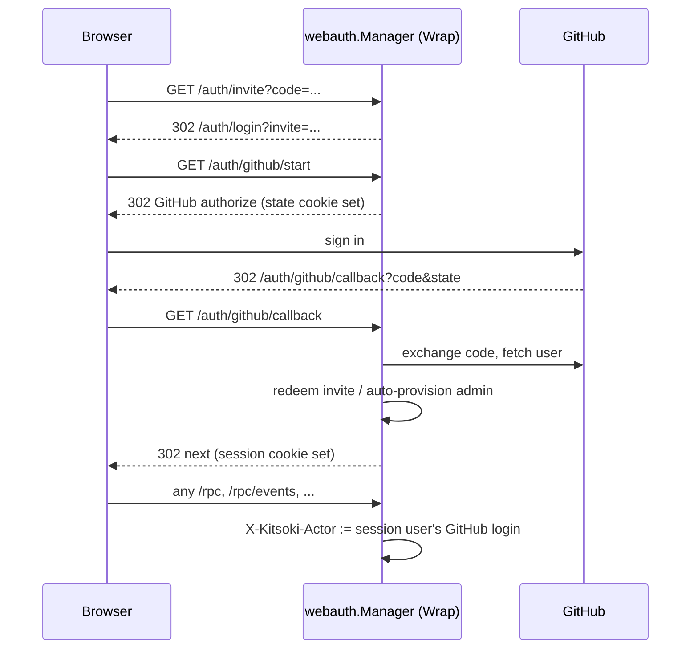

# Web login — invitation-only GitHub sign-in

`kitsoki web` / `kitsoki daemon` serve their HTTP surface with no
authentication by default: the historical posture assumes a trusted
localhost. `internal/webauth` adds a login gate for the case where the
server is deployed somewhere reachable beyond that — only people the
operator has explicitly invited can get in.

## Model

There is no identity provider of kitsoki's own and no password. An
operator mints a one-time invite link tied to a person; opening it and
completing either GitHub's callback-based web flow or Device Flow associates
that person's GitHub account with the invite and starts a browser session. From then on
they sign in with GitHub directly — the invite is consumed on first use.
Admins are defined locally: either `--admin` on the invite, or a GitHub
login listed in `auth.admins` (no invite needed for those). The
admin/user role is recorded and reported (`GET /auth/me`); nothing is
gated by role yet.

## When the gate is on

`auth.mode` in `.kitsoki.yaml` is `off` | `required` | `auto` (default
`auto`). Auto collapses against the listen address
(`webauth.IsLoopbackAddr`, `internal/webauth/addr.go`): a loopback
`--addr` (the `127.0.0.1:7777` default) stays open with no login; any
other bind requires it. `required` with no GitHub App client ID configured—or
with neither an explicitly selected Device Flow nor a web-flow secret—
fails the server at startup rather than serving open or silently
unusable — see `buildWebAuth` in `cmd/kitsoki/web_auth.go`.

```yaml
# .kitsoki.yaml (safe to check in — no secret here)
auth:
  mode: auto                              # off | required | auto
  public_url: https://kitsoki.example.com # anchors redirect_uri + invite links
  admins: [your-github-login]
  session_ttl: 720h                       # default 30 days
  github:
    client_id: <GitHub App client id>
    device_flow: true                    # no callback or client secret
```

For callback-based web flow instead, omit `device_flow` and add the secret in
the gitignored local config:

```yaml
# .kitsoki.local.yaml (gitignored — the secret lives here)
auth:
  github:
    client_secret: "${KITSOKI_GH_CLIENT_SECRET}"
```

Register `<public_url>/auth/github/callback` on the GitHub App when using the
web flow. When using Device Flow, enable that feature in the GitHub App settings;
no callback or client secret is used. Both flows fetch the GitHub profile once,
discard the access token, and then share the same invite/session path.

## Inviting someone

```
kitsoki web invite "Ana"            # role: user
kitsoki web invite "Bob" --admin    # role: admin
kitsoki web invite --list           # see pending/redeemed invites
```

This prints a one-time link (`<public_url>/auth/invite?code=...`) the
operator shares out of band (chat, email — kitsoki sends nothing itself).
The command opens the same `sessions.db` the server uses (WAL makes that
safe alongside a running daemon) and creates it if the server has never
run.

## Request flow



With `auth.github.device_flow: true`, the login button instead creates a
short-lived device authorization. Kitsoki keeps the GitHub `device_code`
server-side, shows only the one-time `user_code`, and polls GitHub from the
server. The browser poll requires both an opaque HttpOnly attempt cookie and a
separate page-bound token. Once GitHub returns an access token, the flow rejoins
the same `fetch user → redeem invite → create session` path shown above. Pending
attempts are memory-only, expiry-bounded, and capped; a restart only requires
the person to begin login again.

`Manager.Wrap` (`internal/runstatus/server/server.go`'s `Handler()`,
gated by `WithAuth`) sits over the whole mux and exempts only `/auth/*`.
An authenticated request has its `X-Kitsoki-Actor` header **overwritten**
with the session user's GitHub login before reaching the RPC dispatch —
reusing the identity seam `resolveActor` already read (`server.go:121`),
and neutralizing any client-supplied spoof of that header. An
unauthenticated page load (`Accept: text/html`) is redirected to
`/auth/login?next=...`; everything else — the SPA's `/rpc` fetches and
its `EventSource` streams — gets a `401` JSON body so clients fail fast.

The frontend (`tools/runstatus/src/transport/transport.ts`) bounces the
tab to `/auth/login` on a `401` from `call()`/`postEventStream()`, and
probes `GET /auth/me` when an `EventSource` errors (the only way to infer
a `401` there, since `EventSource` hides HTTP status) before deciding
whether to reconnect or redirect.

## Service tokens (headless clients)

A headless same-host service (a colony runner driving the Agent Runner
RPC, a cron driver) cannot complete a browser login. `auth.service_tokens`
maps a service name to the environment variable **name** holding its
bearer token:

```yaml
# .kitsoki.yaml (safe to check in — names only, never values)
auth:
  service_tokens:
    colony: KITSOKI_COLONY_TOKEN
```

The value is resolved at server startup (typically from
`~/.config/kitsoki/daemon.env`); an unset env var disables that service
with a warning, and a token shorter than 16 characters is a hard startup
error (`openssl rand -hex 32` makes a good one). A request presenting
`Authorization: Bearer <token>` that matches a resolved token — compared
in constant time via sha256 digests — passes `Manager.Wrap` and the
forward-auth `/auth/check` seam with `X-Kitsoki-Actor: service:<name>`.
No session is created; every request re-presents the token.

## Storage

Three SQLite tables (`webauth_users`, `webauth_invites`,
`webauth_sessions`) live in the same `sessions.db` the session store
already uses, following its idempotent-DDL convention
(`internal/webauth/store.go`). Invite codes and session cookies are
32-byte random values; only their sha256 is ever persisted — the
plaintext exists solely in the printed invite link and the cookie itself.

## Non-goals (for now)

- **No role enforcement.** admin/user is recorded and reported, not
  gated. Add checks in `Manager.Wrap` or per-route when a feature needs
  them.
- **No email delivery.** Invite links are printed for the operator to
  share manually.
- **No GitHub token retained.** The GitHub access token is used once
  (`FetchUser`) and discarded.
