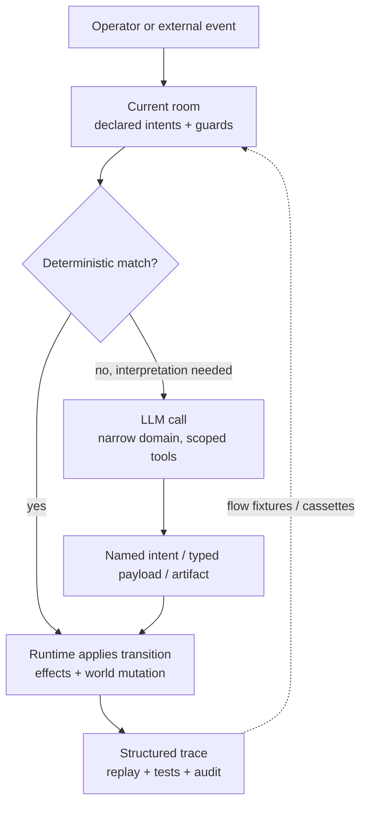

# Evaluate Kitsoki

If you are deciding whether Kitsoki is worth adopting, start here. Kitsoki is
not a better chat box, a faster coding agent, or a fancier graph library. It
answers a narrower question those tools don't: **who is in charge of the
workflow, and can you prove what it did after the fact?**

Most agent systems put the model in the driver's seat: it holds the plan,
picks tools, decides when to ask a human, mutates state through tool calls,
and leaves you with a transcript. Kitsoki inverts that. An author-declared
state machine — the **story graph** — holds the plan, and the model is called
only at named, bounded decision points, with the whole run replayable from a
recording at zero LLM cost.

## The case in one page

Kitsoki's advantage is control inversion:

- **The workflow is explicit.** Rooms, intents, guards, transitions, and effects
  live in YAML. A reviewer can inspect the process without reverse-engineering a
  prompt.
- **The model is not the dispatcher.** Deterministic turns can route without a
  model call; ambiguous turns call a model only to resolve one declared choice.
- **State belongs to the runtime.** The model returns an intent, typed payload,
  or artifact. It does not directly decide the next room or silently rewrite the
  world.
- **Host calls are contracts.** The runtime can reject malformed model output,
  nudge the model, retry inside the same bounded call, and record the whole arc.
- **Every important act is replayable.** Flow fixtures and host cassettes replay
  whole conversations with no live LLM cost, so demos and tests exercise the same
  machinery.

The result is not "the agent is smarter." The result is that fewer things need
to be agent judgment in the first place.

On a typical kitsoki story, roughly 78% of recorded turns route without a
model call at all — the deterministic tiers (exact match, synonym, template)
resolve the turn and the model is reserved for genuine interpretation. That
number, and the mechanism behind it, is in
[Concept §6](architecture/concept.md#6-what-this-buys).

## What to watch first

If you want the shortest visual path, use the [Proof path](/proof.html). These
are the demos it leads with:

1. **Agent action transcripts.** Watch the runtime reject a model submission,
   inject a nudge, and accept the corrected result. That is the control boundary
   a generic coding agent cannot provide by itself.
2. **Trace introspection.** Look for the turn that routes directly with no agent
   call. That proves the model is a callee, not the universal dispatcher.
3. **Operator ask.** A live agent question parks the run and blocks until the
   operator answers. No silent default, no guessed consent.
4. **Meta mode.** A running story can explain and edit its own YAML, then
   hot-reload the changed behavior while preserving the trace.
5. **Bug-fix case studies.** The most valuable proof is a real repo run:
   reproduce, patch, test, review, validate, and close out as a deterministic
   graph.

The product-site videos are generated from deterministic feature fixtures.
Some are recorded from real LLM runs and then replayed from cassettes; others
are synthetic no-LLM fixtures. In both cases, the published render does not ask
a live model to improvise.

## vs. coding agents

Claude Code, Codex, and other agentic coding CLIs put the model on top: it
reads the repo, decides what to try, picks its own tool calls, and decides
when it's done. That's the right shape for open-ended, one-off exploration —
"why is this test flaky," "draft a migration" — and kitsoki does not try to
replace it. kitsoki can run one of these agents *inside* a room as a bounded
worker (a `host.agent.task` call with a fixed toolset and a defined return
shape), with the workflow's checkpoints, gates, and audit trail living outside
the model rather than inside its reasoning loop.

| Tool | Primary job | Who holds the plan | Replay without live LLM spend | Where kitsoki differs |
|---|---|---|---|---|
| Claude Code, Codex, and similar agentic coding CLIs | Open-ended implementation work in a repo: read, plan, edit, run commands, decide next steps. | The model — it picks tools, arguments, and ordering turn by turn. | Not the core product promise; a session is a conversation, not a fixture built for byte-identical replay. | kitsoki wraps a coding agent as a bounded worker inside a room, with the workflow's gates, host contracts, and audit trail kept outside the model. |
| [OpenClaw](https://openclaw.ai/) | Personal/team assistant across chat apps, integrations, memory, and a controlled machine. | The assistant loop. | Not the core product promise. | kitsoki is narrower but more falsifiable: it proves one declared workflow, not a general assistant outcome. |
| [OpenCode](https://opencode.ai/) | Open-source coding agent for terminal, IDE, and desktop sessions. | The coding-agent loop. | Not the core product promise. | kitsoki can wrap coding agents as bounded workers inside a deterministic process. |
| [Devin](https://docs.devin.ai/get-started/devin-intro) | Autonomous software engineer for tickets, bugs, features, and parallel agent fleets. | Devin's task plan and execution loop. | Not the core product promise. | kitsoki separates process from worker: reproduce, propose, implement, test, review, validate as named rooms with typed handoffs. |
| [GitHub Copilot cloud agent](https://docs.github.com/en/copilot/concepts/agents/cloud-agent/about-cloud-agent) | GitHub-native issue-to-branch-to-PR automation. | The Copilot cloud coding session, scoped by repo and org settings. | GitHub logs and commits are reviewable; conversational-workflow replay isn't the core abstraction. | kitsoki can drive a workflow across surfaces beyond GitHub and replay the same state machine as a test fixture. |

## vs. orchestration frameworks

A code-first orchestrator like LangGraph, or a durable execution engine
like Temporal, can absolutely be wired so the LLM is a bounded node rather
than the planner — that's the right comparison, more so than a no-code
automation tool. The difference is what's *enforced* rather than merely
*possible*. In a code-first graph, a node is arbitrary code: nothing stops
it from also doing I/O, mutating state directly, or picking its own next
step, so "the LLM only translates" is a convention the team polices, not
something the framework rejects. In kitsoki, effects are queued and applied
by the runtime only after a pure transition function returns, so a room
can't collapse back into "one fat node that decides, calls tools, and
writes state" — the loader and the turn loop reject that shape outright.

| Alternative | What it's good at | Where kitsoki is different |
|---|---|---|
| LangGraph-style orchestration | Programmatic agent graphs; full control over nodes and edges in code. | kitsoki makes the operator-facing story, the UI, the replay fixture, and the docs-driven demo all come from one declarative source, and host effects can't be invoked mid-transition — only after it returns. |
| Temporal or a job workflow engine | Durable, event-sourced background execution at scale. | kitsoki is built for conversational state: free-text intent routing, a turn-based entrance, mid-flight clarification, and human handoff inside the workflow rather than around it. |
| Hand-written scripts | Deterministic automation once the shape is known. | kitsoki keeps a forgiving conversational entrance while progressively moving repeated judgments into deterministic rooms and host calls — see [progressive determinism](architecture/concept.md#4-progressive-determinism). |

The moat is not a single feature. It is the combination: one story definition
drives the runtime, web UI, TUI, MCP surface, traces, demos, and tests. Every
new story compounds the same substrate instead of creating another bespoke
agent prompt.

## The same request, three ways

Take a mid-conversation utterance that names two things at once: *"actually
scale the frontend to three and then ship it."*

- **A coding/planning agent** decides on its own that this means two tool
  calls, in some order, with some arguments. If the run goes wrong, the
  failure is somewhere in that reasoning — there's no single edge to point
  at, only a transcript to re-read.
- **A no-code workflow tool with an LLM step** classifies the message to a
  single string and a downstream branch matches on it. A compound request
  like this one doesn't fit a single classification step; you'd need a
  second pipeline run wired up by hand, with session state stitched
  together outside the tool.
- **kitsoki** maps the utterance onto a named, declared intent (say,
  `scale{service, replicas}`), applies its transition and effects, and — if
  the room declares a follow-on path — hands control to the next intent in
  the same turn. Each hop is a named, recorded decision. If `scale` weren't
  a valid intent in that room, the trace shows the model was asked and
  which fallback fired, which is itself the signal that the intent
  vocabulary needs to widen.

## What kitsoki does not try to be

Honest non-goals, because they're where a skeptical reader's next question
usually lands:

- **Not a coding-agent replacement.** kitsoki has no built-in code-editing
  intelligence. It's a substrate that can call a coding agent as a bounded
  worker — it doesn't compete with one on raw implementation skill.
- **Not a general-purpose workflow/orchestration engine.** kitsoki's graph
  is shaped for *conversation* — typed turns, a free-text entrance,
  off-path escapes, mid-flight clarification — not the data-pipeline
  shapes Temporal, Airflow, or Step Functions are built around. If the
  job is "run this DAG on a schedule with no human turn in the middle,"
  use one of those instead.
- **Not a chat product.** The model has no latitude to invent actions
  outside the intent alphabet a room declares. If what you want is an
  open-ended assistant with no fixed workflow, kitsoki is the wrong tool.
- **Not finished software.** kitsoki is an early-stage project under
  active development. The architectural commitment above — separate
  interpretive decisions from deterministic execution — is stable; the
  surface area around it is still moving. See
  [Concept §7](architecture/concept.md#7-what-kitsoki-is-not).
- **Not always worth the structure.** kitsoki does not remove model risk;
  it gives model risk a smaller surface area and a better paper trail. If
  a task is genuinely a one-off, open-ended, creative conversation, a
  plain chat agent may be enough. kitsoki earns its keep when the workflow
  repeats, has expensive failure modes, needs operator handoff, or has to
  be tested and defended after the run.

## The adoption path

Start with a workflow that already needs human judgment: triage a bug, collect a
deployment decision, draft a proposal, run a review, or coordinate a multi-step
repo change. Write the loose process as a story. Let the LLM handle the parts
that still need interpretation. Then read the trace and move recurring choices
out of prompt prose and into rooms, intents, guards, and host calls.

That loop is progressive determinism: use the model to get moving, then make the
stable parts boring, auditable, and cheap.

## Check the claims yourself

- **[Concept](architecture/concept.md)** — the architecture behind control
  inversion and progressive determinism.
- **[Proof path](/proof.html)** — the curated sequence of recorded demos.
- **[Demos and features](/features/)** — the full catalog.
- **[Decision-first trace detail](/features/trace-introspection.html)** —
  a recorded demo of a turn routing with no model call, and every decision
  after it inspectable in the trace.
- **[Bug-fix case study](case-studies/bug-fix.md)** — a real repo workflow
  turned into a seven-room pipeline: reproduce, propose, implement, test,
  review, validate.
- **[Bugfix bake-off](case-studies/bugfix-bakeoff.md)** — an early,
  measured comparison of the structured pipeline against an unbounded
  agent prompt on the same bugs.
- **[Getting started](getting-started.md)** — install the binary and onboard
  your own repository.
