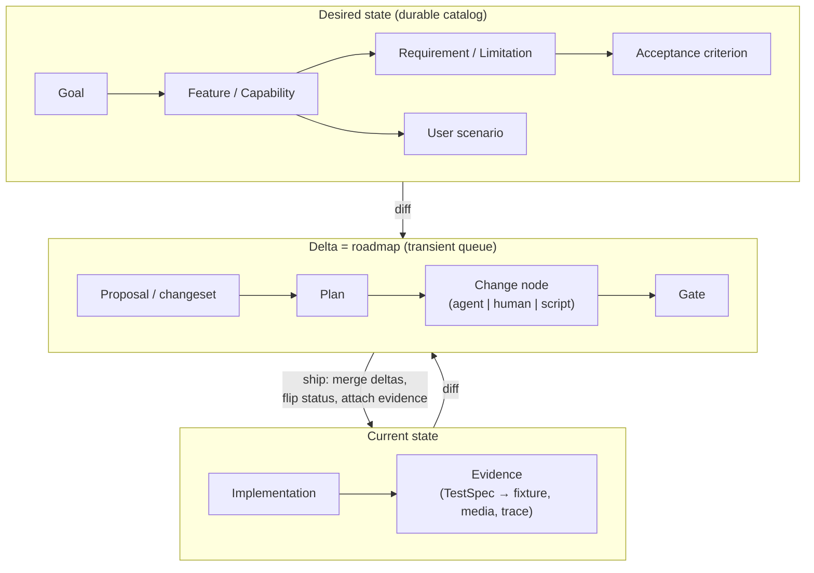

# Epic: Project object graph — typed documents, delta change management, roadmap as a state delta

**Status:** Draft v1. No slices implemented. One child already exists as a
draft ([`lifecycle-taxonomy.md`](lifecycle-taxonomy.md), re-parented here);
the rest are sketched below but not cut.
**Kind:**   epic
**Slices:** 6 (0/6 shipped)

## Why

Kitsoki holds at least six representations of "what the product is, what work
remains, and how change happens" — and none of them can see the others:

| Loose end | What it is | Status |
|---|---|---|
| [`lifecycle-taxonomy.md`](lifecycle-taxonomy.md) | Feature / Proposal / Plan / TestSpec as schema-pinned YAML records + catalog lint | Draft, nothing implemented |
| [`decomposition-graph.md`](../architecture/decomposition-graph.md) + `schemas/change-node.schema.json` | The unified change-node contract and the two-graph model (acyclic `depends_on` DAG + cyclic process state machine + `goal_ref` traceability) | **Shipped**, three consumers |
| [`roadmap-portfolio-work.md`](roadmap-portfolio-work.md) | The `goal / initiative / wall / epic / change / task / decision / gate` work taxonomy + `roadmap/v1` manifest | Draft (child of [`human-action-workflows.md`](human-action-workflows.md)) |
| [`human-work-decomposition.md`](human-work-decomposition.md) | The `executor: agent \| human \| script` dimension on briefs | Draft |
| [`features/*.yaml`](../../features/AGENTS.md) + [`docs/site/`](../site/README.md) | The shipped machine-readable capability catalog that generates the promo site, tours, demos, and help docs | **Shipped**, disconnected from all of the above |
| `/goal` spine (`.agents/skills/goal/goal.py`) | `goal → wall → change → gate → integration commit → trace` traceability with a deterministic ledger | Shipped skill |

The chain *feature → requirement → proposal → plan → task → test spec →
evidence* cannot be walked by any tool, story, or lint. The roadmap is not a
computable object anywhere — it is prose plus whatever the operator holds in
their head. The product site's feature catalog knows nothing about acceptance
criteria, test evidence, or what's still missing. Three follow-on proposals
that `decomposition-graph.md` names (`workflow-unification.md`, `cia.md`,
`artifact-provenance.md`) have no home to land in.

The underlying observation: **any project — software or real-world
(human/physical/ISO-style) — has the same systemic shape.** It is a graph of
typed elements (features, requirements, limitations, integrations, behaviors,
user scenarios, implementations large and small) plus the evidence that
verifies them and the decisions that shaped them. If every element is a typed
document — a static, schema-validated record — and every relationship is a
typed edge, then:

- **Change management becomes delta operations on the graph.** "What changed,
  what does it imply, what work does it create" stops being un-recorded chat
  and becomes a recorded, replayable, lintable operation — exactly the
  [concept](../architecture/concept.md) applied to project management itself:
  interpretive steps (author a delta, judge feasibility, prioritize) are named
  `decide`/`task`/`host.human.*` calls; structural truth (schema validity,
  DAG acyclicity, coverage, merge) is deterministic engine work.
- **The roadmap is literally a delta.** Represent the *current* state of the
  product as one subgraph and the *desired* state as another; the difference
  is the work graph. Graph tools — critical path over `depends_on`, goal
  coverage, scope-disjoint ready sets (all shipped in
  `decomposition-graph.md`'s two-graph model) — evaluate and prioritize how to
  close the delta most efficiently. The shipped
  `deliver`/`fleet`/`implementation` machinery executes it; `host.human.*`
  (the human-action epic) routes the people-shaped nodes.
- **The same substrate generalizes past software.** An ISO 9001/14001
  management system is a type pack — clauses → requirements → processes →
  records/evidence — over the identical graph, with kitsoki stories automating
  the audit/CAPA/review loops that are today manual paperwork.

## What changes

Once every slice has shipped:

One **project object graph**: a catalog of typed YAML documents (nodes) with
typed references (edges), validated by pinned JSON Schemas, walkable and
lintable end-to-end. The type system is extensible GTS-style — a small core
vocabulary that domain packs *derive* from — so kitsoki-the-product,
an external customer project, and an ISO management system are all instances
of the same machinery with different type packs.



- **Nodes** ride one shared envelope (id, type pin, title, status, visibility,
  edges) — the shipped change-node contract generalized. Existing objects map
  onto it rather than being reinvented: `lifecycle-taxonomy.md`'s four objects
  are the first types; `roadmap-portfolio-work.md`'s eight levels are the work
  subtree; `features/*.yaml` becomes the capability subtree.
- **Changesets are first-class nodes**: a delta document declaring
  ADDED / MODIFIED / REMOVED / RENAMED operations against durable nodes
  (OpenSpec's shipped archive mechanic, generalized — see the
  [prior-art note](notes/lifecycle-taxonomy-prior-art.md) §2). Applying a
  changeset is deterministic (`yaml.Node` rewrite + re-lint); authoring one is
  interpretive story work. The changeset itself is the audit record.
- **Roadmap = computed view.** `kitsoki graph diff` (working name) renders the
  open delta as a prioritized work graph; the existing goal.py guarantees
  (ready set, scope-disjoint, ledgered state transitions) apply to it
  unchanged because work nodes *are* change nodes.
- **Dogfood #1 is the kitsoki capability catalog for the product site.** The
  `features/` catalog is re-typed as graph nodes (a superset schema — the
  site/tour codegen keeps working), gains edges to acceptance criteria, test
  specs, and evidence, and gains a `visibility: public | internal` field so
  one system holds both the public promo surface and the proprietary inner
  workings; site codegen filters on visibility.
- **Producers adopt, consumers unify.** The dev-story design pipeline emits
  Proposal nodes; decompose/deliver emit Plan nodes whose tasks are change
  nodes (retiring the parallel brief shapes — `lifecycle-taxonomy.md` Open
  question 2, decided here); the punch-list and goal.py read the same graph.

The first review fixture is data, not prose:
[`project-object-graph/seed-objects.yaml`](project-object-graph/seed-objects.yaml)
contains a small typed catalog mined from the current proposal backlog,
`features/operator-ask.yaml`, and `.context` strategy notes. It seeds the
feature / requirement / use-case layer with explicit typed edges and source
provenance so the graph shape can be reviewed before the loader and schemas
exist.

## Impact

- **Spans:** runtime (substrate, delta ops, lint), story (catalog authoring,
  roadmap, adoption), tui/web (site codegen, later graph views), tracing
  (changesets as decision provenance).
- **Net surface:** one new `internal/graph/` (or the proposed
  `internal/lifecycle/`, renamed) — loader, schema registry with derivation,
  catalog lint, diff/apply; a `kitsoki graph` CLI verb family; migrations of
  `features/` and `schemas/change-node.schema.json` consumers onto the shared
  envelope; type packs under a catalog root.
- **Docs on ship:** `docs/architecture/project-object-graph.md` (subsuming
  today's `decomposition-graph.md`), the capability catalog replacing
  `features/AGENTS.md`'s prose contract, `docs/features/mvp.md` deleted.

## Slices

| # | Slice | Kind | Scope (one line) | Depends on | Status | File |
|---|---|---|---|---|---|---|
| 1 | Object-graph substrate | runtime | Node envelope + type registry (GTS-style derivation) + loader + catalog lint; the four lifecycle objects as the first types | — | Draft | [`lifecycle-taxonomy.md`](lifecycle-taxonomy.md) (amend to the envelope + derivation model) |
| 2 | Changesets & delta operations | runtime | Changeset node type; deterministic apply/merge (`yaml.Node`), `kitsoki graph diff/apply`; ship-step automation | 1 | not cut | — |
| 3 | Capability catalog dogfood | story | Re-type `features/*.yaml` as graph nodes with acceptance/evidence edges + `visibility`; site/tour codegen reads the graph | 1 | not cut | — |
| 4 | Roadmap as a state delta | story | Desired-state authoring + computed roadmap view + graph prioritization; absorbs [`roadmap-portfolio-work.md`](roadmap-portfolio-work.md) | 1, 2 | Draft (as the absorbed child) | — |
| 5 | Producer/consumer adoption | story | Design pipeline emits Proposal nodes; decompose/deliver/goal.py unify on change nodes; retire parallel schemas | 1, 2 | not cut | — |
| 6 | Management-system packs (ISO) | story | An ISO 9001-shaped type pack + audit/CAPA story proving generality beyond software | 1, 2, 3 | deferred | — |

## Sequencing

```
#1 (substrate) ──▶ #2 (deltas) ──▶ #4 (roadmap) ──▶ #5 (adoption)
       └──────────▶ #3 (capability catalog, parallel after #1)
                                        #6 (ISO pack, after the dogfood proves the shape)
```

Slice 1 first — it is `lifecycle-taxonomy.md`, which already says "expected to
become an epic once the object model is agreed"; this epic is that epic, and
the amendment it needs is the shared node envelope + derivation (Shared
decisions 1–2) rather than four bespoke shapes. Slice 3 is deliberately early:
the product-site catalog is the highest-priority dogfood and needs only the
substrate, not deltas. Slice 6 ships only after slices 1–3 prove the pack
mechanism on kitsoki itself.

## Shared decisions

1. **One node envelope, not N bespoke objects.** Every node carries
   `schema:` (type pin), `id`, `title`, `status`, `visibility`, plus typed
   edge fields. The shipped change-node contract
   (`schemas/change-node.schema.json` — id / title / goal / scope /
   acceptance / depends_on) is the precedent and must remain expressible as a
   node type so goal.py, work-decomposition, and `stories/deliver` migrate
   without a flag day.
2. **GTS is the typing discipline, not a dependency.** From gears-rust's GTS
   (the **Global Type System**, `github.com/hypernetix/gts-spec`; integration
   in `gears-rust/libs/toolkit-gts/`, registry in
   `gears-rust/gears/system/types-registry/`) we borrow: schema-per-type with
   validation at registration, the **type vs. instance** distinction, and
   **derivation** — a domain type extends a base type the way a GTS chained id
   (`base.v1~derived.v1~instance`) does, so an ISO pack's `iso9001.clause`
   derives from the core `requirement` and generic lints still apply. We do
   **not** adopt the Rust crates or (in v1) the full dotted-id grammar —
   kitsoki keeps `schema: <pack>/<type>/v1` pins and kebab-case ids
   (`lifecycle-taxonomy.md` container conventions), with an `extends:` field
   in the type schema registry. Important correction to the original framing:
   GTS itself is a typed-schema system, *not* a graph or delta system — the
   edges and delta semantics are this epic's new work.
3. **Deltas are documents; applying them is deterministic.** A changeset is
   authored (interpretive, recorded) and applied (deterministic merge +
   full re-lint, exit code is the gate) — the moat split, and the same
   validation sandwich every decomposition surface already uses. Shipped
   changesets are the durable design history, replacing hand-editing of
   durable nodes.
4. **Roadmap is computed, never authored.** Desired-state nodes and open
   changesets are authored; the roadmap is a view (`graph diff` + the
   two-graph ready-set machinery). No hand-maintained roadmap file — the
   machine-checkable-docs principle from the 2026-07-04 strategic review.
5. **Visibility is a node field with field-level overrides.**
   `visibility: public | internal` (default internal); public site codegen
   hard-fails on an internal node reachable from a public edge rather than
   leaking it. This is what lets proprietary projects use one system without
   exposing inner workings.
6. **Durable/transient split is retained.** Features, requirements,
   scenarios, test specs, evidence: durable catalog. Proposals, plans,
   changesets, change nodes: transient queue, trimmed/deleted on ship with
   their outcome merged into the durable side — the existing proposal
   lifecycle, now mechanized by slice 2.
7. **Files in git are the store.** No database, no server; the graph is the
   repo. Everything stays reviewable as diffs, and parallel agents/humans
   coordinate through ordinary VCS.

## Prior art, anchors, and "why not just use X"

Full cited survey (two adversarially-verified research passes + gap-fill):
[`../competitive-analysis/project-object-graph-research.md`](../competitive-analysis/project-object-graph-research.md).
The design anchors, ranked:

1. **OpenSpec** — the closest working precedent for the whole shape: durable
   current-state specs + transient delta change folders
   (ADDED/MODIFIED/REMOVED) archived into the source of truth. Cite the
   mechanism; its delta vocabulary is *not* a documented closed set.
2. **Backstage software catalog** — production-proven YAML node/edge
   mechanics (`apiVersion/kind` envelope, per-kind JSON Schemas, typed
   entity-reference edges) and, critically, **authored facts vs. computed
   relations kept separate** — external validation of Shared decision 4
   (roadmap is computed, never authored).
3. **eQMS drift-delta loop (Drata/Vanta)** — the live commercial
   instantiation of roadmap-as-delta: controls as shared nodes mapped
   many-to-many to 30+ frameworks, machine-populated evidence edges,
   continuous desired-vs-observed drift detection. What they don't capture is
   *why* a control was scoped in/out — the interpretive decision.
4. **XTDB bitemporal facts** — the citable audit substrate: as-at
   reconstruction of the whole graph, retroactive correction without
   destroying provenance (what auditors and CAPA loops require).
5. **Digital-thread literature** (Hedberg et al. 2020, peer-reviewed, NIST
   lineage) — the generality claim beyond software: typed-edge graph
   federation cut cross-domain traceability from hours to seconds; PLM's
   ad-hoc hard-coded links are the documented failure mode a typed edge
   schema fixes (independently echoed by 2025 MBSE/openCAESAR-lineage work).

The competitive claim to hold: adversarial search across trackers, RM suites,
eQMS, PLM, and spec-as-code tools found **no system that records interpretive
decision provenance as first-class graph data** (existing systems record
execution provenance and artifact state only), and no general
roadmap-as-state-delta (nearest neighbors — Drata/Vanta drift, Jama coverage
gaps — are scoped to compliance/trace coverage). Those two capabilities,
which fall out of the kitsoki moat rather than being features to build, are
what this epic can own; per-tool rebuttals live in the research doc §4.

## Cross-cutting open questions

1. **Re-parent `roadmap-portfolio-work.md`?** It is currently slice 4 of
   [`human-action-workflows.md`](human-action-workflows.md). The taxonomy and
   manifest belong here (slice 4); the `host.human.*` execution belongs there.
   *Lean: re-parent the taxonomy/manifest here, leave human-action-workflows
   owning the runtime verbs; needs Brad's call since it reshapes a second
   epic.*
2. **Catalog root** — grow `docs/features/` + `docs/proposals/` in place, or
   a single graph root (e.g. `catalog/` or `.kitsoki/graph/`) with the
   existing dirs as views? *Lean: keep existing homes in v1
   (lifecycle-taxonomy Open question 1); revisit when a second project
   (external target or ISO pack) needs a self-contained catalog.*
3. **How far does the `features/` superset schema bend?** The site/tour
   codegen and `make features-check` invariants (promo⇒demo, posterStep,
   docs-allowlist) must keep passing during slice 3 — superset-and-migrate,
   or adapter codegen from graph nodes to today's shape? *Lean: adapter
   first (zero risk to the shipped site pipeline), collapse later.*
4. **Full GTS id grammar later?** If external interop (gears, other GTS
   consumers) becomes real, dotted globally-unique ids and the `~` chain
   could replace pack-local kebab ids. *Lean: design the id fields so a
   later mechanical rewrite is possible; do not pay the ergonomics cost
   now.*

## Non-goals

- **Not a Jira/Linear replacement UI.** v1 has no general project-management
  web surface; the graph is files + lint + computed views. (A graph view in
  `kitsoki web` is a natural follow-on.)
- **Not adopting gears-rust code.** GTS is a design donor only.
- **Not a runtime datastore.** No server, no DB; execution state stays in
  goal.py-style ledgers and traces, not in durable nodes (the
  no-pass/fail-in-files rule from `lifecycle-taxonomy.md`).
- **No mass migration** of the ~30 existing markdown proposals or of live
  goal.py ledgers; wrapper/adapter first, new-work-first.
- **Not replacing flow fixtures, cassettes, or the trace format** — those are
  execution artifacts; the graph sits upstream and points at them as
  evidence.
- **ISO packs are a proof of generality, not a compliance product** in this
  epic; certification-grade tooling is out of scope.
