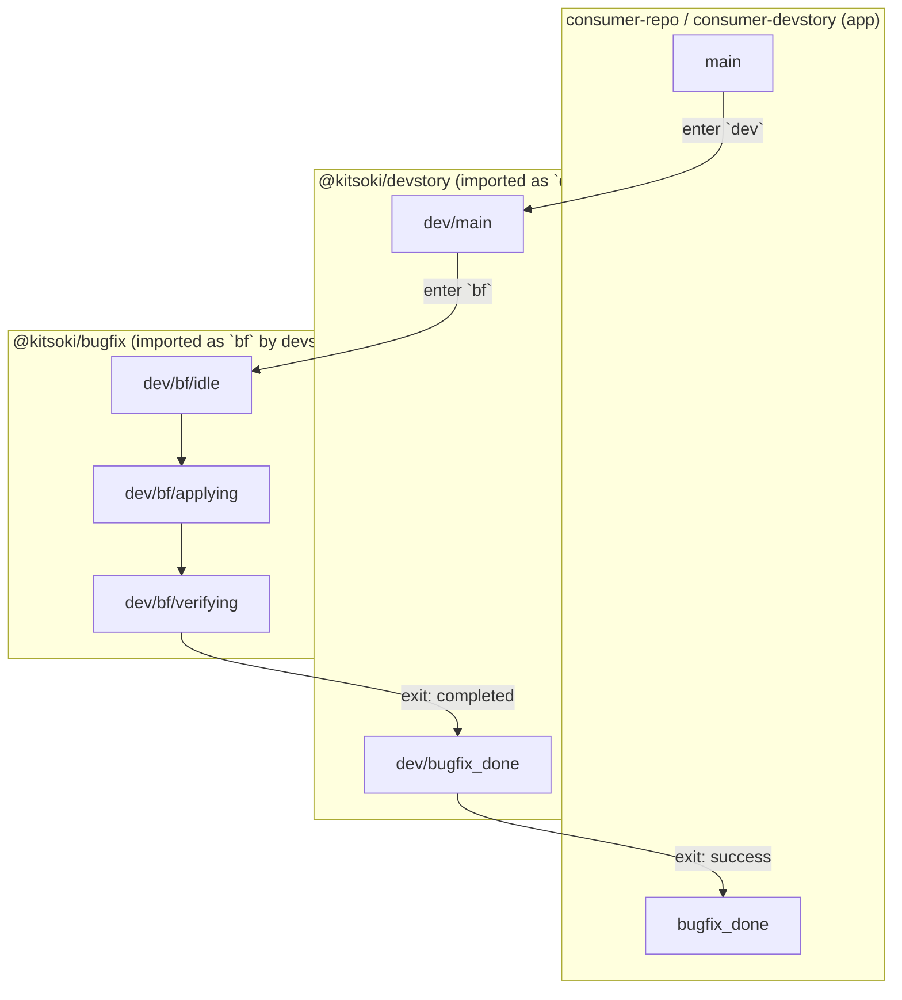
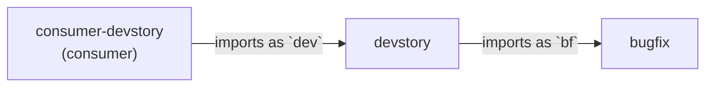

# Proposal — Story imports: namespaced composition with private worlds

**Status:** Draft v1. Authored to scope the "Phase H" sub-room
composition gap from
[`bugfix-room-proposal.md` §8](bugfix-room-proposal.md#8-sub-room-composition-last-priority).
Supersedes that sketch.

**Goal.** Make stories a real unit of reuse. A consumer app (e.g.
consumer-repo's `consumer-devstory`) should be able to import an upstream
story (e.g. kitsoki-shipped `devstory`, which itself imports `bugfix`),
add or replace rooms, and project world state across the layers
through an explicit interface. Today's `include:` is a glob-merge in
a single flat namespace; that doesn't scale past one repo.

**TL;DR.** Add an `imports:` block to `AppDef`. Each import binds an
alias, prefixes all imported states/intents under that alias, gives
the import a private `world`, and declares an explicit interface in
the form of `world_in:` (parent → child on entry) and `world_out:`
(child → parent on exit). Imports are recursive with cycle detection.
Importers can `override:` specific child states/intents to extend
without forking. `include:` keeps its current single-app meaning.

---

## 1. Why `include:` isn't enough

`internal/app/loader.go:127-194` merges every included file into one
flat `AppDef`. Concretely:

- **One namespace.** `bugfix_reproducing` and `bugfix_localizing`
  collide with anything else in the parent.
- **One world.** `world.ticket_id` declared in `bugfix.yaml` and
  `world.ticket_id` declared in `devstory.yaml` collide at load
  time (`loader.go:182-191`).
- **One host allow-list.** Hosts are unioned silently — the importer
  has no signal about which hosts an included file demands.
- **No exit contract.** `bugfix` has to know it lives inside devstory
  and hard-code transitions back to `main` or whatever the parent
  named its post-bugfix state. The two files are coupled by string.
- **No override.** A consumer that wants to swap `bugfix_applying`'s
  prompt has to fork the file.

`include:` is the right primitive for "split a big app across files in
one repo." It is the wrong primitive for "ship a reusable story across
repos and let consumers extend it."

---

## 2. Concepts



**App.** A loadable kitsoki manifest (`app.yaml` plus its `include:`,
phase templates, rooms, prompts, scripts). One app, one private world.

**Import.** A directed reference from one app to another, bound to an
alias. The imported app retains its own world; the importer projects
values across the boundary explicitly.

**Layer.** The chain `consumer-devstory → devstory → bugfix` is three
layers. Each layer is just an app importing other apps; there is no
distinct "library" type.

**Prefix path.** Every state in an imported app is addressable as
`<alias>/<state-path>`. Prefixes compose: from consumer-devstory,
bugfix's `idle` state has the absolute path `dev/bf/idle`. The
existing slash-vs-dot target resolution in
`internal/app/loader.go:444-487` already accepts slash-segmented
paths; we extend that to recognise alias-prefixed paths.

**Private world.** Each app has a `world:` schema scoped to itself.
Reading or writing world keys across an import boundary requires an
explicit projection.

**Interface.** Two declared projections per import:
- `world_in:` — parent expressions evaluated in the parent's scope and
  bound to child world keys when the child is entered.
- `world_out:` — child world keys lifted into parent world expressions
  when the child returns via a named exit.

**Exit.** A child-declared, named return point. Parent maps each exit
to one of its own states.

---

## 3. The `imports:` block (schema)

```yaml
# In any app.yaml — devstory's manifest, for example.
imports:
  bf:                                    # alias; becomes the prefix
    source: ./stories/bugfix             # path | git ref | @kitsoki/<name>
    version: ">=0.3 <0.4"                # optional, sourced apps only
    entry: idle                          # state inside the child
    exits:                               # child exit name → parent state
      completed:
        to: bugfix_completed
        set:
          last_pr_url: "{{ bf.pr_url }}" # eval'd in child scope; written to parent
      abandoned:
        to: main
      failed:
        to: bugfix_failed
        set:
          last_error: "{{ bf.fail_reason }}"
    world_in:                            # parent → child on entry
      ticket_id:      "{{ world.current_ticket }}"
      workspace_root: "{{ world.workspace_root }}"
      branch_name:    "{{ slots.branch ?? '' }}"
    hosts: inherit                       # inherit | declared
    overrides:                           # see §10
      states:
        applying:
          on_enter:
            - invoke: host.run
              with: { cmd: "{{ company.fix_command }}" }
      prompts:
        shell_repair.md: ./prompts/custom_shell_repair.md
```

Field reference:

| Field | Type | Meaning |
|---|---|---|
| `<alias>` | string | The prefix all child states are namespaced under. Must be a valid identifier; collisions across imports error. |
| `source` | string | Where the child manifest lives. See §4. |
| `version` | semver-ish | Optional. For sourced refs only; rejected for path refs. v1 just stores it for traceability — actual resolution is post-v1. |
| `entry` | string | Required. The child state the parent transitions *into* when invoking the import. Path is in the **child's** namespace, not prefixed. |
| `exits` | map | Required if the child declares any exits. Maps child exit names to parent states + optional projection effects (`world_out` lives here per-exit, because different exits carry different return values). |
| `world_in` | map | Maps child world keys → parent expressions. Evaluated in the parent's scope at entry. Child world keys must exist in the child's `world:` schema. |
| `hosts` | enum | `inherit` (default): child's host allow-list is silently unioned with the parent's. `declared`: parent must list every child host explicitly; load fails otherwise. The strict mode is for consumers who care about audit. |
| `overrides` | map | Patch-style override of specific child states / intents / prompts. See §10. |

The child app doesn't change. It declares its own `world`, its own
`exits`, and is loadable standalone. The importer never patches the
child's source.

---

## 4. Source resolution

Three forms, resolved in order:

1. **Path** (`./stories/bugfix`, `../shared/bugfix`). Relative to the
   importer's `app.yaml` directory. Resolves to a directory holding
   another `app.yaml`. Simplest case; covers consumer-repo importing
   kitsoki-shipped stories via a checked-in path or a git submodule.
2. **Repo-scoped reference** (`@kitsoki/devstory`). Resolves against a
   well-known directory inside the kitsoki module
   (`stories/<name>/app.yaml`). consumer-repo references shipped stories
   this way without knowing the on-disk layout. Cleanly addresses the
   "I want to bring devstory and bugfix into this repo and consume
   them from another repo" goal.
3. **Absolute path.** Escape hatch for tests. Discouraged in checked-in
   manifests.

Git/URL fetching is **out of scope for v1.** Consumers vendor or
submodule the upstream repo. Add a registry later if there's demand.

`@kitsoki/<name>` resolution rule: the loader walks up from the
importer's path looking for a `go.mod` (or a `.kitsoki-root` marker)
and resolves `@kitsoki/<name>` to `<root>/stories/<name>/app.yaml`.
This lets consumer-repo embed kitsoki via Go modules and address
shipped stories without knowing the vendor path.

---

## 5. Private worlds

**Rule.** Each app's `world:` schema is private. World keys declared in
the child are not visible to the parent under any name, and vice
versa, except through the declared `world_in:` / `world_out:`
projections.

**Why closed-by-default.** The whole point of imports vs. include is
encapsulation. If a parent can poke at `bf.cycle__phase_3__refine`
because that key happens to exist in the child's world schema, we've
recreated the include's coupling problem with extra steps.

**Reading parent world from child.** Forbidden. If the child needs
ticket context, the parent declares it in `world_in:` and the child
reads its own local `world.ticket_id`. This means the child can be
loaded standalone for tests — `world.ticket_id` has a default and is
populated either by `world_override:` in a flow test or by the
real parent at runtime.

**Writing parent world from child.** Only via `exits.<name>.set:` —
the projection runs in the child's scope (so `{{ bf.pr_url }}`
refers to the child's world) and the LHS names the parent's world
key. The set fires as part of the exit transition's effects, atomic
with the state change.

**Sub-imports.** The parent's child world is itself private vis-à-vis
that child's children. devstory's `world.current_ticket` is invisible
to bugfix unless devstory declares `world_in.ticket_id: "{{ world.current_ticket }}"`
on its `bf:` import. The boundary doesn't leak through layers.

```mermaid
flowchart LR
    pworld["parent.world<br/>current_ticket = TKT-42"]
    cworld["child.world<br/>ticket_id = ?"]
    gcworld["grandchild.world<br/>ticket = ?"]
    pworld -->|world_in.ticket_id:<br/>'{{ world.current_ticket }}'| cworld
    cworld -->|world_in.ticket:<br/>'{{ world.ticket_id }}'| gcworld
    style pworld fill:#e8f0ff
    style cworld fill:#fff0e8
    style gcworld fill:#f0ffe8
```

---

## 6. Intent scoping

Intents follow the same encapsulation as world keys.

- **Child intents stay child-scoped.** Bugfix's `apply_fix` is only an
  intent inside states under `bf/...`. Parent rooms cannot bind to it
  by name.
- **Parent intents do not leak into child.** Devstory's `go_main`
  is invisible inside bugfix unless re-exported (next bullet). This
  prevents "the parent named a global intent that accidentally
  shadows my local intent."
- **Re-export via `intents:` on the import.** A parent that wants
  bugfix to honor the global "go to main" intent declares:
  ```yaml
  imports:
    bf:
      ...
      intents:
        export:  [go_main, go_inbox]     # parent → child
        import:  [reproduce_bug]         # child → parent (rare; see §10)
  ```
  Re-exports are referenced inside the child by their *child-side
  name* (which is the same name unless aliased). The child author
  controls which of its intents can be re-exported by listing them in
  the child manifest's `exports.intents:` block; the parent picks
  from that set.

Why this matters: the parent's `go_main` and the child's `go_main`
might both exist but mean different things in different layers. Wiring
them through a declared re-export — not an automatic global merge —
keeps the intent of each layer intact.

---

## 7. Exits — the child side

The imported app declares its own exit contract:

```yaml
# stories/bugfix/app.yaml
app: { id: bugfix, version: 0.3.0 }
world:
  ticket_id:      { type: string, required: true }
  workspace_root: { type: string, required: true }
  pr_url:         { type: string, default: "" }
  fail_reason:    { type: string, default: "" }

exits:
  completed:
    description: "Fix applied, verified, PR opened."
    requires: [pr_url]               # world keys that must be set at exit
  abandoned:
    description: "User bailed; no fix shipped."
  failed:
    description: "Fix attempt exhausted retries."
    requires: [fail_reason]

states:
  applying:
    on:
      open_pr:
        - target: "@exit:completed"   # special target syntax
          effects:
            - set: { pr_url: "{{ slots.url }}" }
  giving_up:
    on:
      confirm_abandon:
        - target: "@exit:abandoned"
```

`@exit:<name>` is a new transition target form. At load time, the
loader checks that every `@exit:X` reference matches a declared
exit, and that every `requires:` world key is provably set before
the exit (best-effort static check; runtime guard backs it up).

When invoked standalone, exits become terminal states named
`@exit:<name>`. When imported, the parent's `exits.<name>` mapping
rewrites them to parent-owned targets.

The `requires:` constraint matters: it's the child's way of saying
"if I exit via `completed`, `pr_url` is meaningful." The parent's
`world_out` projection can safely reference `{{ bf.pr_url }}` in
the `completed` exit branch but not in `abandoned`.

---

## 8. State addressing across the boundary

Inside the importer, child states are addressable as
`<alias>/<state-path>`. Transitions in the parent can target:

| Target | Meaning |
|---|---|
| `bf` | Equivalent to `bf/<entry>` — the import's declared entry state. The canonical "invoke the child" form. |
| `bf/idle` | Reach into the child at a specific state. **Discouraged** — couples parent to child internals. v1 allows it but the linter warns. |
| `main` | Parent's own state. |
| `@exit:completed` | Parent's own exit (if the parent is itself imported). |

**Transitions from inside the child to outside are forbidden.** The
child author cannot write `target: ../main` and reach into the parent.
Cross-boundary returns happen via `@exit:` and the parent's mapping —
nothing else. The loader rejects child-to-parent targets at validation
time (the path resolves above the child's root in the relative-ref
resolver, which is already a load-time error).

---

## 9. Hosts

Each app declares its own `hosts:` allow-list. On import:

- **`hosts: inherit` (default).** Child's hosts are silently unioned
  into the parent's effective allow-list. Convenient; matches today's
  `include:` behavior for the same-repo case.
- **`hosts: declared`.** Parent must list every child host in its own
  `hosts:` block. The loader cross-checks and fails loudly if any are
  missing. Use this in audited consumers (the consumer-repo case where
  the security team wants the consumer manifest to be the
  authoritative host list).

Either way, the *runtime* host registry is keyed by handler name, not
by app. There's no per-app host sandboxing in v1 — that's a separate
proposal if anyone needs it. Imports don't grant new capability, they
just compose configuration.

---

## 10. Override (extension without forking)

The consumer-repo motivating case: `consumer-devstory` imports kitsoki's
`devstory` and wants to swap out the deploy room (because consumer-repo's
deploys go through a different pipeline) and override a prompt. The
import declares:

```yaml
imports:
  dev:
    source: "@kitsoki/devstory"
    overrides:
      states:
        deploy:                              # replaces dev/deploy entirely
          view: "Custom deploy room: {{ world.deploy_env }}"
          on:
            trigger_deploy:
              - target: dev/deploy_running
                effects:
                  - invoke: host.consumer.deploy
                    with: { env: "{{ slots.environment }}" }
      intents:
        trigger_deploy:                      # narrows the intent definition
          slots:
            environment:
              values: [dev, staging, prod, isolated]
      prompts:
        shell_repair.md: ./prompts/custom_shell_repair.md
```

**Semantics.**

- `overrides.states.<name>:` **replaces** the child's state of that
  name. Full replacement, not deep merge — the override is a complete
  redefinition. This is loud and predictable; deep-merge of nested
  transitions gets messy fast.
- `overrides.intents.<name>:` **replaces** the child's intent
  definition (slots, examples, etc.). Useful for narrowing enum
  values or adding examples.
- `overrides.prompts.<rel-path>:` **replaces** the file the child
  reads at `<rel-path>` (relative to child's app dir). Loaded from
  the parent's app dir.
- Adding *new* states/intents that don't exist in the child is **not**
  done via `overrides:` — declare them in the parent and target them
  by the parent's path. Overrides are strictly "swap out X for Y."

**Validation.** Every `overrides.states.<name>` must match an existing
child state. Same for intents and prompts. Typo → load fails.

**Compounding overrides across layers.** If consumer-devstory overrides
`dev/deploy`, and a hypothetical fourth-layer app imports consumer-devstory,
the fourth layer sees the *already-overridden* `dev/deploy`. Overrides
are flattened bottom-up at load time.

---

## 11. Host interfaces (capability binding)

The "public default, private override" axis. Stories like `devstory`
ship with a public-friendly toolchain — public PR and ticket services,
plain `host.run` for shell — but real consumers run against private
environments with bespoke auth and internal code-host / ticket
backends. Forking the story or replacing whole states (§10) is too
heavy when the only thing changing is *which concrete handler
fulfills a known operation*.

A **host interface** is a named capability the story depends on,
declared in the manifest with a shape (operations + I/O schemas) and
a default binding. States invoke the interface
(`iface.pr_engine.open_pr`) rather than a concrete host. Importers
rebind the interface to whichever handler their environment requires.
Public stories keep working out-of-the-box; private wiring stays in
the private repo.

### 11.1 Declaring an interface

```yaml
# stories/devstory/app.yaml
host_interfaces:
  pr_engine:
    description: "Open and close pull requests against the source repo."
    operations:
      open_pr:
        input:  { branch: string, title: string, body: string }
        output: { pr_url: string }
      close_pr:
        input:  { pr_url: string }
    default: host.github.pr           # binding used when nobody overrides
  ticket_engine:
    operations:
      get_ticket:
        input:  { ticket_id: string }
        output: { title: string, body: string, assignee: string }
      add_comment:
        input:  { ticket_id: string, body: string }
    default: host.github.issues
```

States inside the story invoke operations through the interface:

```yaml
states:
  applying:
    on:
      open_pr:
        - target: "@exit:completed"
          effects:
            - invoke: iface.pr_engine.open_pr
              with:
                branch: "{{ world.branch_name }}"
                title:  "Fix {{ world.ticket_id }}"
                body:   "{{ slots.body }}"
              bind: { pr_url: result.pr_url }
            - set: { pr_url: "{{ slots.pr_url }}" }
```

`iface.<name>.<op>` is a new invocation target. At load time it's
rewritten to whichever concrete handler is bound (default or
overridden); at runtime the dispatch is identical to today's
`host.<x>.<y>` path. Stories without any `host_interfaces:` behave
exactly as today.

### 11.2 Overriding an interface from the importer

```yaml
# consumer-repo/consumer-devstory/app.yaml
imports:
  dev:
    source: "@kitsoki/devstory"
    host_bindings:
      pr_engine:     host.consumer.pr
      ticket_engine: host.consumer.tickets
```

A binding override replaces the child's default for that interface.
The interface contract (`operations:` shape) stays the child's; the
importer is only naming a different handler that satisfies it.
Bindings compose: a fourth layer importing consumer-devstory sees
`pr_engine` already bound to the consumer's handler unless it
rebinds again.

### 11.3 Contract validation

At load time the loader checks, for every interface:

- The default handler — and any override binding — is registered.
- The handler's declared input/output schema is structurally
  compatible with the interface's. Every input the interface
  promises must be accepted; every output it consumes must be
  produced. Extra fields on the handler are fine.

Mismatches fail the load with a message naming both the interface
and the offending handler. This is what makes rebinding safe across
environments: the runtime never silently calls a handler with a
different shape than the story expects.

### 11.4 Public default, private override

The motivating split:

- **`stories/devstory`** binds `pr_engine` and `ticket_engine` to
  github-flavored defaults. Someone cloning kitsoki and pointing the
  app at their personal repos gets a working flow with zero config.
- **`consumer-repo/consumer-devstory`** rebinds both interfaces to
  the consumer's own handlers, which target whatever private code
  host and ticket system the consumer runs. The kitsoki manifest
  never has to know those hosts exist; the private wiring lives
  entirely in the consumer repo.

The same shape generalizes to anything where the story's operation
is universal but the carrier is environment-specific: deploy,
notification, secrets retrieval, model gateway, log shipping.

### 11.5 Relationship to §9 and §10

- §9 `hosts:` lists are still the allow-list. An override binding
  contributes its handler to the effective host list under the same
  `inherit` / `declared` rules; a `declared` parent must list every
  rebound handler explicitly.
- §10 state/intent/prompt overrides remain the right tool when the
  *flow* changes. Host interface bindings are the right tool when
  only the *carrier* changes. A consumer that needs both uses both
  on the same import.

### 11.6 What this does not do

- Interfaces are optional. Stories without `host_interfaces:` invoke
  handlers directly, as today.
- No runtime sandboxing. The handler is still globally callable by
  name from any state — interfaces are a loader-time indirection,
  not a capability boundary. Real sandboxing is the same follow-up
  noted in §9 and §16.3.
- No registry of "well-known interfaces." Every story declares the
  shape it depends on. Stories that align on the same surface (e.g.
  both `devstory` and `bugfix` wanting a `pr_engine`) do so by
  convention; v1 has no shared interface library. See §20.6.

---

## 12. Recursive imports & cycle detection



The loader resolves imports depth-first. Each (canonical-source-path)
is loaded once and cached; if a load already-in-progress recurses
back to itself, that's a cycle and the load fails with a clear error
naming the path.

Same path imported under two different aliases is allowed (it's just
two namespaced copies — useful for, e.g., importing bugfix twice with
different `world_in` for two ticket types).

Same path imported transitively at multiple depths is also allowed.
Each layer gets its own world projection chain; the validator doesn't
need to de-dup.

---

## 13. File layout

Move canonical stories out of `testdata/` and into a new top-level
`stories/` directory:

```
kitsoki/
  stories/
    devstory/
      app.yaml
      rooms/                 # uses include: for in-app splitting
      prompts/
      README.md              # how to import, exits, world contract
    bugfix/
      app.yaml
      rooms/
      prompts/
      README.md
  testdata/
    apps/                    # smoke/test fixtures stay here
```

`stories/<name>/README.md` is mandatory for shipped stories and
documents: entry state, exits with semantics, `world_in`/`world_out`
contract, intent re-export surface, host requirements. This is the
consumer-facing interface — and the README is the place to write it
because the manifest schema doesn't carry prose.

`testdata/apps/dev-story/` becomes a thin wrapper that imports
`stories/devstory` to exercise the import machinery end-to-end.

---

## 14. Worked example — three layers

The full picture, kept tight.

### Layer 1: bugfix (shipped by kitsoki)

```yaml
# stories/bugfix/app.yaml
app: { id: bugfix, version: 0.3.0 }
hosts: [host.run, host.oracle.ask]
world:
  ticket_id:      { type: string }
  workspace_root: { type: string }
  pr_url:         { type: string, default: "" }
  fail_reason:    { type: string, default: "" }
exits:
  completed: { requires: [pr_url] }
  abandoned: {}
  failed:    { requires: [fail_reason] }
exports:
  intents: [reproduce_bug, apply_fix, verify_fix]
root: idle
states:
  idle: { ... }
  reproducing: { ... }
  applying: { ... }
  verifying:
    on:
      open_pr:
        - target: "@exit:completed"
          effects: [{ set: { pr_url: "{{ slots.url }}" } }]
```

### Layer 2: devstory (shipped by kitsoki, imports bugfix)

```yaml
# stories/devstory/app.yaml
app: { id: devstory, version: 0.5.0 }
hosts: [host.run, host.oracle.ask, host.workspace_manager.get]
world:
  current_ticket:    { type: string, default: "" }
  current_workspace: { type: string, default: "" }
  workspace_root:    { type: string, default: "" }
  last_pr_url:       { type: string, default: "" }
imports:
  bf:
    source: "@kitsoki/bugfix"
    entry: idle
    world_in:
      ticket_id:      "{{ world.current_ticket }}"
      workspace_root: "{{ world.workspace_root }}"
    exits:
      completed:
        to: pr_landed
        set: { last_pr_url: "{{ bf.pr_url }}" }
      abandoned: { to: main }
      failed:    { to: bugfix_failed }
    intents:
      export: [go_main, go_inbox]
exits:
  done: {}
states:
  main: { ... on: { go_bugfix: [{ target: bf }] } ... }
  pr_landed: { ... }
  bugfix_failed: { ... }
```

### Layer 3: consumer-devstory (lives in consumer-repo)

```yaml
# consumer-repo/consumer-devstory/app.yaml
app: { id: consumer-devstory, version: 0.1.0 }
hosts: [host.run, host.oracle.ask, host.consumer.deploy, host.workspace_manager.get]
world:
  active_ticket: { type: string, default: "" }
  deploy_env:    { type: enum, values: [dev, staging, prod, isolated] }
imports:
  dev:
    source: "@kitsoki/devstory"   # resolved against kitsoki Go module
    entry: main
    world_in:
      current_ticket: "{{ world.active_ticket }}"
    exits:
      done: { to: consumer_complete }
    hosts: declared
    host_bindings:                    # rebind the public defaults onto private hosts
      pr_engine:     host.consumer.pr
      ticket_engine: host.consumer.tickets
    overrides:
      states:
        deploy:
          view: "Custom deploy: {{ world.deploy_env }}"
          on:
            trigger_deploy:
              - target: dev/deploy_running
                effects:
                  - invoke: host.consumer.deploy
                    with: { env: "{{ slots.environment }}" }
states:
  consumer_complete: { terminal: true }
root: dev
```

**World projection trace at runtime** (consumer-devstory invokes
devstory, which invokes bugfix):

| Layer | World read by state |
|---|---|
| consumer-devstory | `world.active_ticket = "PLTFRM-42"` |
| devstory | `world.current_ticket = "PLTFRM-42"` (via consumer's `world_in`) |
| bugfix | `world.ticket_id = "PLTFRM-42"` (via devstory's `world_in`) |

On exit:

| Layer | Set on parent |
|---|---|
| bugfix → devstory `completed` | `last_pr_url = "<from bf.pr_url>"` |
| devstory → consumer-devstory `done` | nothing (no `set:`) |

---

## 15. Loader changes (concrete)

The relevant existing code:

- `internal/app/loader.go:48` — `Load(path)` is the entry point.
- `internal/app/loader.go:77-122` — `parseAndMerge` handles `include:`.
- `internal/app/loader.go:230-316` — `validateDef` runs referential
  checks against the merged tree.

New work, in order:

1. **`AppDef.Imports` field** in `internal/app/types.go`, with a
   companion `ImportDef` struct mirroring the schema in §3.
2. **Source resolver** — a small `internal/app/importsrc/` package
   that takes a `source:` string + importer dir and returns an
   absolute manifest path. Handles `./relative`, `/absolute`, and
   `@kitsoki/<name>`.
3. **Recursive loader** — `Load(path)` becomes a wrapper around
   `loadImport(path, alias="", parents=[])`. The recursive function
   loads the manifest, recurses into each `imports:` entry, returns
   a flattened tree of (alias path → AppDef + import metadata).
   Cycle detection via the `parents` stack.
4. **Namespace flattening** — after recursive load, fold child states
   into the parent's `States` map under their alias prefix
   (`bf/idle` → `def.States["bf/idle"]`). Child world schemas stay
   *unflattened* and are tracked on the import metadata, never on the
   parent's `def.World`.
5. **`@exit:` target rewriting** — when an import is folded in,
   every `@exit:<name>` reference inside the child's states is
   rewritten to the parent's mapped target. Unmapped exits become a
   load error.
6. **Override application** — before the child is namespaced, replace
   any state/intent/prompt the importer specified in `overrides:`.
   Validate that every override targets an existing child element.
7. **World projection wiring** — `world_in` becomes an `OnEnter`
   effect list synthesized on the child's entry state, evaluated in
   the parent's expression scope. `world_out` becomes additional
   effects on the exit transitions, evaluated in the child's scope
   with results written to parent world keys (the runtime's existing
   effect dispatch handles this once we tag effects with a scope
   marker — see §16 open question).
8. **Intent re-export** — `intents.export` on the import folds the
   named parent intents into the child's local intent table under
   their child-side names. `intents.import` does the reverse.
9. **Validator updates** — every referential check that currently
   uses `def.States` extends to recognise prefixed paths; transitions
   spanning import boundaries are rejected unless they go through
   `@exit:`.

`include:` continues to work for in-app file splitting and is
orthogonal: it operates on the *child* manifest before recursion,
exactly as it does today.

---

## 16. Open questions

1. **Expression scope tag on effects.** `world_out` effects need to
   evaluate in the child's scope but write to the parent's world.
   Today `Effect` has no scope tag. Two options: (a) add a scope
   marker to `Effect`, (b) compile `world_out` into two effects —
   one in the child that reads, one in the parent that writes,
   threaded through a one-shot binding slot. Option (a) is cleaner
   but touches every effect dispatch site; option (b) keeps the
   runtime model simple. **Lean: (b).**

2. **Versioning.** v1 stores `version:` for traceability but doesn't
   enforce. Adding actual semver resolution requires a manifest
   registry or a vendor convention. Probably worth deferring to a
   v2 once we know whether anyone outside consumer-repo consumes
   shipped stories.

3. **Cross-layer host sandboxing.** Today's host registry is global;
   any app can invoke any registered host. Should imports be able to
   *deny* the child access to specific hosts? Probably yes
   eventually; the `hosts: declared` mode is the v1 surface for that
   conversation. Real sandboxing (separate registries per import)
   is a follow-up.

4. **Hot reload.** The file watcher currently watches the root
   manifest. After this lands, we need to walk every reachable
   manifest and watch all of them. Mechanical.

5. **Trace event shape.** Trace events carry the current state path.
   With imports the path is `dev/bf/applying` — long but informative.
   Should the trace surface the import alias as a separate field for
   filtering, or is the prefixed path enough? Leaning toward the
   prefixed path being authoritative and adding a per-event
   `import_chain: [consumer-devstory, dev, bf]` for filtering.

6. **`testdata/apps/dev-story/` migration.** Move the canonical
   manifest under `stories/devstory/` and reduce the testdata copy
   to a thin importer that exercises one level of `imports:`. Or
   keep both as separate fixtures while the import machinery
   stabilizes. **Lean: keep both during phase A; collapse in phase D.**

7. **Linter for "reaching into a child."** Should the loader fail or
   just warn when the parent targets `bf/some_internal_state`
   directly instead of via `bf` (the entry)? Failing is purist;
   warning is pragmatic for migration. **Lean: warn in v1, fail in
   v2 once everyone's on the canonical pattern.**

---

## 17. Phased delivery

| Phase | Scope | Effort |
|---|---|---|
| **A. Manifest schema + source resolver** | `AppDef.Imports`, `ImportDef`, path / `@kitsoki/<name>` resolution, recursive loader skeleton with cycle detection, no projection yet. Validator rejects everything until later phases. | ~3-4 days |
| **B. Namespace flattening + `@exit:` rewriting** | Fold child states under alias prefixes; rewrite `@exit:` targets; reject cross-boundary parent-to-child-internal targets. Get a child app loading inside a parent with no world projection. | ~3-4 days |
| **C. World projection** | `world_in` synthesized as child `OnEnter` effects evaluated in parent scope; `world_out` synthesized on exit transitions evaluated in child scope. Includes the scope-tag question from §16.1. | ~1 week |
| **D. Intent scoping + re-export** | Per-app intent tables; `intents.export` / `intents.import`. Validator updates. Migration of `testdata/apps/dev-story/` to live under `stories/`. | ~1 week |
| **E. Overrides** | State / intent / prompt replacement at import time. Validator checks every override targets a real child element. | ~3-4 days |
| **F. Host interfaces** | `host_interfaces:` schema in the child, `host_bindings:` on the import, `iface.<name>.<op>` invocation target rewrite at load, structural schema compatibility check between interface and bound handler. | ~3-4 days |
| **G. Hot reload + tooling** | Watch all reachable manifests; teach `kitsoki render` and `kitsoki viz` to emit subgraphs per import; trace event `import_chain`. | ~3-4 days |
| **H. Ship `stories/devstory` and `stories/bugfix`** | Move existing testdata into the canonical layout, write the README contracts, exercise them via consumer-repo. | ~3-4 days, blocking on G |

Total: ~5-6 weeks for the full path. Phase H is the "deliverable for
consumer-repo" milestone — everything before it is engine work.

---

## 18. What this does not do

- **Does not introduce daemon mode or registries.** Imports are
  resolved at load time from the local filesystem.
- **Does not change runtime turn semantics.** A child app running
  inside a parent looks identical to the runtime; only the loader
  and validator are import-aware.
- **Does not sandbox hosts** beyond the existing allow-list. Hosts
  are still global to the process.
- **Does not version-resolve.** `version:` is metadata only in v1.
- **Does not allow child→parent target references.** The only return
  path is `@exit:` with the parent's mapping.

---

## 19. Relationship to other proposals

- Supersedes `bugfix-room-proposal.md` §8 (sub-room composition).
  That section's sketch lives on as the design seed for §3 here.
- Independent of `background-jobs-proposal.md`; imports add no
  scheduling.
- Compatible with phase templates (`internal/app/phases.go`). A
  child's phase templates expand inside the child's namespace
  before the import is folded into the parent.

---

## 20. Decision points the user should weigh in on

1. **`hosts: inherit` vs. `declared` default.** Inherit is friendlier;
   declared is auditable. Proposal picks inherit; consumer-repo might
   want declared by policy.
2. **`@exit:` syntax.** Alternative: a YAML-level `exit: name` field
   on terminal states instead of overloading `target:`. Slightly more
   typing, slightly less magic syntax.
3. **`@kitsoki/<name>` resolution.** Tying it to Go module root is
   convenient for consumer-repo (which imports kitsoki as a Go module)
   but couples the loader to module layout. Alternative: require an
   explicit `paths:` config in the consumer's manifest.
4. **Override granularity.** Whole-state replacement is loud and
   simple. Deep-merge would be more powerful but harder to reason
   about. Proposal picks whole-state; consumer-repo's real overrides
   may show whether that's sufficient.
5. **Whether to keep `include:` long-term.** Imports subsumes include
   conceptually (single-app split = no-prefix import). Cutting
   include would simplify the loader. Proposal keeps both; opinions
   welcome.
6. **Shared interface library vs. per-story declaration.** v1 has
   every story declare its own `host_interfaces:`, on the theory that
   two stories converging on the same surface (`pr_engine` here,
   `pr_engine` there) can do so by convention and the loader's
   structural check catches mismatches. A `stories/interfaces/`
   library both could import is more reusable but adds a sixth file
   type to the manifest model and another resolver path. Lean: defer
   until at least two shipped stories want the same interface.
