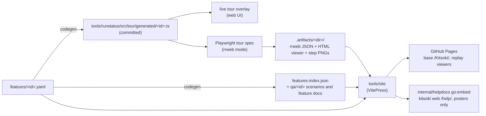

# The promo site, help docs, and feature catalog

One pipeline turns the feature catalog into every public-facing surface:

## The feature catalog (`features/`)

One YAML per feature: title/tagline/summary (promo + docs copy), the tour
steps (drive both the live overlay and the captured demo), the demo's
capture binding, optional gated ui-qa scenarios, doc links. Authoring guide:
[`features/CLAUDE.md`](../../features/CLAUDE.md). The committed manifests under
`tools/runstatus/src/tour/generated/` are code-generated — `make features`
regenerates, `make features-check` (inside `make build` and `make test`) fails
on stale output, schema violations, or spec↔feature drift. Chained into it,
`pnpm demos:lint` (`scripts/features/lint-demos.ts`) fails any legacy video
spec that bypasses the camera helper, omits its chapter sidecar, or drives a
live model — the no-LLM invariant, in CI. The chain YAML → generated TS → live
popover is closed end-to-end by the capture specs' title assertions.

## Demo Capture (`make demos`)

`scripts/record-demos.sh` captures every recordable demo at watch-speed
(`WEB_CHAT_PACE=1`), deterministically (no LLM — `--flow`/`--host-cassette`).
Incremental by per-demo content stamps (feature YAML + spec + story inputs +
binary) in `.artifacts/<dir>/.stamp`; `make demos-force` ignores them. One
rrweb demo: `make demo-feature-rrweb FEATURE=<id>`. New product-site demos
should set `demo.format: rrweb`; `make demo-feature FEATURE=<id>` is the legacy
MP4 fallback for surfaces rrweb cannot reconstruct or for explicit video-export
requests. Generated media is **never committed**. Legacy MP4 specs also emit a
`<video>.mp4.chapters.json` sidecar (one chapter per tour step) the site uses
for its clickable chapter rail.

For `demo.format: rrweb`, the capture spec writes `<videoBase>.rrweb.json` and
step screenshots; `scripts/build-rrweb-viewer.sh` then bundles
`<videoBase>.html` with Slidey when available (`KITSOKI_SLIDEY_CMD`,
`SLIDEY_HOME`, a sibling checkout, or `slidey` on PATH) or with the local
fallback viewer. The product site stages that HTML as
`/media/<feature>/demo.html` and embeds it directly, avoiding the
seek-rasterize-to-MP4 render step during iteration and CI.

Every capture context comes from one device-profile registry
(`tests/playwright/_helpers/camera.ts`): `cameraContext()` sources the viewport,
scale, and fallback `recordVideo.size`, so every capture uses the same
1600×900 canvas. When `KITSOKI_RRWEB_OUT` is set, the helper disables
Playwright video recording and the shared server helper installs rrweb into the
page before the tour begins. `demo.profiles` (default `[desktop]`) is the device-matrix
dimension — `desktop` is the only enabled profile until a demo's UI is
responsive; `mobile`/`tablet` are a per-demo opt-in, captured under
`KITSOKI_DEMO_PROFILE` with a `--<profile>` filename suffix.
Ports come from `demoAddr(basePort)`: `basePort + KITSOKI_DEMO_PORT_BASE`
(a concurrent session/worktree sets the env to claim a free range) plus the
profile's offset — so concurrent sessions and parallel profile passes never
collide on a port. (The matrix is threaded through capture + index today; the
site-side variant serving — per-profile `stage-media` outputs + `ChapteredVideo`
runtime switching on viewport — lands when the first demo actually goes
responsive, so nothing ships a shrunken-desktop "mobile" cut in the meantime.)

## Legacy Product-Tour Export (`make render-tour`)

`make render-tour` is a manual MP4 export path kept for old complete-product-tour
artifacts. It is no longer part of normal catalog demo generation or Pages CI.
Do not use it as the model for new demo work; new multi-act work should be a
Slidey deck with rrweb scenes or a feature-level rrweb replay.

`features/complete-product-tour.yaml` (`kind: product-tour`) can still describe
ordered sections for narrative/reference use, but it is not staged as a normal
product-site demo. If a rendered master export is explicitly requested,
`scripts/features/stitch-tour.mjs` can resolve legacy MP4 clip inputs, render
section cards, concatenate them with `concat-videos.sh`, and merge chapter
sidecars into one rail.

## The site (`tools/site`, VitePress)

- **Promo landing** (`src/index.md`) is a thin layer: hero + `<HeroDemo/>` +
  `<FeatureGrid/>` over the same data/components as the docs pages — zero
  duplicated content.
- **Feature pages** are dynamic routes (`src/features/[id].md` +
  `[id].paths.ts`) over the generated `features-index.json`: embedded rrweb
  replays when `demo.format: rrweb`, chaptered fallback video when a legacy MP4
  demo is the only available media, step cards, narrative markdown, doc links.
- **Slidey deck pages** are dynamic routes (`src/decks/[id].md` +
  `[id].paths.ts`) over top-level `docs/decks/*.json` files: `/decks/` renders
  title-slide gallery cards, and each deck page keeps the VitePress site chrome
  while embedding the committed self-contained viewer from
  `docs/decks/bundled/<deck-id>.html`.
- **Runtime workspace** is `.temp/site`. `tools/site` is source only; `make
  site` / `make site-dev` prepare `.temp/site`, stage generated guide docs and
  media there, and run VitePress from that writable root so Vite loader scratch
  files never land beside source files.
- **Guide docs** are an **allowlist copy** of `docs/` (`docs-manifest.json` +
  `scripts/stage-docs.mjs`): internal trees (proposals, competitive-analysis,
  skills, …) can never leak; links escaping the allowlist are rewritten to
  GitHub URLs; dead links fail the build; `scripts/check-leaks.mjs` re-checks
  the dist. Top-level `docs/decks/*.json` / `*.slidey.json` links are the
  exception: they rewrite to the local `/decks/<deck-id>.html` product-site
  page so `make site-dev` previews newly added decks before they exist on
  GitHub.
- **Localization** publishes English at `/`, Thai at `/th/`, and Japanese at
  `/ja/`. Static locale pages live under `tools/site/src/<locale>/`; generated
  feature pages read optional JSON overlays from `tools/site/i18n/<locale>/`.
  Missing fields fall back to English, so translation can move feature by
  feature. Use `stories/product-site-localization/` to draft or refresh those
  overlays, then accept only after the deterministic site build passes.
- Missing media never fails a build — pages degrade to poster + placeholder,
  so docs-only iteration works with an empty `.artifacts/`.
- The media organization contract is documented in
  [`docs/media/README.md`](../media/README.md) and checked by `make media-check`
  (also part of `make test` when Node/pnpm dependencies are installed). It
  verifies feature demo paths, staged `public/media/<feature>/` shape, and
  Slidey deck/gallery embeds without capturing media or invoking an LLM.

Targets: `make site` (build, base `/Kitsoki/`, output `.temp/site/dist`),
`make site-dev` (prepare and serve `.temp/site`; rerun after source changes),
`make site-full` (demos + site), `make site-clean`.

## Publishing

- **GitHub Pages**: `.github/workflows/site.yml` builds the binary, captures
  stale rrweb demos (two-level cache: `actions/cache` over `.artifacts` + the
  per-demo stamps), builds, deploys. Docs-only pushes deploy in minutes with 0
  captures; a cold run captures every recordable rrweb feature in the catalog.
  Capture (`Capture rrweb demos`) is `continue-on-error` so cached media from a
  prior run can ship if a flaky capture fails, but a subsequent hard gate
  (`make media-check-promo`, no `continue-on-error`) fails the build if any
  promo-grid feature ends up with no staged media at all, so silent all-stale
  ships can't happen. Any capture failures are also written to the job's step
  summary. `scripts/check-download-links.mjs` HEAD-checks download.md's
  `releases/latest/download/...` links (temporarily non-blocking until the
  v0.1.0 release assets publish — see the TODO in site.yml). Manual dispatch
  has a `rerecord` input for cache-busting existing workflow inputs. One-time
  setup: repo Settings → Pages → Source: GitHub Actions.
- **In the binary**: `make site-embed` builds the embedded variant
  (base `/help/`, posters only — never MP4s, ~5MB) into
  `internal/helpdocs/assets/`; the next `make build` embeds it and
  `kitsoki web` serves it at `/help/`. Unstaged help yields an actionable
  placeholder page, never an error (`internal/helpdocs`).

## QA (gated — real LLM, never automatic)

`make feature-qa FEATURE=<id>` is the gated legacy video-review path: it records
an MP4 export and judges it against the catalog-generated scenarios + feature spec
(`.artifacts/features/qa/<id>.{scenarios.yaml,feature.md}`) via the
[kitsoki-ui-qa](../../.agents/skills/kitsoki-ui-qa/SKILL.md) pipeline. For
rrweb-first demos, use the captured step PNGs or make an explicit rendered-video
export before running the same gated QA path. `make demo-tour-qa` is the
onboarding-tour instance of the same flow. `make tour-qa` is retained only for
manual legacy complete-product-tour exports.
