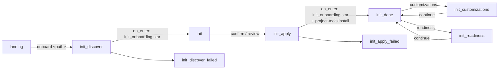
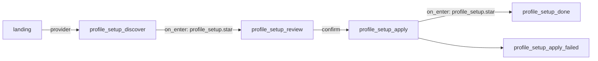

# dev-story onboarding — the `init` pipeline

The [dev-story](../../stories/dev-story/README.md) hub ships a small,
deterministic **project onboarding** pipeline that takes a target checkout from
no `.kitsoki/` files to a working Kitsoki environment. This is the dev-story-specific
mechanics; for the user-facing "how do I onboard my repo" walkthrough and the
standalone `kitsoki project-tools install` command, read
[getting-started.md](../getting-started.md) first.

The pipeline is **boring and auditable on purpose**: discovery, apply, readiness,
and customization review are native host operations called through the
story-provided Starlark adapter, the operator reviews the profile before any
write, and the whole walk is gated by no-LLM flow fixtures.

---

## Goal, postcondition, and resolution contract

Onboarding does not define success as "some files were written." The generated
`.kitsoki/project-profile.yaml` records two named outcome contracts under
`goals:`:

| Goal | Required outcome |
|---|---|
| `onboarding` | The project wrapper loads the current `@kitsoki/dev-story`; the canonical tests run; an applicable dev server has a deterministic boot/probe/teardown path; branch naming and ticket-ID policy are explicit; the ordered ticket sources are explicit; and the PR destination, base, and template policy are explicit. |
| `validation` | After onboarding, independently RED/GREEN-proved repo-history cases are frozen as a calibration `corpus-receipt.v1`; the calibration corpus is driven green without tuning on heldout evidence; and a developer can pick a configured bug ticket, work it, and open a policy-compliant PR. |

This is the canonical project-specific way to document the goal of any story or
lifecycle phase. `app.yaml` does not have a generic story-level `goal` field;
story exits and their `requires:` keys describe composition handoffs, not the
project outcome. Add a stable name under profile `goals:`, state the outcome,
declare prerequisite goals, and point every measurable postcondition at a
verification:

```yaml
goals:
  onboarding:
    statement: Make this checkout ready for deterministic dev-story work.
    postconditions:
      - id: tests-runnable
        statement: Canonical project tests run deterministically.
        gate: required
        verification: tests
        applicable: true
  validation:
    statement: Prove and improve dev-story against a stable corpus.
    requires: [onboarding]
    postconditions:
      - id: reference-corpus-frozen
        statement: Independently proved cases are frozen as a calibration receipt.
        gate: required
        verification: reference-corpus
        applicable: true

setup_plan:
  verifications:
    - id: tests
      kind: tests
      command: make test
      gate: required
    - id: reference-corpus
      kind: corpus
      command: ./scripts/verify-calibration-receipt
      gate: required
```

The corpus verifier above is deliberately project-owned: until the receipt
consumer described below ships, it must inspect the frozen receipt and its
independent proof artifacts rather than treating the presence of profile fields
as evidence that a corpus exists.

Each goal contains measurable `postconditions`. A postcondition names a
`setup_plan.verifications[].id`, declares whether it is required or advisory,
and can set `applicable: false` for an explicit not-applicable result. The
`validation` goal declares `requires: [onboarding]`; a passing onboarding
readiness report therefore means the checkout is ready to enter validation,
not that corpus optimization has already happened.

Discovery also records every managed answer in `onboarding.resolutions`:

| Field | Meaning |
|---|---|
| `field` / `value` | Canonical project-profile path and the last resolved value. |
| `source: discovered` | Backed by deterministic repository evidence and safe to refresh when that evidence changes. |
| `source: default` | Kitsoki could not prove the answer. The review and refresh output show a notice and the exact `.kitsoki/project-profile.yaml#<field>` location to edit. |
| `source: operator` | Project policy chosen by a human. Reruns preserve it. |
| `evidence` / `update` / `notice` | Why the value was chosen, where to change it, and the user-facing default warning when applicable. |

The operator-source rule is deliberate: `discovered` and `default` fields are
managed by deterministic refresh; `operator` fields are project policy and are
never replaced by later discovery. Editing a managed field to a value different
from its recorded resolution promotes that field to `source: operator` on the
next apply/refresh. An operator may also mark the matching resolution entry
`source: operator` explicitly. Keep its recorded `value` equal to the chosen
field value so future reviews remain intelligible.

## The rooms



Defined in [`stories/dev-story/rooms/init.yaml`](../../stories/dev-story/rooms/init.yaml).

| Room | Does |
|---|---|
| `init_discover` | `on_enter` runs [`scripts/init_onboarding.star`](../../stories/dev-story/scripts/init_onboarding.star), which calls native `host.dev.onboarding` discovery against the target and binds the discovered profile (`init_project_id`, `init_stack`, dev/test/build commands, repo metadata, …). Reads nothing it shouldn't — discovery is **read-only** and refuses missing or non-directory targets instead of creating them. |
| `init` | Operator **reviews** the discovered profile. `confirm_init` applies; `revise_init` records feedback; `quit` returns to the workbench. No writes happen until confirm. |
| `init_apply` | `on_enter` runs the file apply and toolkit install host steps (below), then surfaces the written paths + MCP registration or a loud retry read-out. |
| `init_done` | Read-out of the applied result; `review_customizations` promotes and reviews mined customization reports; `run_readiness` explicitly runs the generated verifier; `go_main` returns to the workbench. |
| `init_customizations` | Calls native `host.dev.onboarding` through `init_onboarding.star`, shows pending/accepted/refinement counts and entries, and lets the operator accept pending entries or record refinement feedback in the project profile. |
| `init_readiness` | Calls native `host.dev.onboarding` through `init_onboarding.star`, runs declared project checks, writes `.artifacts/kitsoki-readiness.json`, updates the profile readiness block, and returns to `init_done` for review. |
| `init_discover_failed` / `init_apply_failed` | Error read-outs with retry arcs. |

## Entering onboarding

Two arcs from [`landing`](../../stories/dev-story/rooms/landing.yaml) reach
`init_discover`:

- **`go_init`** — the explicit "onboard" quick action. Its optional `target`
  slot points at an **external** repo deterministically (no free-text routing):
  the slot value becomes `init_request`, which the Starlark adapter passes to
  native discovery like
  any path. An empty slot (the bare button) falls back to the current checkout.
- **`work`** with an onboarding utterance — `landing`'s default intent captures
  free text, and a narrow guard routes leading verbs
  (`onboard …` / `project onboarding …` / `init project …`) into onboarding,
  carrying the request as `init_request`. Native discovery parses the target
  path out of the request (`onboard ~/code/foo` → `/abs/.../foo`), falling back
  to `repo_root` / `workdir` / cwd.

The request can also preselect a named first-run story pack:

```text
onboard ~/code/acme-api --pack focused-engineering
```

Discovery emits the pack catalog and the selected pack into
`init_story_packs`, `init_story_pack`, and `init_starter_stories`. The review
room exposes a `story packs` menu before writes happen; selecting a pack updates
the starter set in memory. The default `focused-engineering` pack is `setup`,
`bugfix`, `repo-bakeoff` (repo-history capsules), `pr-refinement`, and
`git-ops`.

For one-off custom scopes, discovery still accepts
`--stories`/`stories=`/`focus=` and normalizes aliases such as `bugfixing` →
`bugfix` and `gitops` → `git-ops`; those are recorded as a custom pack.

## Ticket source composition

Onboarding writes one ordered source list at
`.kitsoki/project-profile.yaml#tracker.sources`. Local markdown intake under
`.artifacts` is always present. Discovery then adds every distinct GitHub
repository found in configured git remotes, with `origin`, `upstream`, and any
additional remote kept as separate source identities. A source label names the
actual repository rather than merely saying "GitHub", so equal issue numbers
cannot hide which tracker owns a row.

```yaml
tracker:
  sources:
    - id: local
      label: Local
      provider: host.local_files.ticket
      kind: local
      mode: local
      args: {root: .artifacts}
    - id: origin
      label: acme/project
      provider: host.gh.ticket
      kind: github
      mode: remote
      args: {repo: acme/project}
    - id: upstream
      label: upstream/project
      provider: host.gh.ticket
      kind: github
      mode: remote
      args: {repo: upstream/project}
```

The generated wrapper binds `iface.ticket` once to
`host.ticket_federation` and projects the complete list through
`world.ticket_sources`. The federation passes each entry's `args` directly to
its concrete provider and namespaces returned refs by source id. New provider
kinds compose the same way when their `provider` is a statically registered
`host.*` ticket handler; raw `.star` paths remain direct, single-provider
bindings and cannot be placed in `tracker.sources`. A future provider lists
source-owned identity args such as `project` or `queue` in `locator_keys` so
ambient runtime values cannot redirect one configured source into another.

No network call is made during discovery or apply. Remote providers are called
only when the user searches, fetches, comments on, or transitions their tickets.
Generated profiles always include local intake; a manual `tracker.sources`
override is an intentional whole-list replacement and should restate `local`
when the operator wants to keep it.

## Local harness profile setup

The landing room also exposes a deterministic **provider** action:

```text
provider
```

or the equivalent free-text escape hatch:

```text
setup local harness profile
```

That enters `profile_setup_discover`, which reads `.kitsoki.yaml` plus
`.kitsoki.local.yaml`, detects backend binaries (`claude`, `codex`, `copilot`,
`agy`) and their `KITSOKI_AGENT_*_BIN` overrides, and reports credential
source/presence for common env vars and local auth files. For Claude Code it
also runs the safe auth probe `claude auth status --json` when the CLI is
installed. That command does not send a model prompt or spend tokens; discovery
parses its JSON even when the command exits non-zero for a logged-out account.

`logged_in=yes` is intentionally conservative: it means discovery found an env
credential, a positive Claude auth-status probe, or a credential-looking auth
file marker when no active probe is available. `logged_in=no` for Claude means
the CLI explicitly reported `loggedIn:false`. Configuration/history files such
as `~/.claude/settings.json` or `~/.claude.json` are reported as presence-only
evidence and leave the login state `unknown` when the active probe is
unavailable.

The graph is:



`profile_setup_review` is the write gate. The operator can accept the
recommended patch, set an existing discovered profile as `default_profile`,
create a codex/OpenAI-compatible profile by naming an env var such as
`OPENAI_API_KEY`, or create a `builtin.local_llm` profile by naming the local
model id. Apply writes only `.kitsoki.local.yaml`, preserves unrelated local
keys where possible, refuses raw secret values, and refuses to write the local
override if git tracks it.

## The apply step — the native host boundary plus toolkit install

`init_apply.on_enter` runs the Starlark onboarding adapter and then the toolkit
installer:

1. **`scripts/init_onboarding.star`** ([source](../../stories/dev-story/scripts/init_onboarding.star))
   — calls native `host.dev.onboarding` to write the checked-in onboarding files:
   `.kitsoki.yaml`, `.kitsoki/project-profile.yaml`,
   `.kitsoki/stories/<id>-dev/app.yaml` (+ README), and appends the kitsoki
   runtime block to `.gitignore`. It validates the generated profile before any
   write and binds
   `init_apply_result` (the JSON report); a failure routes to
   `init_apply_failed`. The generated profile's `onboarding` block records the
   selected starter pack, deterministic repo evidence, and initial
   project-local customizations so later session mining can propose changes
   without patching the shared story. It records the chosen pack in
   `kitsoki.story_pack` / `onboarding.story_pack` and the focused starter set in
   `kitsoki.enabled_stories` / `onboarding.starter_stories`; those fields are an
   adoption scope, not a runtime fence. Teams expand later with
   `kitsoki project-profile story-packs add <pack>` after adding matching
   readiness checks/flows.

2. **`kitsoki project-tools install --target <path>`** — installs the agent
   toolkit (skills + subagents) and registers the studio MCP, producing the
   `.agents/` sources, the `.claude/` symlinks, and `.mcp.json`. This is
   **loud and retryable**: a tools hiccup routes to `init_tools_failed` instead
   of silently reporting a complete onboarding, while the file apply result is
   preserved so the operator can continue with `applied-no-tools` if needed.
   The command is backed by
   `internal/baseskills` (embedded toolkit; see
   [getting-started.md](../getting-started.md)).

The generated `.kitsoki/stories/<id>-dev/app.yaml` imports
`@kitsoki/dev-story` from the binary's embedded story library and rebinds the
ticket interface to `host.ticket_federation`. It projects
`tracker.sources` as `world.ticket_sources` and allow-lists every statically
registered provider named by that list. The other defaults (`host.git`,
`host.local`, `host.capsule_workspace`, `host.append_to_file`) let the instance
run standalone with only the `kitsoki` binary present.

New generated instances bind their workspace interface to
`host.capsule_workspace`; `host.git_worktree` remains a compatibility alias for
old stories and traces, not the recommended lifecycle for newly onboarded
projects.

### Idempotent reruns and profile refresh

Onboarding apply is merge-safe. Repeating it with the same discovery result
produces no file writes. It preserves project-owned profile values. A generated
wrapper carries a `# kitsoki-managed-wrapper: v1 sha256=...` content checksum,
so generator-owned wiring can follow profile ticket-source changes; an
untouched pre-marker wrapper is migrated only when it exactly matches the
frozen prior generator output. Customized
wrappers remain project-owned and are never overwritten. If their ticket
contract drifts, apply returns `instance_update_required: true` plus a visible
validation warning. Readiness is also rerunnable: it re-executes the declared
gates, replaces `.artifacts/kitsoki-readiness.json`, and refreshes the profile's
`readiness:` result rather than appending stale status.

For an already-onboarded checkout, use the explicit profile update channel.
The first command is always a dry run:

```sh
kitsoki project-profile refresh --target /path/to/project
kitsoki project-profile refresh --target /path/to/project --json
```

Review `preserved operator fields`, `defaults requiring review`, and the
candidate profile. Then apply the validated merge:

```sh
kitsoki project-profile refresh --target /path/to/project --apply
```

Refresh updates only fields still owned by discovery/default provenance,
preserves operator-owned and unrelated profile policy, validates the complete
candidate before writing, and refreshes only generator-owned wrapper wiring.
It reports customized-wrapper drift rather than replacing it. Repeating
`--apply` without repository or policy changes reports `changed: false` and
performs no write.

### Base-story update channels

The generated wrapper is intentionally thin: it continues to import
`@kitsoki/dev-story`. Choose one source channel for that import; do not copy a
new base story over the project-owned wrapper.

| Use | Command or configuration | Scope |
|---|---|---|
| Released/staging binary | Install the new `kitsoki` binary, remove source overrides, then run normally. | Uses the `dev-story` embedded in that binary. This is the normal downstream update path. |
| One source-checkout invocation | `kitsoki --kitsoki-repo /abs/path/to/Kitsoki run` | Resolves **all** `@kitsoki/<name>` imports from `/abs/path/to/Kitsoki/stories/<name>/app.yaml`. |
| Repo-wide environment | `KITSOKI_REPO=/abs/path/to/Kitsoki kitsoki run` | Same repo-wide source override for the process and its children. |
| One story, one process | `KITSOKI_KIT_DEV_DEV_STORY=/abs/path/to/Kitsoki/stories/dev-story kitsoki run` | Overrides only `@kitsoki/dev-story`; the path itself must contain `app.yaml`. |
| One story, persisted | `kitsoki kit dev dev-story --path /abs/path/to/Kitsoki/stories/dev-story` | Persists the scoped override under `~/.kitsoki/kit-dev/`. |
| Clear persisted story override | `kitsoki kit dev dev-story --clear` | Returns `dev-story` to the repo-wide or embedded source. |

For this repository's staging checkout, the explicit folder route is:

```sh
kitsoki --kitsoki-repo /Users/brad/code/Kitsoki/.capsules/staging/local run
```

The equivalent story-scoped route is:

```sh
KITSOKI_KIT_DEV_DEV_STORY=/Users/brad/code/Kitsoki/.capsules/staging/local/stories/dev-story \
  kitsoki run
```

Resolution precedence is the per-story environment override, then persisted
`kit dev`, then `--kitsoki-repo` / `KITSOKI_REPO` (including a remembered
source checkout), then the binary's embedded story. This matters when testing a
new binary: an old per-story or repo-wide override can intentionally mask its
embedded `dev-story`. Profile refresh and base-story resolution are independent
channels; a new base story does not erase project policy, and a profile refresh
does not change which base story is loaded.

When deterministic discovery finds associated Claude/Codex transcript history,
apply also writes `.context/kitsoki-session-mining-seed.md` and records a
pending seed job in the profile's `mining` block. The generated `.kitsoki.yaml`
also gets a disabled runtime `mining:` block (`enabled: false`, `cadence`,
`first_pass_sample`, and the discovered `transcript_dirs`) so the operator can
opt in later with `/mine resume` or `/mine now` without re-discovering scope.
This is a review handoff only: no mining pass or LLM call runs during
onboarding.

The native `host.dev.onboarding` customization operation is the deterministic
bridge from emitted mining reports to profile customizations. It scans
`.artifacts/mining/jobs/*/analysis.json` (or explicit paths), ignores
quarantined recipes, and appends pending `onboarding.story_customizations`
entries for operator review. It never edits the shared base story and never
calls an LLM. From `init_done`, the story's `customizations` action runs that
helper, shows the reviewable entries, and lets the operator mark pending entries
accepted or record refinement feedback back into `.kitsoki/project-profile.yaml`.

Repo metadata is inferred locally as well. Git checkouts keep their current or
origin default branch and origin remote in `repo.default_branch` /
`repo.remote`; non-git directories are recorded as `repo.vcs: none` with empty
branch and remote fields.

### Parent meta-repo and custom providers

Parent and child projects use the same `tracker.sources` contract. A child can
copy selected source entries from a meta-repo profile, add a child-local source,
or replace the list. Source ids must remain unique within the resulting list;
labels should identify the owning project or repository.

Federated custom sources must name a statically registered `host.*` ticket
handler. Its entry can use any `kind` and provider-specific `args`, so Jira,
Linear, or an internal tracker can coexist with local files and multiple GitHub
repositories without adding provider-specific world keys.

Legacy `.star` ticket bindings remain supported as direct
`kitsoki.instance.bindings.ticket` values and can use a `ticket_provider/v1`
sidecar, but they are not federation source handlers. Profile refresh preserves
such a binding instead of silently converting the script path into an invalid
`tracker.sources[].provider`. The same script module remains reusable outside a
story through `kitsoki ticket-provider call --script <provider.star> --op
search ...` and the studio MCP `ticket.call` tool.

The native `host.dev.onboarding` readiness operation is the explicit post-apply
verifier. It mirrors the profile's declared commands, writes
`.artifacts/kitsoki-readiness.json`, and replaces the profile's top-level
`readiness:` block with a schema-shaped summary of the pass/fail results.
Onboarding does not execute those commands automatically.

The story exposes that verifier as an explicit `readiness` action from
`init_done`. Red project checks are treated as data: the action stays in the
onboarding flow, shows the failed check details, and lets the operator return to
the applied result without turning a target-project failure into a Kitsoki
runtime error.

## Validation after onboarding

Validation starts only after the `onboarding` postconditions are green. Its
prerequisites are the facts needed to create isolated historical cases and to
deliver a fresh bug safely:

- canonical test/build commands and, when applicable, the dev-server command,
  working directory, readiness probe, timeout, and teardown behavior;
- repository identity, VCS, default/PR base branch, working-branch template,
  and whether a ticket ID is required, optional, or forbidden in that template;
- an ordered ticket source list with unique ids, unambiguous labels, provider
  arguments, and a working federated search, fetch, and pick path;
- PR provider, destination repository, base branch, template policy, and a
  working open-PR path;
- local history containing the selected baseline/fix refs, a direct argv oracle
  for each case, an isolated workspace root, durable receipt storage, and an
  explicit harness/model/effort + trace policy for live drives.

The generated `reference-corpus`, `optimization-loop`, and `bug-to-pr`
verification entries establish that these prerequisites are present. They are
not substitutes for a frozen receipt, per-case independent results, or a real PR
URL. Before marking `goals.validation` green, extend or replace those entries
with project-owned commands/artifact checks that verify the far-side evidence.

The canonical reference-corpus path is:

1. Define **repo-history capsules** from real fixed bugs with ticket text,
   `baseline_sha`, `fix_sha`, and a hidden oracle that is RED at baseline and
   GREEN with the maintainer fix. “Oracle capsules” is only a legacy alias.
2. Run the no-cost repo-history preflight and RED/GREEN arming described in
   [Repo History Training For A New Repo](../recipes/repo-history-training-new-repo.md).
3. Admit canonical `corpus-case.v1` candidates through
   [Corpus Forge](../../stories/corpus-forge/README.md). Its independent proof
   freezes the selected cases as a durable `corpus-receipt.v1`.
4. Freeze a **calibration** receipt for development and repeatable dogfood.
   Freeze a separate **heldout** receipt in the same durable registry; candidate
   overlap is rejected. Never inspect or tune prompts/story behavior on heldout
   cases. Use heldout only for promotion measurement after calibration is green.
5. Prove the configured bug-to-PR path on a fresh ticket using the recorded
   branch and PR policy.

The current pieces are real but not yet one command. `repo-bakeoff` prepares and
scores repo-history cells, `dogfood-marathon` drives and independently verifies a
queue, and `goal-seeker` supplies an outer evaluate/dispatch/integrate loop.
There is **no single shipped corpus → dogfood → goal-seeker optimizer command**
that consumes a `corpus-receipt.v1` and runs until every calibration case is
green. Do not describe onboarding readiness as that result; orchestrate the
three surfaces explicitly and retain each receipt, trace, independent oracle
result, and integration record.

There is also a portability boundary today: the `repo-bakeoff` harness and its
`make history-smoke` helpers live under `tools/bugfix-bakeoff/external` and still
need a Kitsoki source checkout. They are not installed as part of the downstream
binary/toolkit. Corpus Forge's receipt contract is source-neutral, but the
repo-history preparation commands must currently run from the Kitsoki checkout.
See [Repo History Capsules](../recipes/repo-history-capsules.md) for the catalog
and terminology.

## The external-target profile

The instance `app.yaml` carries an **external-target profile**: a block of world
keys (`publish_durable_path`, `prd_doc_filename`, `design_*`,
`ticket_sources`, …) that retargets doc placement, fixed filenames, or one or
more issue trackers.
Generic generated projects default PRDs and design documents into `.context/`
subdirectories and assume no project-specific design template directory.
Project-specific profiles, such as a Slidey checkout that already has a docs
tree, can keep repo-native docs paths. That profile is documented
authoritatively in the dev-story README's
[Doc profile section](../../stories/dev-story/README.md#doc-profile--targeting-an-external-project)
— onboarding seeds the defaults; tuning it is a per-instance edit.

## Testing — no LLM

The walk is covered by focused no-LLM flows such as
[`flows/init_ticket_provider_menu.yaml`](../../stories/dev-story/flows/init_ticket_provider_menu.yaml),
[`flows/init_slidey_project.yaml`](../../stories/dev-story/flows/init_slidey_project.yaml),
[`flows/init_customizations_review.yaml`](../../stories/dev-story/flows/init_customizations_review.yaml),
[`flows/init_readiness_check.yaml`](../../stories/dev-story/flows/init_readiness_check.yaml),
[`flows/init_git_metadata.yaml`](../../stories/dev-story/flows/init_git_metadata.yaml),
[`flows/init_node_pnpm_project.yaml`](../../stories/dev-story/flows/init_node_pnpm_project.yaml),
[`flows/init_python_project.yaml`](../../stories/dev-story/flows/init_python_project.yaml),
[`flows/init_transcript_seed.yaml`](../../stories/dev-story/flows/init_transcript_seed.yaml),
and the profile setup flows
[`flows/profile_setup_existing_profile.yaml`](../../stories/dev-story/flows/profile_setup_existing_profile.yaml),
[`flows/profile_setup_openai_env_happy_path.yaml`](../../stories/dev-story/flows/profile_setup_openai_env_happy_path.yaml),
[`flows/profile_setup_skip_no_credentials.yaml`](../../stories/dev-story/flows/profile_setup_skip_no_credentials.yaml), and
[`flows/profile_setup_apply_failed.yaml`](../../stories/dev-story/flows/profile_setup_apply_failed.yaml).
They stub the discovery, apply, and toolkit-install `host.run` calls (by their
`id`: `discover`, `apply`, `install_tools`, `profile_setup_discover`,
`profile_setup_apply`) and assert routing, generated paths, tool commands,
transcript seed handoff, local profile patch gating, and failure handling — all
with no real LLM and without touching a real checkout:

```sh
kitsoki test flows stories/dev-story/app.yaml
```

## See also

- [getting-started.md](../getting-started.md) — the user-facing guide +
  the standalone `kitsoki project-tools install` command.
- [../../stories/dev-story/README.md](../../stories/dev-story/README.md) — the
  dev-story hub the onboarded instance imports.
- [imports.md](imports.md) — how the generated instance imports
  `@kitsoki/dev-story`.
