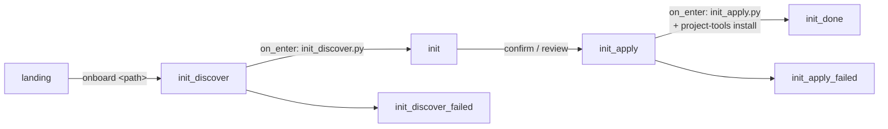

# dev-story onboarding — the `init` pipeline

The [dev-story](../../stories/dev-story/README.md) hub ships a small,
deterministic **project onboarding** pipeline that takes a target checkout from
nothing to a fully working kitsoki environment. This is the dev-story-specific
mechanics; for the user-facing "how do I onboard my repo" walkthrough and the
standalone `kitsoki project-tools install` command, read
[project-onboarding.md](../project-onboarding.md) first.

The pipeline is **boring and auditable on purpose**: discovery and apply are
plain Python scripts that emit JSON, the operator reviews the profile before any
write, and the whole walk is gated by a no-LLM flow fixture.

---

## The rooms



Defined in [`stories/dev-story/rooms/init.yaml`](../../stories/dev-story/rooms/init.yaml).

| Room | Does |
|---|---|
| `init_discover` | `on_enter` runs [`scripts/init_discover.py`](../../stories/dev-story/scripts/init_discover.py) against the target and binds the discovered profile (`init_project_id`, `init_stack`, dev/test/build commands, repo metadata, …). Commands are **stack-aware**: Node scripts through the repo's selected package manager (`npm`, `pnpm`, `yarn`, or `bun`), Cargo (`cargo build`/`test`, or Makefile targets), Go (`go build ./...`/`go test ./...`, Makefile targets winning), and Python (`pytest`/`tox`, FastAPI/Flask dev hints) — so a recognised stack is never left command-less when it has canonical commands. Reads nothing it shouldn't — discovery is **read-only** and refuses missing or non-directory targets instead of creating them. |
| `init` | Operator **reviews** the discovered profile. `confirm_init` applies; `revise_init` records feedback; `quit` returns to the workbench. No writes happen until confirm. |
| `init_apply` | `on_enter` runs the file apply and toolkit install host steps (below), then surfaces the written paths + MCP registration or a loud retry read-out. |
| `init_done` | Read-out of the applied result; `go_main` returns to the workbench. |
| `init_discover_failed` / `init_apply_failed` | Error read-outs with retry arcs. |

## Entering onboarding

Two arcs from [`landing`](../../stories/dev-story/rooms/landing.yaml) reach
`init_discover`:

- **`go_init`** — the explicit "onboard" quick action. Its optional `target`
  slot points at an **external** repo deterministically (no free-text routing):
  the slot value becomes `init_request`, which `init_discover.py` resolves like
  any path. An empty slot (the bare button) falls back to the current checkout.
- **`work`** with an onboarding utterance — `landing`'s default intent captures
  free text, and a narrow guard routes leading verbs
  (`onboard …` / `project onboarding …` / `init project …`) into onboarding,
  carrying the request as `init_request`. `init_discover.py` parses the target
  path out of the request (`onboard ~/code/foo` → `/abs/.../foo`), falling back
  to `repo_root` / `workdir` / cwd.

## The apply step — two host calls

`init_apply.on_enter` runs two `host.run` invocations, in order:

1. **`init_apply.py`** ([source](../../stories/dev-story/scripts/init_apply.py))
   — writes the checked-in onboarding files: `.kitsoki.yaml`,
   `.kitsoki/project-profile.yaml`, `.kitsoki/check-readiness.py`,
   `.kitsoki/stories/<id>-dev/app.yaml` (+ README), and appends the kitsoki
   runtime block to `.gitignore`. Binds
   `init_apply_result` (the JSON report); a failure routes to
   `init_apply_failed`. The generated profile's `onboarding` block records the
   selected starter story, deterministic repo evidence, and initial
   project-local customizations so later session mining can propose changes
   without patching the shared story.

2. **`kitsoki project-tools install --target <path>`** — installs the agent
   toolkit (skills + subagents) and registers the studio MCP, producing the
   `.agents/` sources, the `.claude/` symlinks, and `.mcp.json`. This is
   **loud and retryable**: a tools hiccup routes to `init_tools_failed` instead
   of silently reporting a complete onboarding, while the file apply result is
   preserved so the operator can continue with `applied-no-tools` if needed.
   The command is backed by
   `internal/baseskills` (embedded toolkit; see
   [project-onboarding.md](../project-onboarding.md)).

The generated `.kitsoki/stories/<id>-dev/app.yaml` imports
`@kitsoki/dev-story` from the binary's embedded story library and rebinds the
providers to local implementations (`host.local_files.ticket`, `host.git`,
`host.local`, `host.git_worktree`, `host.append_to_file`), so it runs
standalone with only the `kitsoki` binary present.

When deterministic discovery finds associated Claude/Codex transcript history,
apply also writes `.context/kitsoki-session-mining-seed.md` and records a
pending seed job in the profile's `mining` block. The generated `.kitsoki.yaml`
also gets a disabled runtime `mining:` block (`enabled: false`, `cadence`,
`first_pass_sample`, and the discovered `transcript_dirs`) so the operator can
opt in later with `/mine resume` or `/mine now` without re-discovering scope.
This is a review handoff only: no mining pass or LLM call runs during
onboarding.

Repo metadata is inferred locally as well. Git checkouts keep their current or
origin default branch and origin remote in `repo.default_branch` /
`repo.remote`; non-git directories are recorded as `repo.vcs: none` with empty
branch and remote fields.

The generated `.kitsoki/check-readiness.py` is the explicit post-apply verifier.
It mirrors `setup_plan.verifications`, supports `--list` for review, and writes
`.artifacts/kitsoki-readiness.json` when run. With `--update-profile`, it also
replaces the profile's top-level `readiness:` block with a schema-shaped summary
of the pass/fail results. Onboarding does not execute those commands
automatically.

## The external-target profile

The instance `app.yaml` carries an **external-target profile**: a block of world
keys (`publish_durable_path`, `prd_doc_filename`, `design_*`, `ticket_repo`, …)
that retargets doc placement, fixed filenames, or a GitHub-issue tracker.
Generic generated projects default PRDs and design documents into `.context/`
subdirectories and assume no project-specific design template directory. Known
dogfood profiles, such as Slidey, can keep repo-native docs paths. That profile
is documented authoritatively in the dev-story README's
[Doc profile section](../../stories/dev-story/README.md#doc-profile--targeting-an-external-project)
— onboarding seeds the defaults; tuning it is a per-instance edit.

## Testing — no LLM

The walk is covered by focused no-LLM flows such as
[`flows/init_slidey_dogfood.yaml`](../../stories/dev-story/flows/init_slidey_dogfood.yaml),
[`flows/init_git_metadata.yaml`](../../stories/dev-story/flows/init_git_metadata.yaml),
[`flows/init_node_pnpm_project.yaml`](../../stories/dev-story/flows/init_node_pnpm_project.yaml),
[`flows/init_python_project.yaml`](../../stories/dev-story/flows/init_python_project.yaml),
and [`flows/init_transcript_seed.yaml`](../../stories/dev-story/flows/init_transcript_seed.yaml).
They stub the discovery, apply, and toolkit-install `host.run` calls (by their
`id`: `discover`, `apply`, `install_tools`) and assert routing, generated paths,
tool commands, transcript seed handoff, and toolkit-install failure handling —
all with no real LLM and without touching a real checkout:

```sh
kitsoki test flows stories/dev-story/app.yaml
```

## See also

- [project-onboarding.md](../project-onboarding.md) — the user-facing guide +
  the standalone `kitsoki project-tools install` command.
- [../../stories/dev-story/README.md](../../stories/dev-story/README.md) — the
  dev-story hub the onboarded instance imports.
- [imports.md](imports.md) — how the generated instance imports
  `@kitsoki/dev-story`.
