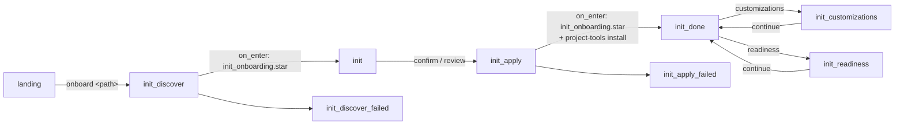
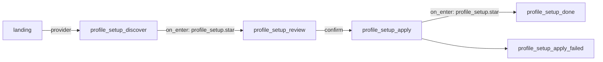

# dev-story onboarding — the `init` pipeline

The [dev-story](../../stories/dev-story/README.md) hub ships a small,
deterministic **project onboarding** pipeline that takes a target checkout from
no `.kitsoki/` files to a working Kitsoki environment. This is the dev-story-specific
mechanics; for the user-facing "how do I onboard my repo" walkthrough and the
standalone `kitsoki project-tools install` command, read
[getting-started.md](../getting-started.md) first.

The pipeline is **boring and auditable on purpose**: discovery, apply, readiness,
and customization review are native host operations called through the
story-provided Starlark adapter, the operator reviews the profile before any
write, and the whole walk is gated by no-LLM flow fixtures.

---

## The rooms



Defined in [`stories/dev-story/rooms/init.yaml`](../../stories/dev-story/rooms/init.yaml).

| Room | Does |
|---|---|
| `init_discover` | `on_enter` runs [`scripts/init_onboarding.star`](../../stories/dev-story/scripts/init_onboarding.star), which calls native `host.dev.onboarding` discovery against the target and binds the discovered profile (`init_project_id`, `init_stack`, dev/test/build commands, repo metadata, …). Reads nothing it shouldn't — discovery is **read-only** and refuses missing or non-directory targets instead of creating them. |
| `init` | Operator **reviews** the discovered profile. `confirm_init` applies; `revise_init` records feedback; `quit` returns to the workbench. No writes happen until confirm. |
| `init_apply` | `on_enter` runs the file apply and toolkit install host steps (below), then surfaces the written paths + MCP registration or a loud retry read-out. |
| `init_done` | Read-out of the applied result; `review_customizations` promotes and reviews mined customization reports; `run_readiness` explicitly runs the generated verifier; `go_main` returns to the workbench. |
| `init_customizations` | Calls native `host.dev.onboarding` through `init_onboarding.star`, shows pending/accepted/refinement counts and entries, and lets the operator accept pending entries or record refinement feedback in the project profile. |
| `init_readiness` | Calls native `host.dev.onboarding` through `init_onboarding.star`, runs declared project checks, writes `.artifacts/kitsoki-readiness.json`, updates the profile readiness block, and returns to `init_done` for review. |
| `init_discover_failed` / `init_apply_failed` | Error read-outs with retry arcs. |

## Entering onboarding

Two arcs from [`landing`](../../stories/dev-story/rooms/landing.yaml) reach
`init_discover`:

- **`go_init`** — the explicit "onboard" quick action. Its optional `target`
  slot points at an **external** repo deterministically (no free-text routing):
  the slot value becomes `init_request`, which the Starlark adapter passes to
  native discovery like
  any path. An empty slot (the bare button) falls back to the current checkout.
- **`work`** with an onboarding utterance — `landing`'s default intent captures
  free text, and a narrow guard routes leading verbs
  (`onboard …` / `project onboarding …` / `init project …`) into onboarding,
  carrying the request as `init_request`. Native discovery parses the target
  path out of the request (`onboard ~/code/foo` → `/abs/.../foo`), falling back
  to `repo_root` / `workdir` / cwd.

The request can also preselect a named first-run story pack:

```text
onboard ~/code/acme-api --pack core-engineering
```

Discovery emits the pack catalog and the selected pack into
`init_story_packs`, `init_story_pack`, and `init_starter_stories`. The review
room exposes a `story packs` menu before writes happen; selecting a pack updates
the starter set in memory. The default `core-engineering` pack is `setup`,
`bugfix`, `repo-bakeoff` (repo-history capsules), `pr-refinement`, and
`git-ops`.

For one-off custom scopes, discovery still accepts
`--stories`/`stories=`/`focus=` and normalizes aliases such as `bugfixing` →
`bugfix` and `gitops` → `git-ops`; those are recorded as a custom pack.

## Ticket provider setup

Onboarding also asks which ticket intake mode this project should start with:

- **Good capability, no provider required** — local markdown tickets and pasted
  bug reports. A user can start from `tickets`, a local file under
  `issues/bugs/`, or a pasted report (`fix bug ...`) without configuring a
  remote service.
- **Full capability** — a configured ticket provider such as GitHub Issues.
  When discovery sees a `github.com` origin, the provider menu offers that
  `owner/repo` slug. The operator can also type a custom slug. Full mode lets
  the story search remote issues, fetch issue bodies from links, comment, and
  transition status through `iface.ticket`.

The selected provider is written into `.kitsoki/project-profile.yaml` and the
generated `.kitsoki/stories/<id>-dev/app.yaml`. Choosing local mode keeps
`iface.ticket` bound to `host.local_files.ticket`; choosing GitHub binds it to
`host.gh.ticket` pinned by `world.ticket_repo`. No network call is made during
discovery or apply; actual GitHub use happens later when the user searches or
starts work from a link and has access.

## Local harness profile setup

The landing room also exposes a deterministic **provider** action:

```text
provider
```

or the equivalent free-text escape hatch:

```text
setup local harness profile
```

That enters `profile_setup_discover`, which reads `.kitsoki.yaml` plus
`.kitsoki.local.yaml`, detects backend binaries (`claude`, `codex`, `copilot`,
`agy`) and their `KITSOKI_AGENT_*_BIN` overrides, and reports credential
source/presence for common env vars and local auth files. For Claude Code it
also runs the safe auth probe `claude auth status --json` when the CLI is
installed. That command does not send a model prompt or spend tokens; discovery
parses its JSON even when the command exits non-zero for a logged-out account.

`logged_in=yes` is intentionally conservative: it means discovery found an env
credential, a positive Claude auth-status probe, or a credential-looking auth
file marker when no active probe is available. `logged_in=no` for Claude means
the CLI explicitly reported `loggedIn:false`. Configuration/history files such
as `~/.claude/settings.json` or `~/.claude.json` are reported as presence-only
evidence and leave the login state `unknown` when the active probe is
unavailable.

The graph is:



`profile_setup_review` is the write gate. The operator can accept the
recommended patch, set an existing discovered profile as `default_profile`,
create a codex/OpenAI-compatible profile by naming an env var such as
`OPENAI_API_KEY`, or create a `builtin.local_llm` profile by naming the local
model id. Apply writes only `.kitsoki.local.yaml`, preserves unrelated local
keys where possible, refuses raw secret values, and refuses to write the local
override if git tracks it.

## The apply step — the native host boundary plus toolkit install

`init_apply.on_enter` runs the Starlark onboarding adapter and then the toolkit
installer:

1. **`scripts/init_onboarding.star`** ([source](../../stories/dev-story/scripts/init_onboarding.star))
   — calls native `host.dev.onboarding` to write the checked-in onboarding files:
   `.kitsoki.yaml`, `.kitsoki/project-profile.yaml`,
   `.kitsoki/stories/<id>-dev/app.yaml` (+ README), and appends the kitsoki
   runtime block to `.gitignore`. It validates the generated profile before any
   write and binds
   `init_apply_result` (the JSON report); a failure routes to
   `init_apply_failed`. The generated profile's `onboarding` block records the
   selected starter pack, deterministic repo evidence, and initial
   project-local customizations so later session mining can propose changes
   without patching the shared story. It records the chosen pack in
   `kitsoki.story_pack` / `onboarding.story_pack` and the focused starter set in
   `kitsoki.enabled_stories` / `onboarding.starter_stories`; those fields are an
   adoption scope, not a runtime fence. Teams expand later with
   `kitsoki project-profile story-packs add <pack>` after adding matching
   readiness checks/flows.

2. **`kitsoki project-tools install --target <path>`** — installs the agent
   toolkit (skills + subagents) and registers the studio MCP, producing the
   `.agents/` sources, the `.claude/` symlinks, and `.mcp.json`. This is
   **loud and retryable**: a tools hiccup routes to `init_tools_failed` instead
   of silently reporting a complete onboarding, while the file apply result is
   preserved so the operator can continue with `applied-no-tools` if needed.
   The command is backed by
   `internal/baseskills` (embedded toolkit; see
   [getting-started.md](../getting-started.md)).

The generated `.kitsoki/stories/<id>-dev/app.yaml` imports
`@kitsoki/dev-story` from the binary's embedded story library and rebinds the
providers to project-selected implementations. Local mode uses
`host.local_files.ticket`; full GitHub mode uses the composite
`host.local_github.ticket` with the selected `owner/repo`; and a child checkout
under a parent meta-repo can inherit a parent-declared non-GitHub ticket
provider. The other defaults (`host.git`, `host.local`, `host.git_worktree`,
`host.append_to_file`) let the instance run standalone with only the `kitsoki`
binary present.

New generated instances bind their workspace interface to
`host.capsule_workspace`; `host.git_worktree` remains a compatibility alias for
old stories and traces, not the recommended lifecycle for newly onboarded
projects.

When deterministic discovery finds associated Claude/Codex transcript history,
apply also writes `.context/kitsoki-session-mining-seed.md` and records a
pending seed job in the profile's `mining` block. The generated `.kitsoki.yaml`
also gets a disabled runtime `mining:` block (`enabled: false`, `cadence`,
`first_pass_sample`, and the discovered `transcript_dirs`) so the operator can
opt in later with `/mine resume` or `/mine now` without re-discovering scope.
This is a review handoff only: no mining pass or LLM call runs during
onboarding.

The native `host.dev.onboarding` customization operation is the deterministic
bridge from emitted mining reports to profile customizations. It scans
`.artifacts/mining/jobs/*/analysis.json` (or explicit paths), ignores
quarantined recipes, and appends pending `onboarding.story_customizations`
entries for operator review. It never edits the shared base story and never
calls an LLM. From `init_done`, the story's `customizations` action runs that
helper, shows the reviewable entries, and lets the operator mark pending entries
accepted or record refinement feedback back into `.kitsoki/project-profile.yaml`.

Repo metadata is inferred locally as well. Git checkouts keep their current or
origin default branch and origin remote in `repo.default_branch` /
`repo.remote`; non-git directories are recorded as `repo.vcs: none` with empty
branch and remote fields.

### Parent meta-repo providers

For meta-repos or monorepos with child projects under `projects/` or `src/`,
discovery walks ancestors for `.kitsoki/project-profile.yaml`. If the child
does not have a GitHub `ticket_repo`, onboarding can inherit a non-GitHub
`tracker.provider` and `kitsoki.instance.bindings.ticket` from the nearest
parent profile. Relative `.star` bindings are rebased into the child profile and
again into the generated `.kitsoki/stories/<id>-dev/app.yaml`.

Parent tracker metadata is copied into the child's `tracker:` block. When the
parent declares `setup_command`, `readiness_command`, or `required_env`, those
remain generic profile metadata; a declared `readiness_command` is added to the
generated profile checks and runs from the parent root through the native
readiness operation.
`ticket_repo` stays GitHub-only, so private providers use the `iface.ticket`
binding without triggering GitHub-specific publish or closeout behavior.

Inherited `.star` bindings can be first-class ticket providers by declaring a
`ticket_provider/v1` sidecar. The script defines pure functions such as
`search(ctx)` and `get(ctx)` rather than `main(ctx)`. Its sidecar declares HTTP
hosts/methods and symbolic auth policies; scripts pass `auth="name"` to
`ctx.http.get/post`, while the Go HTTP transport reads the configured env or
secret and applies headers after the Starlark runtime has built the request.
Provider functions return normal ticket data or `{"ok": false, "error":
{"code": "...", "message": "..."}}` for custom operator-facing failures.

The same module is reusable outside a story through
`kitsoki ticket-provider call --script <provider.star> --op search ...` and the
studio MCP `ticket.call` tool.

The native `host.dev.onboarding` readiness operation is the explicit post-apply
verifier. It mirrors the profile's declared commands, writes
`.artifacts/kitsoki-readiness.json`, and replaces the profile's top-level
`readiness:` block with a schema-shaped summary of the pass/fail results.
Onboarding does not execute those commands automatically.

The story exposes that verifier as an explicit `readiness` action from
`init_done`. Red project checks are treated as data: the action stays in the
onboarding flow, shows the failed check details, and lets the operator return to
the applied result without turning a target-project failure into a Kitsoki
runtime error.

## The external-target profile

The instance `app.yaml` carries an **external-target profile**: a block of world
keys (`publish_durable_path`, `prd_doc_filename`, `design_*`, `ticket_repo`, …)
that retargets doc placement, fixed filenames, or a GitHub-issue tracker.
Generic generated projects default PRDs and design documents into `.context/`
subdirectories and assume no project-specific design template directory.
Project-specific profiles, such as a Slidey checkout that already has a docs
tree, can keep repo-native docs paths. That profile is documented
authoritatively in the dev-story README's
[Doc profile section](../../stories/dev-story/README.md#doc-profile--targeting-an-external-project)
— onboarding seeds the defaults; tuning it is a per-instance edit.

## Testing — no LLM

The walk is covered by focused no-LLM flows such as
[`flows/init_ticket_provider_menu.yaml`](../../stories/dev-story/flows/init_ticket_provider_menu.yaml),
[`flows/init_slidey_project.yaml`](../../stories/dev-story/flows/init_slidey_project.yaml),
[`flows/init_customizations_review.yaml`](../../stories/dev-story/flows/init_customizations_review.yaml),
[`flows/init_readiness_check.yaml`](../../stories/dev-story/flows/init_readiness_check.yaml),
[`flows/init_git_metadata.yaml`](../../stories/dev-story/flows/init_git_metadata.yaml),
[`flows/init_node_pnpm_project.yaml`](../../stories/dev-story/flows/init_node_pnpm_project.yaml),
[`flows/init_python_project.yaml`](../../stories/dev-story/flows/init_python_project.yaml),
[`flows/init_transcript_seed.yaml`](../../stories/dev-story/flows/init_transcript_seed.yaml),
and the profile setup flows
[`flows/profile_setup_existing_profile.yaml`](../../stories/dev-story/flows/profile_setup_existing_profile.yaml),
[`flows/profile_setup_openai_env_happy_path.yaml`](../../stories/dev-story/flows/profile_setup_openai_env_happy_path.yaml),
[`flows/profile_setup_skip_no_credentials.yaml`](../../stories/dev-story/flows/profile_setup_skip_no_credentials.yaml), and
[`flows/profile_setup_apply_failed.yaml`](../../stories/dev-story/flows/profile_setup_apply_failed.yaml).
They stub the discovery, apply, and toolkit-install `host.run` calls (by their
`id`: `discover`, `apply`, `install_tools`, `profile_setup_discover`,
`profile_setup_apply`) and assert routing, generated paths, tool commands,
transcript seed handoff, local profile patch gating, and failure handling — all
with no real LLM and without touching a real checkout:

```sh
kitsoki test flows stories/dev-story/app.yaml
```

## See also

- [getting-started.md](../getting-started.md) — the user-facing guide +
  the standalone `kitsoki project-tools install` command.
- [../../stories/dev-story/README.md](../../stories/dev-story/README.md) — the
  dev-story hub the onboarded instance imports.
- [imports.md](imports.md) — how the generated instance imports
  `@kitsoki/dev-story`.
